--- Page 1 ---

# Nemotron-Cascade 2: Post-Training LLMs with Cascade RL and Multi-Domain On-Policy Distillation

Thinking

Thinking + Tool Calling (Python)

Zhuolin Yang ∗ , Zihan Liu * , Yang Chen * , Wenliang Dai * , Boxin Wang * , Sheng-Chieh Lin, Chankyu Lee, Yangyi Chen, Dongfu Jiang, Jiafan He ‡ , Renjie Pi, Grace Lam, Nayeon Lee, Alexander Bukharin, Mohammad Shoeybi, Bryan Catanzaro, Wei Ping * † LiveCodeBench V6 100 88.4 85.0 LiveCodeBench Pro 25Q1 Medium 50 45.2 44.4 45.6 HMMT February 2025 100 94.6 94.8 89.0 95.4 IMO ProofBench 100

83.6

87.2

80.2

80

40

90

80

76.7

74.6

39.2

72.9

60

# Abstract

40

30

20

25.6

80

70

60

40

We introduce Nemotron-Cascade 2, an open 30B MoE model with 3B activated parameters that delivers best-inclass reasoning and strong agentic capabilities. Despite its compact size, its mathematical and coding reasoning performance approaches that of frontier open models. It is the second open-weight LLM, after DeepSeekV3.2-Speciale-671B-A37B, to achieve Gold Medal -level performance in the 2025 International Mathematical Olympiad (IMO), the International Olympiad in Informatics (IOI), and the ICPC World Finals, demonstrating remarkably high intelligence density with 20× fewer parameters. In contrast to Nemotron-Cascade 1, the key technical advancements are as follows. After SFT on a meticulously curated dataset, we substantially expand Cascade RL to cover a much broader spectrum of reasoning and agentic domains. Furthermore, we introduce multi-domain on-policy distillation from the strongest intermediate teacher models for each domain throughout the Cascade RL process, allowing us to efficiently recover benchmark regressions and sustain strong performance gains along the way. We release the collection of model checkpoint and training data. 20 NemotronCascade-2 30B-A3B Qwen3.535B-A3B Qwen3.5397B-A17B Kimi-K2.5-1T Thinking 10 NemotronCascade-2 30B-A3B Qwen3.535B-A3B Qwen3.5397B-A17B Kimi-K2.5-1T Thinking 60 NemotronCascade-2 30B-A3B Qwen3.535B-A3B 20 NemotronCascade-2 30B-A3B DeepSeek Math-V2 671B-A37B Gemini Deep Think (IMO Gold) ArenaHard v2 20 40 60 80 NemotronCascade-2 30B-A3B 100 83.5 TODO 65.4 Qwen3.535B-A3B IFBench prompt 20 40 60 80 NemotronCascade-2 30B-A3B 100 82.9 76.5 70.2 Qwen3.535B-A3B SWE Verified OpenHands 20 40 60 80 NemotronCascade-2 30B-A3B 50.2 38.8 Nemotron-3 Nano 30B-A3B 69.2 Qwen3.535B-A3B 60.5 Nemotron-3 Super 120B-A12B Humanity's Last Exam 5 10 15 20 NemotronCascade-2 30B-A3B 25 17.7 10.6 Nemotron-3 Nano 30B-A3B 22.4 Qwen3.535B-A3B 18.3 Nemotron-3 Super 120B-A12B 0 Qwen3.5397B-A17B Kimi-K2.5-1T Thinking 70.2 Qwen3.5397B-A17B Qwen3.5397B-A17B Kimi-K2.5-1T Thinking

Nemotron-Cascade-2-30B-A3B: the post-trained model based on Nemotron-3-Nano-30B-A3B-Base.

Nemotron-Cascade-2-SFT-Data: collection of SFT datasets for Nemotron-Cascade-2.

Nemotron-Cascade-2-RL-Data: collection of RL datasets for Nemotron-Cascade-2.

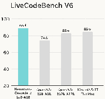

LiveCodeBench V6

100

88.4

85.0

83.6

80

74.6

60

40

20

Nemotron-

Qwen3.5-

Qwen3.5-

Kimi-K2.5-1T

Cascade-2

35B-A3B

397B-A17B

Thinking

30B-A3B

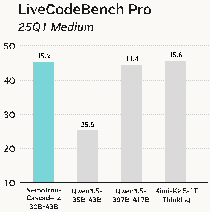

LiveCodeBench Pro 25Q1 Medium

50

45.6

45.2

44.4

40

30

25.6

20

10

Nemotron-

Qwen3.5-

Qwen3.5-

Kimi-K2.5-1T

Cascade-2

35B-A3B

397B-A17B

Thinking

30B-A3B

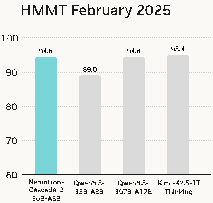

HMMT February 2025

100

95.4

94.6

94.8

89.0

90

80

70

60

Nemotron-

Qwen3.5-

Qwen3.5-

Kimi-K2.5-1T

Cascade-2

35B-A3B

397B-A17B

Thinking

30B-A3B

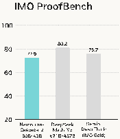

IMO ProofBench

100

80.2

80

76.7

72.9

60

40

20

Gemini

Nemotron-

DeepSeek

Deep Think

Cascade-2

Math-V2

(IMO Gold)

30B-A3B

671B-A37B

SWE Verified OpenHands

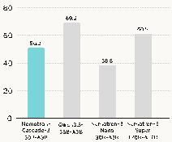

80

69.2

60.5

60

50.2

38.8

40

20

0

Nemotron-

Nemotron-3

Nemotron-3

Qwen3.5-

Cascade-2

Nano

Super

35B-A3B

30B-A3B

30B-A3B

120B-A12B

Humanity's Last Exam

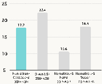

25

22.4

20

18.3

17.7

15

10.6

10

5

Nemotron-

Nemotron-3

Nemotron-3

Qwen3.5-

Cascade-2

Nano

Super

35B-A3B

30B-A3B

30B-A3B

120B-A12B

IFBench prompt

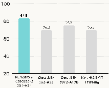

100

82.9

80

76.5

70.2

70.2

60

40

20

Nemotron-

Qwen3.5-

Qwen3.5-

Kimi-K2.5-1T

Cascade-2

35B-A3B

397B-A17B

Thinking

30B-A3B

ArenaHard v2

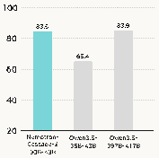

100

83.9

83.5

80

65.4

60

40

20

Nemotron-

Qwen3.5-

Qwen3.5-

Cascade-2

35B-A3B

397B-A17B

30B-A3B

∗ Equal contribution, with authors listed in reverse alphabetical order by first name.

‡ Reviewed and scored our model-generated solutions for IMO 2025 as a gold medalist at the IMO 2015. Correspondence to: <jiafanhe19@ucla.edu>.

† Leads the effort. Correspondence to: <wping@nvidia.com>.

--- Page 2 ---

# Contents

|1 Introduction| | |4|
|---|---|---|---|
|2 Main Results| | |4|
|3 Supervised Fine-Tuning| | |6|
|3.1|Training|Framework . . . . . . . . . . . . . . . . . .|6|
| |3.1.1|Overview . . . . . . . . . . . . . . . . . . . .|6|
| |3.1.2|Chat Template . . . . . . . . . . . . . . . . .|6|
|3.2|SFT Data Curation .|. . . . . . . . . . . . . . . . . .|7|
| |3.2.1|Math . . . . . . . . . . . . . . . . . . . . . . .|7|
| |3.2.2|Code Reasoning . . . . . . . . . . . . . . . . .|7|
| |3.2.3|Science . . . . . . . . . . . . . . . . . . . . .|8|
| |3.2.4|Long Context . . . . . . . . . . . . . . . . . .|8|
| |3.2.5|General Chat . . . . . . . . . . . . . . . . . .|8|
| |3.2.6|Instruction Following . . . . . . . . . . . . . .|8|
| |3.2.7|Safety . . . . . . . . . . . . . . . . . . . . . .|8|
| |3.2.8|Conversational Agent . . . . . . . . . . . . . .|9|
| |3.2.9|Software Engineering Agent . . . . . . . . . .|9|
| |3.2.10|Terminal Agent . . . . . . . . . . . . . . . . .|9|
|4 Cascade RL and Multi-Domain On-Policy Distillation| | |9|
|4.1|Training|Framework . . . . . . . . . . . . . . . . . .|9|
| |4.1.1|What determines the ordering of Cascade RL .|10|
| |4.1.2|RL Training Configuration . . . . . . . . . . .|10|
|4.2|Instruction-Following Reinforcement Learning (IF-RL)| |11|
| |4.2.1|Dataset . . . . . . . . . . . . . . . . . . . . .|11|
| |4.2.2|Training recipe . . . . . . . . . . . . . . . . .|11|
|4.3|Multi-domain RL . . . .|. . . . . . . . . . . . . . . .|12|
|4.4|Multi-domain On-Policy Distillation (MOPD) . .|. . .|12|
|4.5|Reinforcement Learning from Human Feedback (RLHF) .| |14|
| |4.5.1|Dataset . . . . . . . . . . . . . . . . . . . . .|14|
| |4.5.2|Training recipe . . . . . . . . . . . . . . . . .|14|
| |4.5.3 Hyper-parameters .|. . . . . . . . . . . . . .|14|
|4.6|Long-context RL . . . .|. . . . . . . . . . . . . . . .|15|
| |4.7.1|Data Curation . . . . . . . . . . . . . . . . . .|15|
| |4.7.2|Training Details . . . . . . . . . . . . . . . . .|15|
|4.8|Software Engineering Reinforcement Learning (SWE RL)| |15|
| |4.8.1|Agentless RL . . . . . . . . . . . . . . . . . .|15|
| |4.8.2|Execution-based RL for Agentic SWE Scaffold|16|
|5 International Mathematical Olympiad (IMO)| | |16|
|5.1 IMO 2025 . . . . . . . 5.2 IMO-ProofBench . . .| |. . . . . . . . . . . . . . . . .|16|
| | |. . . . . . . . . . . . . . . . .|17|
| |Competitive|Coding|17|
| | | |17|
|6.1 IOI 2025 and ICPC World Finals 2025 6.2 Competitive Coding Benchmark Results| |. . . . . . . .| |

--- Page 3 ---

|7|Acknowledgments| |19|
|---|---|---|---|
|A|Benchmarks and Evaluation Setups| |20|
|A.1| |Math . . . . . . . . . . . . . . . . . . . . . . . . . . .|20|
| |A.1.1|Non-proof Math . . . . . . . . . . . . . . . . .|20|
| |A.1.2|Math Proof . . . . . . . . . . . . . . . . . . .|20|
|A.2|Code Reasoning . .|. . . . . . . . . . . . . . . . . . .|21|
|A.3|Knowledge and STEM .|. . . . . . . . . . . . . . . .|21|
|A.4|Alignment and Instruction-Following|. . . . . . . . .|22|
|A.5|Long Context and Context Learning .|. . . . . . . . .|22|
|A.6|Agentic Tasks . .|. . . . . . . . . . . . . . . . . . . .|23|
|A.7|Multilingual|. . . . . . . . . . . . . . . . . . . . . . .|24|
|B|Training Hyperparameters| |24|
|C|Prompt Templates| |26|
| |C.1|Prompt Templates for Test-Time Scaling on IOI 2025|26|
| |C.2|HLE Judge Prompt . . . . . . . . . . . . . . . . . . .|27|
|D|ELO Rating Analysis| |27|
|E|IMO 2025 Model Solutions| |30|

--- Page 4 ---

# 1. Introduction

Reinforcement Learning (RL) (Guo et al., 2025; Ouyang et al., 2022) has emerged as the cornerstone of LLM post-training, driving advances in reasoning, agentic capabilities, and real-world problem-solving. As models are tasked with increasingly sophisticated requirements, the primary challenge lies in successfully incorporating a broader array of RL environments and very diverse reasoning and agentic tasks. Scaling RL to encompass multifaceted, real-world applications necessitates robust frameworks capable of handling varied reward signals and complex environmental feedback without destabilizing the training process.

Our previous work, Nemotron-Cascade 1 (Wang et al., 2025), introduced Cascade RL, a framework that orchestrates sequential, domain-wise RL training across specialized task domains. Cascade RL significantly simplifies the engineering complexity associated with multi-domain RL while achieving state-of-the-art performance across a wide range of benchmarks. The advantages of Cascade RL are threefold. First, domain-specific RL stages are remarkably resistant to catastrophic forgetting . They rarely degrade benchmark performance attained in earlier domains and may even improve it. Second, it allows RL hyperparameters and the training curriculum to be carefully tailored to each specific domain, enabling optimized learning dynamics and improved final performance. Third, task homogeneity within each RL stage also yields substantial compute savings, as response lengths and verification wall-clock times are more uniform within a domain than across multiple domains trained jointly.

In this work, we introduce Nemotron-Cascade 2, an open 30B Mixture-of-Experts (MoE) model with 3B activated parameters. Similar to its predecessor, Nemotron-Cascade 2 further scales Cascade RL on high-priority domains to preserve the benefits of domain-wise training, enabling us to push the limits of reasoning performance in key domains to state-of-the-art levels. Furthermore, we incorporate on-policy distillation (Xiao et al., 2026; Zeng et al., 2026) into Cascade RL training stages. By distilling knowledge from the best-performing intermediate teacher models within each specific domain during Cascade RL, this mechanism effectively recovers any benchmark regressions that can occur when training in increasingly complex RL environments. In addition, we integrate multi-domain RL into Cascade RL for groups of tasks with similar response formats and comparable verification costs, allowing them to be trained jointly to scale up for more RL environments and improve training efficiency when cross-task interference is minimal.

Our Nemotron-Cascade-2-30B-A3B achieves breakthrough performance in mathematical and coding reasoning, securing gold-medal results in both the 2025 International Mathematical Olympiad (IMO) and the International Olympiad in Informatics (IOI) despite being only a 30B MoE model, 1 while also delivering best-in-class performance across a broad range of benchmarks, including alignment, instruction-following, long context (e.g., 1M context window), and agentic tasks. See Table 1 for the full results. We fully open source the model weights, training data, and methodological details, enabling the research community to reproduce, analyze, and extend the proposed Cascade RL training paradigm.

We organize the remainder of this report as follows. Section §2 summarizes the main results. Section §3 describes the supervised fine-tuning (SFT) with details on data curation. Section §4 presents Cascade RL framework intergrated with the multi-domain on-policy distillation. Section §5 details the evaluation setup and results on IMO, while Section §6 presents the evaluation setup and results on IOI and the ICPC World Finals.

# 2. Main Results

We evaluate Nemotron-Cascade 2 on a comprehensive suite of benchmarks covering mathematical and coding reasoning, knowledge and STEM, alignment and instruction following, long-context understanding and incontext learning, multilingual capabilities, and agentic tasks. The main results are shown in Table 1, and the benchmarks and detailed evaluation setups are described in Appendix A.

1 Our model is the second open-weight LLM, after DeepSeek-V3.2-Speciale-671B-A37B (Liu et al., 2025), to achieve gold-medal performance in both the IMO and IOI.

--- Page 5 ---

Table 1: Main results . Nemotron-Cascade-2-30B-A3B achieves gold-medal performance in both the IMO 2025 and IOI 2025, which demonstrate remarkably high intelligence density. † Numbers in brackets refers to Tool-Integrated Reasoning (TIR) results. ‡ For the baseline models, we use official numbers when available, otherwise evaluate them using the recommended settings.

|Benchmark Metric: pass@1|Nemotron-3-Nano 30B-A3B|Nemotron-3-Super 120B-A12B|Qwen3.5 35B-A3B|Nemotron-Cascade-2 30B-A3B|
|---|---|---|---|---|
|Math| | | | |
|IMO 2025|-|-|-|35 pts|
|IMO AnswerBench|70.4 ‡|77.2 ‡|74.8 ‡|79.3|
|IMO ProofBench|-|-|-|72.9|
|AIME 2025|89.1|90.2|91.9 ‡|92.4 (98.6)†|
|AIME 2026|89.9 ‡|89.8 ‡|91.1 ‡|90.9 (95.0)†|
|HMMT Feb25|84.6 ‡|93.7|89.0|94.6|
|Code Reasoning| | | | |
|IOI 2025|-|-|348.6 ‡|439.28|
|ICPC World Finals 2025|-|-|-|10/12|
|LiveCodeBench v6 (2408-2505)|68.3|78.7|74.6|87.2 (88.4)†|
|LiveCodeBenchPro 25Q2 (Easy)|54.5 ‡|81.7 ‡|81.1 ‡|87.0 (89.3)†|
|LiveCodeBenchPro 25Q2 (Med)|3.50 ‡|23.2 ‡|17.8 ‡|27.6 (36.8)†|
|SciCode|33.3|42.1|38.0|36.4|
|Knowledge & STEM| | | | |
|MMLU-Redux|-|-|93.3|86.3|
|MMLU-Pro|78.3|83.7|85.3|79.8|
|GPQA-Diamond|73.0|79.2|84.2|76.1|
|HLE (no tool)|10.6|18.3|22.4|17.7|
|Alignment & Instruction Following| | | | |
|ArenaHard v2 (Avg.)|67.7|-|65.4 ‡|83.5|
|- Hard Prompt|72.1|73.9|64.5 ‡|88.2|
|- Creative Writing|63.2|-|66.3 ‡|78.7|
|IFBench (prompt)|71.5|72.6|70.2|82.9|
|Scale AI Multi-Challenge|38.5|55.2|60.0|45.3|
|Long Context & Context Learning| | | | |
|AA-LCR|35.9|58.3|58.5|39.1|
|LongBench v2|39.6|-|59.0|40.3|
|NIAH@1M (RULER Subset)|94.8|98.3|94.3 ‡|99.0|
|CL-Bench|12.0 ‡|-|15.5 ‡|12.2|
|Agentic| | | | |
|BFCL v4|53.8|-|67.3|52.9|
|𝜏 2 -Bench|49.0|61.2|81.2|58.9|
|Terminal Bench 2.0|8.5|31.0|40.5|21.1|
|SWE Verified (OpenHands)|38.8|60.5|69.2|50.2|
|Multilingual| | | | |
|MMLU-ProX|59.5|79.4|81.0|72.5|
|WMT24++ (en -> xx)|86.2|86.7|87.6 ‡|84.1|

From Table 1, Nemotron-Cascade-2-30B-A3B outperforms both the latest released Qwen3.5-35B-A3B (2026-0224) (Qwen Team, 2026) and the larger Nemotron-3-Super-120B-A12B (2026-03-11) (Blakeman et al., 2025), and achieves best-in-class performance across benchmarks in mathematics, code reasoning, alignment, and instruction following. Notably, despite being only a 30B MoE model, Nemotron-Cascade 2 achieves gold-medal

--- Page 6 ---

Table 2: Performance of Nemotron-Cascade-2-30B-A3B model on IMO 2025, IOI 2025, and ICPC World Finals 2025 competitions. Nemotron-Cascade-2 model achieved solid gold medal on all these top-tier competitions. Our IMO 2025 solutions are evaluated by human expert (IMO 2015 Gold medalist) while IOI 2025 and ICPCWF 2025 solutions are verified through OnlineJudge with official testcases.

|Competition|P1|P2|P3|P4|P5| |P6|Overall| |Medal| | |
|---|---|---|---|---|---|---|---|---|---|---|---|---|
|IMO 2025|7|7 †|7|7|7| |0|35/42| |Gold| | |
|IOI 2025|39|88.53|100|100|28.75| |83|439.28/600| |Gold| | |
|Competition|A|B C|D|F|G|H|I|J|K|L|Overall|Medal|
|ICPC World Finals 2025|+|- +|+|+|-|+|+|+|+|+|10/12|Gold|

† For IMO 2025 P2, we use LLM grader with reference solution and marking schema from ProofBench (Ma et al., 2025) due to the extensive analytic geometry approach of the model, which human expert could be hard to verify all the intermediate derivation steps.

performance on IMO 2025, IOI 2025 and ICPC World Finals 2025, results previously thought to be attainable only by frontier proprietary models (Gemini Team, 2025) (i.e., Gemini Deep Think) and frontier-sized open models (Liu et al., 2025) (i.e., DeepSeek-V3.2-Speciale-671B-A37B). The detailed performance of our model is reported in Table 2. It underperforms Qwen3.5-35B-A3B primarily on knowledge-intensive and agentic tasks, highlighting the importance of stronger knowledge-intensive pretraining and agentic RL in future work.

Nemotron-Cascade-2-30B-A3B also outperforms Nemotron-3-Nano-30B-A3B on nearly all benchmarks, even though both models are post-trained from the same pretrained model, Nemotron-3-Nano-30B-A3B-Base (NVIIDA, 2025). This result further demonstrates the effectiveness of our Cascade RL plus MOPD training pipeline.

# 3. Supervised Fine-Tuning

In this section, we describe the training framework and data curation process for supervised fine-tuning (SFT), the first stage of our post-training pipeline. This stage equips the model with foundational capabilities, including reasoning, conversational ability, instruction following, and agentic and software engineering skills.

# 3.1. Training Framework

# 3.1.1. Overview

Our SFT data spans a broad range of domains, including mathematics, coding, science, tool use, agentic tasks, and software engineering, as well as more general domains such as multi-turn dialogue, knowledge-intensive question answering, creative writing, role-playing, safety, and instruction following.

We pack all SFT samples into sequences of up to 256K tokens and train the model in a single stage. Empirically, we find that the SFT model reaches optimal performance after approximately 1.5 epochs. The SFT training hyperparameters can be found in Appendix B.

# 3.1.2. Chat Template

Our chat template is depicted in Figure 1. There are two changes to the chat template compared with NemotronCascade (Wang et al., 2025). First, we remove the /think and /no_think tags for simplicity. Second, we prepend an empty <think></think> block to activate the non-thinking mode.

For tool calling task, we specify all available tools in the system prompt within the <tools> and </tools> tags, and instruct the model to perform tool calls wrapped within the <tool_call> and </tool_call> tags.

--- Page 7 ---

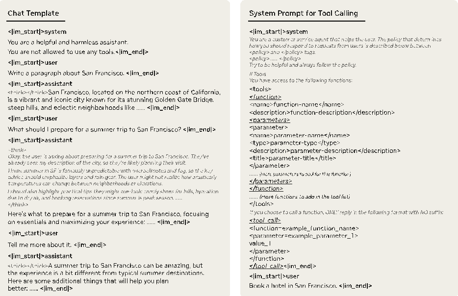

*The image is a chat template for a service called "San Francisco." The chat is for a user named Jim, who is a helpful and harmless assistant. The chat is for a summer trip to San Francisco, and the user is asking about preparing for a summer trip to San Francisco. The user is asked to provide a description of the city, the key questions to ask, and the tips to use. The user is also asked to provide a list of tools they should use, such as a map, a map app, a map app, a map app, a map app, a map app, a map app, a map app, a map app, a map app, a map app, a map app, a map app, a map app, a map app, a map app, a map app, a map app, a map app, a map app, a map app, a map app, a map app, a map app, a map app, a map app, a map app, a map app, a map app, a map app, a map app, a map app, a map app, a map app, a map app, a map app, a map app, a map app, a map app, a map app, a map app, a map app, a map app, a map app, a map app, a map app, a map app, a map app, a map app, a map app, a map app*

# Chat Template

# System Prompt for Tool Calling

# <|im_start|>system

# <|im_start|>system

You are a customer service agent that helps the user. The policy that determines

You are a helpful and harmless assistant.

how you should respond to requests from users is described below between

You are not allowed to use any tools. <|im_end|>

<policy> and </policy> tags.

<policy> ...... </policy>

<|im_start|>user

Try to be helpful and always follow the policy.

Write a paragraph about San Francisco. <|im_end|>

# Tools

You have access to the following functions:

# <|im_start|>assistant

# <tools>

<think></think> San Francisco, located on the northern coast of California, is a vibrant and iconic city known for its stunning Golden Gate Bridge, steep hills, and eclectic neighborhoods like ...... <|im_end|>

<function>

<name>function-name</name>

<description>function-description</description>

# <|im_start|>user

<parameters>

<parameter>

What should I prepare for a summer trip to San Francisco? <|im_end|> <|im_start|>assistant

<name>parameter-name</name>

<type>parameter-type</type>

<think>

<description>parameter-description</description>

Okay, the user is asking about preparing for a summer trip to San Francisco. They've

<title>parameter-title</title>

already seen my description of the city, so they're likely planning their visit.

</parameter>

Hmm, summer in SF is famously unpredictable with microclimates and fog, so the key

......

(more parameters to add for this function)

advice should emphasize layers and rain gear. The user might not realize how drastically

</parameters>

temperatures can change between neighborhoods or elevations.

</function>

I should also highlight practical tips they might overlook: comfy shoes for hills, hydration

......

(more functions to add in the tool list)

due to dry air, and booking reservations since summer is peak season. ......

</tools>

</think>

If you choose to call a function, ONLY reply in the following format with NO suffix: <tool_call>

Here's what to prepare for a summer trip to San Francisco, focusing on essentials and maximizing your experience: ...... <|im_end|>

<function=example_function_name>

<|im_start|>user

<parameter=example_parameter_1>

value_1

Tell me more about it. <|im_end|>

</parameter>

# <|im_start|>assistant

</function>

<think></think> A summer trip to San Francisco can be amazing, but the experience is a bit different from typical summer destinations. Here are some additional things that will help you plan better: ...... <|im_end|>

</tool_call>

<|im_end|>

<|im_start|>user

Book a hotel in San Francisco. <|im_end|>

Figure 1: (Left) The chat template uses adjacent <think></think> tokens to indicate non-thinking mode, and a single <think> followed by \n to indicate thinking mode. (Right) For tool calling, the available tools are listed in the system prompt. The model is instructed to call tools within the <tool_call> and </tool_call> tags.

# 3.2. SFT Data Curation

<|im_start|>assistant

......

# 3.2.1. Math

Our non-proof math prompts are primarily sourced from Nemotron-Cascade (Wang et al., 2025) and NemotronMath-v2 (Du et al., 2025), from which we collect 1.8M tool calling (i.e., python) samples and 1.9M non-tool samples, with responses generated by DeepSeek-V3.2 and DeepSeek-V3.2-Speciale (Liu et al., 2025), respectively. In addition, we collect 676K samples from the generation-selection category (without tool calling) of Nemotron3-Nano (Blakeman et al., 2025), with responses generated by GPT-OSS-120B (Agarwal et al., 2025). In total, the competition math SFT comprises 1.8M tool-calling samples and 2.6M samples without tool use.

For mathematical natural language proof, we collect 98K mathematical proof problems from the AOPS split of Nemotron-Math-Proofs-v1 (Du et al., 2025). We generate multiple samples per problem to cover two capabilities including proof generation (410K) and proof verification (400K) using DeepSeek-V3.2-Speciale (Liu et al., 2025), resulting in a total of 816K samples.

# 3.2.2. Code Reasoning

Built on Nemotron-Cascade 1 (Wang et al., 2025), we curate approximately 165K unique coding prompts from several open-source datasets, including OpenCode-Stage2 (Huang et al., 2024), OpenCodeReasoning (Ahmad et al., 2025), and HardTests (He et al., 2025). These prompts are originally sourced from competitive programming platforms such as Codeforces, AtCoder, AIZU, and CodeChef. To encourage prompt diversity and reduce redundancy in our SFT training set, we apply strict deduplication using two methods: (1) sample I/O fingerprinting and (2) n-gram-based text analysis. This process removes approximately 24.2% of self-duplicated coding prompts.

--- Page 8 ---

We choose GPT-OSS-120B (Agarwal et al., 2025) as our SFT teacher model due to its strong code reasoning capabilities. For each coding prompt with verifiable test cases, we apply correctness filtering to the teacher's reasoning traces, retaining only those that generate correct code. For prompts without verifiable test cases, we generally select longer reasoning traces under the assumption that they reflect more thorough problem analysis. This pipeline yields a final dataset comprising 1.9M Python reasoning traces, 1.0M C++14 reasoning traces, and 1.3M Python tool-calling reasoning traces for competitive coding.

Scientific Coding: We further collect scientific research coding prompts spanning the domains of biology, material science, physics, chemistry, and mathematics. The responses to these prompts are generated by GPT-OSS-120B (Agarwal et al., 2025), resulting in a total of 1.1M SFT samples.

# 3.2.3. Science

The science prompts we collect span physics, chemistry, and biology. We use 1.4M science SFT samples from Nemotron-Cascade (Wang et al., 2025) and an additional 1.3M samples from Nemotron-3-Nano (Blakeman et al., 2025). Responses in both datasets are generated by GPT-OSS-120B (Agarwal et al., 2025).

# 3.2.4. Long Context

We adopt the 160K long context SFT data from Nemotron-3-Nano (Blakeman et al., 2025), which has an average sequence length of 128K tokens. In addition, we collect another 74K long context SFT from ChatQA-2 (Xu et al., 2024), which has an average length of 29K tokens.

# 3.2.5. General Chat

We source prompts from Nemotron-Cascade 1 (Wang et al., 2025) and construct 4.9M reasoning-on and 372K reasoning-off samples. Responses for reasoning-on samples are generated by GPT-OSS-120B (Agarwal et al., 2025). For reasoning-off samples, 300K responses are drawn from high-quality annotated short answers within the dataset itself, while an additional 330K are generated by DeepSeek-V3-0324 (Liu et al., 2024) to improve response quality.

To enhance multi-turn dialogue capabilities, we synthesize approximately 700K multi-turn conversation samples using two GPT-OSS-120B (Agarwal et al., 2025) instances in a role-playing setup, where one instance plays the user and the other the assistant. The user-side model may terminate the conversation at any point to prevent repetitive exchanges.

We additionally incorporate 4.6M reasoning-on chat samples from Nemotron-3-Nano (Blakeman et al., 2025), with prompts drawn from LMSYS (Zheng et al., 2023) and WildChat (Zhao et al., 2024). Responses are generated by GPT-OSS-120B (Agarwal et al., 2025), Qwen3-235B-A22B-Thinking-2507, and Qwen3-235BA22B-Instruct-2507 (Yang et al., 2025).

# 3.2.6. Instruction Following

We source prompts from Nemotron-Cascade 1 (Wang et al., 2025) and generate approximately 230K reasoningon responses using GPT-OSS-120B (Agarwal et al., 2025) and 64K reasoning-off responses using DeepSeekV3-0324 (Liu et al., 2024). In addition, we incorporate 497K instruction-following samples from Nemotron-3Nano (Blakeman et al., 2025), including 457K reasoning-on and 40K reasoning-off responses. These responses are generated by GPT-OSS-120B (Agarwal et al., 2025), Qwen3-235B-A22B-Thinking-2507, and Qwen3-235BA22B-Instruct-2507 (Yang et al., 2025).

# 3.2.7. Safety

We collect 4K safety SFT samples from Nemotron-3-Nano (Blakeman et al., 2025) to enable models to exhibit appropriate refusal behavior when encountering unsafe inputs. The SFT prompts are originally sourced from Nemotron Content Safety v2 (Ghosh et al., 2025), Gretel Safety Alignment v1 (gre, 2024), Harmful Tasks (Hasan et al., 2024), and Red-Team-2K (Luo et al., 2024).

--- Page 9 ---

# 3.2.8. Conversational Agent

Aside from the Python tool-use data for math and code reasoning, we further gather tool-use samples in multi-turn conversational settings, where multiple tools are available and the assistant must determine which tools to invoke and how to use them effectively. We collect 822K conversational tool-use samples from Nemotron3-Nano (Blakeman et al., 2025), with responses generated by Qwen3-235B-A22B-Thinking-2507, Qwen3-32B, Qwen3-235B-A22B-Instruct-2507 (Yang et al., 2025), and GPT-OSS-120B (Agarwal et al., 2025).

# 3.2.9. Software Engineering Agent

We curate the software engineering (SWE) data using various agentic scaffolds, including OpenHands (Wang et al., 2025), SWE-Agent (Yang et al., 2024), Mini-SWE-Agent, and the agentless scaffold proposed by Wei et al. (2025), to enhance the models' agentic software engineering capabilities. First, we utilize the data from Nemotron 3 Nano (Blakeman et al., 2025) and Super (Blakeman et al., 2025), which includes SWE agentic trajectories generated using Qwen3-Coder-480B-A35B-Instruct (Yang et al., 2025). The problem instances are drawn from SWE-Gym (Pan* et al., 2025), SWE-rebench (Badertdinov et al., 2025), and R2E-Subset (Jain et al., 2025). Second, we employ SWE agentless data from Nemotron-Cascade 1 (Wang et al., 2025), which includes three main tasks: (1) buggy code localization, (2) code repair, and (3) test case generation. Following the established procedure in Wang et al. (2025), we reconstruct the code repair data using DeepSeek-V3.2 (Liu et al., 2025).

Our preliminary study shows that incorporating SWE agentless data improves models' effectiveness on SWE agentic tasks. For example, fine-tuning solely on agentic data achieves Pass@1 of 48.9 and Pass@4 of 62.8, whereas fine-tuning on a combination of agentic and agentless data improves performance to Pass@1 of 49.9 and Pass@4 of 65.2 on SWE-bench Verified using OpenHands. Based on this observation, we combine 125K agentic samples and 389K agentless samples as the supervised fine-tuning (SFT) data for SWE tasks. Our models are trained in non-thinking mode on SWE agentic data and in thinking mode on SWE agentless data.

# 3.2.10. Terminal Agent

To enhance agentic capabilities for terminal use, we adopt the Terminal-Task-Gen methodology (Pi et al., 2026) to curate our training tasks. This framework consists of (1) dataset adapters that transform static data into interactive terminal formats, and (2) synthetic tasks generated from both diverse seed prompts and a structured terminal skill taxonomy. Using this framework, we curate 490K samples in total. Specifically, we first adapt 162K math, 32K code, and 32K SWE-specific samples from existing high-quality sources (Wang et al., 2025), which establishes broad foundational coverage. To further improve targeted skill refinement, we synthesize 120K seed-based and 140K skill-based tasks. For trajectory construction, we leverage the tasks curated from above, and employ DeepSeek-V3.2 (Liu et al., 2025) as the core engine to generate step-by-step solution traces via an execution-feedback loop within isolated Docker environments. The Terminus 2 agent framework (Merrill et al., 2026) serves as the underlying scaffolding and tool-use protocol, enabling the model to interact with the terminal and complete complex tasks.

# 4. Cascade RL and Multi-Domain On-Policy Distillation

Following a similar approach to Nemotron-Cascade 1 (Wang et al., 2025), we apply Cascaded Reinforcement Learning (Cascade RL) as our post training pipeline. In particular, we integrated the Multi-Domain On-Policy Distillation (MOPD) along the Cascade RL process.

# 4.1. Training Framework

We illustrate our training process in Figure 2. In this work, we start the Cascade RL process with IF-RL (§4.2) to establish foundational instruction adherence, followed by multi-domain RL (§4.3) to enhance the model's tool-calling capabilities, STEM reasoning, and response format adherence. We then transition to Multi-domain On-policy Distillation (§4.4) to unify specialized expertise into a single, cohesive policy to mitigate performance

--- Page 10 ---

3/19/26, 2:01 AM

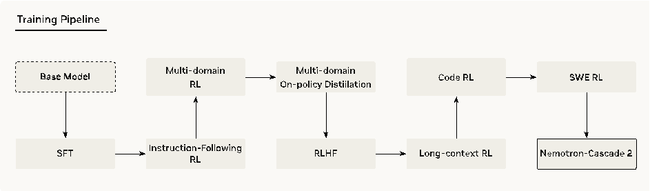

*### Image Description  The image is a training pipeline, which is a sequence of steps that are used to train a machine learning model. The pipeline is structured as follows:  - **Base Model**: This is the initial step, where the model is trained on the training data. - **Multi-domain**: This step is where the model is trained on the multi-domain data. Multi-domain data refers to the set of features that are used to train the model. - **Multi-domain On-policy Distillation**: This step is where the model is trained on the multi-domain data. Multi-domain data refers to the set of features that are used to train the model. - **Sweep**: This step is where the model is trained on the multi-domain data. Sweep is a feature extraction step that is used to extract the features from the multi-domain data. - **Sweep-following**: This step is where the model is trained on the multi-domain data. Sweep-following is a feature extraction step that is used to extract the features from the multi-domain data. - **Instruction-Following**: This step is where the model is trained on the multi-domain data. Instruction-following is a feature extraction step that is used to extract the features from the multi-domain data. - **Nemotron-Cascade 2**: This step is where the model is trained on*

Training Pipeline

Multi-domain

Multi-domain

Base Model

Code RL

SWE RL

RL

On-policy Distiilation

Instruction-Following

SFT

RLHF

Long-context RL

Nemotron-Cascade 2

RL

Figure 2: Nemotron-Cascade 2 applies Cascade RL with the sequential, domain-wise ordering after SFT, leading to substantial improvements across the corresponding domains.

degradation. We continue with RLHF (§4.5) for human alignment, Long-context RL (§4.6) to enhance reasoning over massive input sequences, Code RL (§4.7) for competitive coding problems, and finally SWE RL (§4.8) for mastering agentic software interactions.

# 4.1.1. What determines the ordering of Cascade RL

The optimal ordering of stages within a Cascade RL pipeline is not a universal constant; rather, it is a dynamic function of the model's underlying behaviors and learning trajectories. In contrast to the original Nemotron Cascade (Wang et al., 2025), our current work Nemotron-Cascade 2 introduces significant improvements in SFT data quality and substantially scales the complexity of the RL environments and tasks. These advancements have fundamentally altered the model's behavioral dynamics, which require us to adopt a different order to better accommodate the evolving capabilities of LLMs.

Rule of thumb: Mitigating Inter-Domain Interference. Specifically , the rationale for this ordering is primarily driven by the need to mitigate catastrophic forgetting as the model interacts with increasingly diverse environments. Cascade RL provides a granular lens through which we can observe how specific domains compete or conflict, such as strict instruction adherence in IF-RL versus human preference alignment in RLHF. Our core design principle is to identify an ordering that minimizes negative interference across domains while thoroughly optimizing the highest-priority domains. By identifying which tasks serve as foundational priors and which act as specialized refinements, we can mitigate inter-domain interference.

Scaling via Multi-Domain Integration. Following this principle, the Cascade RL pipeline can incorporate multi-domain RL stages when specific domains are found to be non-conflicting or beneficial to the overall performance. This integrated approach is particularly effective as RL environments and datasets grow in complexity, while ensuring that the model maintains a broad performance profile across various benchmarks, as detailed in §4.3.

Stabilization through On-policy Distillation. Furthermore, We find that Multi-domain On-policy Distillation (§4.4) serves as a critical stabilization point in this ordering. It is effective at recovering benchmark performance that may have regressed during earlier, more specialized stages of the cascade RL, leading to a more balanced and robust final policy model.

# 4.1.2. RL Training Configuration

file:///C:/Users/boxinw/Downloads/cascade2.drawio.html 1/1 Throughout the entire Cascade RL process, we use Group Relative Policy Optimization (GRPO) algorithm (Shao et al., 2024) with strict on-policy training following Nemotron Cascade (Wang et al., 2025). We adopt on-policy training for improved stability and higher accuracy. We conduct our training using the Nemo-RL repository (NVIDIA, 2025).

--- Page 11 ---

At each iteration, we generate a group of 𝐺 rollouts from the current policy 𝜋 𝜃 and then perform a single gradient update. This ensures that the policy used for data collection always matches the one being updated, making the importance sampling ratio exactly 1. This on-policy setup contributes to stable RL training and mitigates entropy collapse. In addition, we remove KL divergence term entirely, which simplifies the GRPO objective to the standard REINFORCE objective (Williams, 1992) with group-normalized rewards and token-level loss (Yu et al., 2025):

$$
𝒥 GRPO ( 𝜃 ) = E ( 𝑞,𝑎 ) ∼𝒟 , { 𝑜 𝑖 } 𝐺 𝑖 =1 ∼ 𝜋 𝜃 ( ·| 𝑞 ) [︃ 1 ∑︀ 𝐺 𝑖 =1 | 𝑜 𝑖 | 𝐺 ∑︁ 𝑖 =1 | 𝑜 𝑖 | ∑︁ 𝑡 =1 ˆ 𝐴 𝑖,𝑡 ]︃ , where ˆ 𝐴 𝑖,𝑡 = 𝑟 𝑖 -mean ( { 𝑟 𝑖 } 𝐺 𝑖 =1 ) std ( { 𝑟 𝑖 } 𝐺 𝑖 =1 ) for all 𝑡, (1)
$$

and { 𝑟 𝑖 } 𝐺 𝑖 =1 denotes the group of G rewards assigned to the sampled responses { 𝑜 } 𝐺 𝑖 =1 for a given question 𝑞 drawn from the dataset 𝒟 , verified against the ground-truth answer 𝑎 in RLVR. For RLHF, 𝑟 𝑖 is the aggregated reward score from the generative reward model for response 𝑜 𝑖 and question 𝑞 . Details of the reward functions for different domains will be provided in the corresponding subsections.

# 4.2. Instruction-Following Reinforcement Learning (IF-RL)

In this subsection, we describe our instruction-following RL recipe, which serves as the first stage of our Cascade RL. We demonstrate that applying verifiable IF-RL significantly improves instruction adherence, achieving a state-of-the-art accuracy of 83.13% on IFBench (Pyatkin et al., 2025).

# 4.2.1. Dataset

We use the same instruction-following training data used for NVIDIA Nano-v3 post-training (Blakeman et al., 2025). The instructions in this dataset are designed for objective verifiability, for instance, requiring a response to be under 200 words. This making the dataset well-suited for training and evaluating models on strict adherence. Given the high baseline quality of the data, our curation process mainly resolves formatting inconsistencies within the keyword arguments for certain instruction types (e.g., count_increment_word ).

# 4.2.2. Training recipe

Following (Wang et al., 2025), we also apply dynamic filtering (Yu et al., 2025). This technique filters out samples where all rollouts are either entirely correct or entirely incorrect. By ensuring that every prompt in a batch provides effective gradients, dynamic filtering stabilizes IF-RL training and pushes the upper bound of model performance. Furthermore, we observed that extended IF-RL training can lead to excessive token usage, which is often unnecessary for fulfilling specific constraints in general chat domains. To mitigate this, we apply overlong penalty, which penalizes samples that fail to complete generation within the maximum sequence length with a zero reward.

Unlike Nemotron Cascade (Wang et al., 2025), we position IF-RL as the first stage of our Cascade RL training for two primary reasons: (i) IF-RL can negatively impact human alignment capabilities (e.g., ArenaHard), while our subsequent generative-reward-model-based RLHF has a negligible impact on instruction following scores. By prioritizing instruction adherence first, we can focus on maximizing instruction following performance and then utilize the later stages to recover and refine human preference alignment. (ii) An early IF-RL stage produces a model with superior instruction-following capabilities, which serves as a strong teacher for subsequent multi-domain on-policy distillation. Another difference from Nemotron Cascade (Wang et al., 2025) is that our IF-RL is trained exclusively in 'thinking mode' without incorporating a reward model. We found that the 'thinking mode' yields higher accuracy on instruction-following benchmarks (e.g., IFBench (Pyatkin et al., 2025)). Because subsequent RL stages recover any regressions in human preference alignment introduced during IF-RL, we can focus entirely on maximizing instruction adherence without incurring the computational overhead of an auxiliary reward model.

We use a batch size of 128, sampling 16 responses per prompt with temperature 1.0 and top-p 1.0. We adopt

--- Page 12 ---

a learning rate of 3e-6 with AdamW (Kingma, 2014), and set both the entropy loss coefficient and KL loss coefficient to 0. Our IF-RL with dynamic filtering takes around 180 steps. The full set of hyperparameters is provided in Appendix B.

# 4.3. Multi-domain RL

Following IF-RL, we conduct an additional stage of multi-domain RL that covers three capabilities: multi-choice question answering (MCQA) in the STEM domain, agentic tool calling, and structured output for instruction following. The datasets are drawn from the NVIDIA Nano-v3 RL training blend (Blakeman et al., 2025). The data mixture consists of approximately 55% MCQA, 30% agentic tool calling using the Workplace Assistant setup (Blakeman et al., 2025), and 15% structured output.

We group these domains into a single multi-domain RL stage for two main reasons. First, we do not observe performance degradation across evaluation benchmarks when training on the blended domains. Instead, the model exhibits consistent improvements on benchmarks including MMLU-Pro, 𝜏 2 -Bench, and IF-Bench. Second, the response lengths and verification times of these datasets are similar, which minimizes training inefficiencies caused by waiting for longer generations or slower environment verification.

During training, we use a batch size of 128 and sample 16 responses per prompt with temperature 1.0 and top-p 1.0 (see Appendix B). We adopt a learning rate of 3 × 10 -6 with AdamW (Kingma, 2014), and set both the entropy loss coefficient and KL loss coefficient to zero. This multi-domain RL stage runs for approximately 70 training steps.

# 4.4. Multi-domain On-Policy Distillation (MOPD)

While well-designed Cascade RL substantially reduces catastrophic forgetting compared with vanilla sequential RL in an arbitrary order, it does not fully eliminate capability drift as the number of training environments increases. In practice, we observe noticeable fluctuations across different benchmark categories tracked throughout training, and the dominant trade-offs differ by stage. For example, certain RLVR training often reduces model entropy and shortens reasoning traces, thus can negatively impact mathematical reasoning performance, while RLHF-oriented optimization can partially trade off against instruction-following behavior. These observations motivate an additional training stage for re-balancing capabilities within the Cascade RL process.

We therefore adopt multi-domain on-policy distillation (MOPD) (Agarwal et al., 2024; Lu and Lab, 2025; Xiao et al., 2026; Yang et al., 2025; Zeng et al., 2026) as a complementary post-training stage. In our setting, MOPD is particularly attractive for three reasons. First, teacher checkpoints can be selected directly from the Cascade RL pipeline by choosing the strongest validation checkpoint for each benchmark category, which makes it easy to assemble a capability-diverse teacher pool without introducing external model families. Second, because these teachers are derived from the same SFT initialization, they share the same tokenizer and vocabulary as the student, reducing distribution shift and avoiding additional alignment issues. Third, MOPD provides a dense token-level training advantage, which is especially useful compared with sparse outcome rewards, and in Figure 3(c) we show its training-efficiency benefits compared with GRPO.

# MOPD objective.

Let 𝜋 inf denote the student policy used for response generation in the inference engine, and let 𝜋 train denote the student policy optimized by the training engine. For each prompt 𝑥 , we sample a response 𝑦 = ( 𝑦 1 , . . . , 𝑦 𝑇 ) ∼ 𝜋 inf ( · | 𝑥 ) . We then select a domain teacher 𝜋 domain 𝑖 for that training example, where domain 𝑖 indicates the capability domain associated with the chosen teacher. Writing 𝑠 𝑡 = ( 𝑥, 𝑦 <𝑡 ) for the decoding state at step 𝑡 , we define the token-level distillation advantage using reverse-KL as

$$
𝑎 MOPD 𝑡 = log 𝜋 domain 𝑖 ( 𝑦 𝑡 | 𝑠 𝑡 ) -log 𝜋 train ( 𝑦 𝑡 | 𝑠 𝑡 ) . (2)
$$

--- Page 13 ---

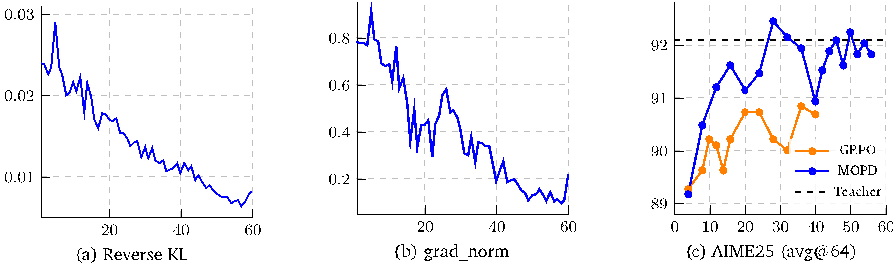

*The image is a line graph titled "AME25 (avg@64)" with a title at the top that reads "AME25 (a) Reverse KL." The x-axis is labeled "(a) Reverse KL" and ranges from 0 to 100. The y-axis is labeled "0.01" and ranges from 0 to 90. The graph shows a downward trend in the values of the "AME25" variable, with the highest value being 90 and the lowest being 0.01.  The graph has two main axes: the x-axis (a) and the y-axis (0.01). The x-axis is labeled "0.01" and ranges from 0 to 90. The y-axis is labeled "0.01" and ranges from 0 to 90.  The graph shows a downward trend in the values of the "AME25" variable, with the highest value being 90 and the lowest being 0.01. The graph also shows a downward trend in the values of the "AME25" variable, with the highest value being 90 and the lowest being 0.01.  There are two lines on the graph: the "AME25" line and the "0.01" line. The "*

0

.

03

0

.

8

92

0

.

6

0

.

02

91

0

.

4

90

GRPO

MOPD

0

.

01

0

.

2

Teacher

89

0

10

20

30

40

50

60

20

40

60

20

40

60

(c) AIME25 (avg@64)

(b) grad_norm

(a) Reverse KL

Figure 3: Training dynamics and downstream evaluation.

Intuitively , this term is positive when the domain teacher assigns a higher probability to the sampled token than the current training policy, and therefore serves as a dense token-level distillation advantage that converges toward 0 during training. The log-probability difference is computed only on the student-sampled token rather than over the full vocabulary.

Because responses are sampled under 𝜋 inf but optimized under 𝜋 train , we apply truncated importance weighting to account for train-inference mismatch:

$$
𝑟 𝑡 = 𝜋 train ( 𝑦 𝑡 | 𝑠 𝑡 ) 𝜋 inf ( 𝑦 𝑡 | 𝑠 𝑡 ) , 𝑤 𝑡 = sg[ 𝑟 𝑡 ] 1 [ 𝜖 low ≤ 𝑟 𝑡 ≤ 𝜖 high ] , (3)
$$

where sg[ · ] denotes stop-gradient. We then optimize the surrogate objective

$$
ℒ MOPD = -E 𝑥 ∼𝒟 , 𝑦 ∼ 𝜋 inf ( ·| 𝑥 ) ⎡ ⎣ 1 |𝒱 ( 𝑦 ) | ∑︁ 𝑡 ∈𝒱 ( 𝑦 ) 𝑤 𝑡 sg [︀ 𝑎 MOPD 𝑡 ]︀ log 𝜋 train ( 𝑦 𝑡 | 𝑠 𝑡 ) ⎤ ⎦ , (4)
$$

where 𝒱 ( 𝑦 ) is the set of valid response tokens retained by the token mask.

# Hyperparameters.

Unless otherwise specified, we use a rollout size of 4 and 128 prompts per update, giving an effective batch size of 512 responses. In later experiments, we find that using 512 prompts with rollout size 1 yields slightly more stable optimization while producing similar final results. We use a learning rate of 2 × 10 -6 with linear warm-up over the first 30 optimization steps, starting from 2 × 10 -7 . Training typically converges within 40-50 optimization steps (Fig. 3(a)). We find the warm-up stage important for stability: gradient norms are substantially larger at the beginning of training and decrease rapidly after the warm-up phase (Fig. 3(b)). For truncated importance weighting, we set 𝜖 low = 0 . 5 and 𝜖 high = 2 . 0 . In the main experiments, we use three domain teachers corresponding to math, RLHF, multi-domain. The math teacher is the initial SFT checkpoint, which already exhibits strong mathematical reasoning capabilities thanks to the meticulously curated SFT dataset. The RLHF teacher is a checkpoint optimized through RLHF from the initial SFT checkpoint. The multi-domain teacher is selected from the checkpoints after previous IF-RL + Multi-domain RL stages. We sample prompts accordingly from the RL training data pools (RLHF, IF-RL, and Multi-domain), as well as from AceReason-Math for math (Chen et al., 2025).

# Training efficiency advantage.

MOPD provides a dense token-level distillation advantage, whereas GRPO relies on a sparse sequence-level outcome reward that is shared across all generated tokens. This makes MOPD substantially more sample- and step-efficient in practice. Starting from the same initial checkpoint, MOPD consistently reaches stronger performance in fewer optimization steps. On AIME25 (Figure 3(c)), under math-only training, GRPO improves from

--- Page 14 ---

Table 3: Comparison of MOPD and RLHF at matched evaluation checkpoints on ArenaHard V2.0.

| | |ArenaHard v2| |
|---|---|---|---|
|Method|Steps|Hard Prompt|Creative Writing|
|Initial|0|71.5|40.6|
|RLHF|100 160|81.7 80.7|68.6 71.2|
|MOPD|52|85.5|71.0|

89.9 to 91.0 after 25 steps, while MOPD reaches 92.0 within 30 steps and recovers teacher-level performance. A similar trend appears on ArenaHard v2 (Table 3). After 52 steps, MOPD improves Hard Prompt from 71.5 to 85.5 and Creative Writing from 40.6 to 71.0. In contrast, RLHF training requires 160 steps to reach 80.7 on Hard Prompt and 71.2 on Creative Writing. These results show that the dense token-level advantage in on-policy distillation lead to much faster training convergence.

# 4.5. Reinforcement Learning from Human Feedback (RLHF)

Building on multi-domain on-policy distillation, our RLHF recipe focuses on human preferece learning. This process further enhances creative writing and non-verifiable problem-solving in coding and mathematics, as measured by ArenaHard v2 (Li et al., 2024), while maintaining performance across other domains without degradation.

# 4.5.1. Dataset

Weadopt the RLHF training dataset from NVIDIA Nano-v3 (Blakeman et al., 2025), which comprises HelpSteer3 (Wang et al., 2025), a commercially-friendly subset of the arena-human-preference-140k dataset (Chiang et al., 2024), and a synthetic safety blend (Blakeman et al., 2025). Following the NVIDIA Nano-v3 (Blakeman et al., 2025), we utilize Qwen3-235B-A22B-Thinking-2507 (Yang et al., 2025) as our generative reward model (GenRM), trained via the HelpSteer3 framework (Wang et al., 2025). Given a conversation history, a user request, and two candidate responses, the GenRM first reasons through the strengths and weaknesses of each response before producing individual helpfulness scores and a final comparative ranking.

# 4.5.2. Training recipe

Following a training recipe similar to NVIDIA Nano-v3 (Blakeman et al., 2025), we conduct RLHF using the GenRM. To ensure the training signals are of high quality, we adopt pair-wise comparisons for all pairs of rollouts per prompt. We aggregate the reward scores in the same way as NVIDIA Nano-v3 RLHF training, and apply the same length-normalized reward adjustment and quality-gated conciseness bonus (Blakeman et al., 2025). These mechanisms encourage shorter responses without sacrificing quality, effectively mitigating the rapid growth of inference token usage.

Different from Nemotron Cascade (Wang et al., 2025), we train RLHF exclusively in the thinking mode. While incorporating both thinking and non-thinking modes can improve training convergence and yield slight gains on evaluation benchmarks, we observe a significant degradation in instruction-following performance. The resulting drop is substantial enough that the gains obtained in the earlier RLVR stage cannot be fully recovered.

# 4.5.3. Hyper-parameters

We use a batch size of 128, generating 16 rollout per prompt with a temperature of 1.0 and a top-p value of 1.0. We use a maximum response length of 16K during RLHF without applying overlong filtering. We adopt a learning rate of 3e-6 with AdamW (Kingma, 2014). We set the entropy loss coefficient to 0 and the KL loss coefficient to 0.03 to keep the model capabilities on other domains. The training takes around 30 steps.

--- Page 15 ---

# 4.6. Long-context RL

Following RLHF, we conduct a stage of long-context RL to further enhance the model's long-context understanding and reasoning capabilities. We use the NVIDIA Nano-v3 RL data blend (Blakeman et al., 2025), but restrict this phase to long-context datasets only. In our experiments, incorporating other domains during long-context RL negatively affects performance on unrelated benchmarks, motivating this domain-specific training setup.

We adopt the Nemo-Gym RL environment (NVIDIA, 2025) and use Qwen3-235B-A22B-Instruct-2507 as an LLM judge to evaluate model rollouts for question answering tasks. During training, input sequences are limited to 32K tokens, and the maximum sequence length is set to 49K tokens without applying overlength filtering.

We train with a batch size of 128, generating 16 rollouts per prompt with temperature 1.0 and top-p 1.0. Optimization is performed using AdamW (Kingma, 2014) with a learning rate of 3 × 10 -6 , while both the entropy and KL loss coefficients are set to zero. Training runs for approximately 30 steps, as we observe a rapid increase in generated tokens beyond that point.

# 4.7. Code RL

# 4.7.1. Data Curation

We construct our Code RL training set from the Nemotron-Cascade coding corpus (Wang et al., 2025), which contains coding prompts sourced from modern competitive programming platforms such as AtCoder, Codeforces, and AIZU with robust test cases for reward verification. To improve training efficiency and strengthen deep reasoning, we aggressively filter out prompts that GPT-OSS-120B solves correctly in all 8 of 8 rollouts, yielding a compact final set of only 3.5K samples. We find that high-difficulty prompts paired with strong test cases are critical for further boosting model performance.

# 4.7.2. Training Details

We conduct Code RL using a batch size of 128 and a learning rate of 3 × 10 -6 with the AdamW optimizer. Compared to Nemotron-Cascade, we increase the maximum response length during RL to 118K tokens and the number of rollouts per sample to 16, enabling the policy to better capture sparse reward signals on extremely difficult problems that require long reasoning traces. We adopt the strict binary reward function to avoid potential reward hacking and keep the whole training to be fully on-policy for stability. To support the resulting verification throughput of 128 × 16 = 2 , 048 code executions per RL step, we deploy an asynchronous reward verification server that completes each batch in 427.2 seconds across 384 CPU cores.

# 4.8. Software Engineering Reinforcement Learning (SWE RL)

# 4.8.1. Agentless RL

# Training Details and Hyperparameters.

To enhance the models' code repair capability, we adopt the same data source as Wang et al. (2025) for agentless code repair reinforcement learning (RL) training. Since most instances do not provide executable Docker environments, we employ GPTOOS-120B as a reward model to evaluate the quality of code repairs generated by our models. Following Wang et al. (2025), for each instance we construct prompts using both the golden localization and the top5 retrieved localizations, and filter out relatively easy samples. We perform agentless SWE RL with a batch size of 128 × 16 = 2 , 048 (128 prompts with 16 rollouts per prompt), a maximum sequence length of 98,304, and a learning rate of 3 × 10 -6 using the AdamW optimizer. We sample responses with temperature 1.0 and top-p 1.0. During training, we mask the loss for prompts for which none of the rollouts receives a reward greater than 0.5. We observe that these difficult prompts degrade the stability and effectiveness of agentless SWE RL training. Our agentless RL training typically converges within 40-50 steps.

--- Page 16 ---

Table 4: Effectiveness of Agentless RL on SWE-bench Verified.

|Scaffold|Agentless Mini| |OpenHands| |
|---|---|---|---|---|
| |avg@4|pass@4|avg@4|pass@4|
|Init.|41.9%|55.2%|49.8%|64.2%|
|after Agentless RL|44.3%|57.4%|50.8%|65.0%|

# Can Agentless RL Training Helps Agentic Tasks?

Table 4 shows that agentless RL training not only improves model performance within the agentless framework but also enhances the models' ability to solve SWE tasks in agentic settings. Note that for Agentless Mini evaluation, we employ a code embedding model, NV-Embed-Code (Sohrabizadeh et al., 2025), to retrieve 5 candidate files whose code contents are semantically similar to the problem context. This result suggests that improving models' code repair capability alone can generalize across different scaffolds, consistent with the observations from Yang et al. (2026).

# 4.8.2. Execution-based RL for Agentic SWE Scaffold

Modern software engineering agents rely on scaffolding frameworks that coordinate repository interaction, tool calling, code editing, and test execution. Training agents to operate effectively within these environments requires optimizing not only individual model outputs but the entire problem-solving trajectory. To address this, we apply Reinforcement Learning from Verifiable Rewards (RLVR) directly within agentic SWE scaffolds, enabling end-to-end optimization of the full agent workflow. Our training environments integrate established OpenHands frameworks (Wang et al., 2025), which provide structured tool usage, repository interaction, and iterative patch generation.

We train agents using execution-based reinforcement learning in fully executable software environments, where each episode corresponds to resolving a software issue instance from benchmarks such as SWE-bench. The agent operates inside an instrumented repository that exposes tools for file inspection, search, code editing, and test execution. Candidate patches generated by the agent are executed within the environment, which returns verifiable signals from compilation results and unit test outcomes, enabling automatic reward computation without human annotation. Through the OpenHands scaffolding framework, the agent iteratively localizes defects, proposes patches, and validates them through test execution. Environment feedback-including compilation errors, failing tests, or successful test passes-provides deterministic rewards that directly reflect functional correctness.

Specifically , we conduct execution-based agentic reinforcement learning with a batch size of 1024, corresponding to 16 prompts with 64 rollouts per prompt. The maximum context length is set to 256k tokens, and the agent is allowed up to 200 interaction turns, providing a larger reasoning token budget during agentic coding problem solving. Training data is drawn from SWE-Gym (Pan* et al., 2025) and R2E-Subset (Jain et al., 2025). We generate 16 rollouts per instance using our intermediate model and evaluate them using the verification pipeline. Instances for which all rollouts pass verification (100% accuracy), indicating overly simple problems, are removed from the dataset. For instances where none of the rollouts pass verification (0% accuracy), indicating extremely difficult problems, we randomly discard 90% of such cases to reduce their proportion in the training data.

# 5. International Mathematical Olympiad (IMO)

# 5.1. IMO 2025

In Table 2, we evaluate Nemotron-Cascade-2-30B-A3B on the IMO 2025 problem set using a self-improving test-time scaling framework (Shao et al., 2025), in which the model iteratively generates candidate solutions,

--- Page 17 ---

verifies them, and refines them based on its own feedback. Remarkably, despite its relatively modest 30B-A3B scale, the model successfully solves the first five problems. We provide the full model solutions in Appendix E, together with comments from the human expert. These results are particularly encouraging, as they suggest that strong olympiad-level mathematical reasoning can emerge from a comparatively compact model when paired with effective inference-time scaling. There remain several promising directions for improvement: expert review indicates that some proofs are longer than necessary, include superfluous intermediate steps or definitions, occasionally expose traces of intermediate reasoning, and sometimes contain minor typographical issues. For Problem 2, the model adopts an analytic solution strategy, similar to OpenAI's approach, rather than a more geometric approach such as that used by Gemini Deep Think (IMO Gold).

# 5.2. IMO-ProofBench

Table 5: IMO-ProofBench (Luong et al., 2025) reports scores split into the Basic (30 problems) and Advanced (30 problems) subtasks, as well as Overall (60 problems). Expert-evaluated results are taken from the IMOProofBench leaderboard (accessed on 2026/3/9).

|Model|IMO-ProofBench| | |
|---|---|---|---|
| |Basic (30)|Advanced (30)|Overall (60)|
|Aletheia (Feng et al., 2026)|-|91.9|-|
|Gemini 3 Deep Think (Gemini Team, 2026)|-|76.7|-|
|Gemini Deep Think (IMO Gold) (Gemini Team, 2025)|89.0|65.7|76.7|
|DeepSeek-Math-V2-671B-A37B (Shao et al., 2025)|99.0|61.9|80.2|
|DeepSeek-Math-V2-671B-A37B ( our reproduced score ) †|99.5|57.7|78.6|
|Nemotron-Cascade-2-30B-A3B †|92.5|53.4|72.9|
|GPT-5.2-Thinking (high) (OpenAI, 2025)|-|35.7|-|
|Gemini 3 Pro (Gemini Team, 2025)|-|30.0|-|
|GPT-5 Pro (OpenAI, 2025)|-|28.6|-|

† Use DeepSeek-V3.2-Speciale as the judge model with LLM ProofAutoGrader prompt (Luong et al., 2025).

As shown in Table 5, Nemotron-Cascade-2-30B-A3B achieves 72 . 9 on IMO-ProofBench with generate-verifyrefine test-time scaling, placing it within 8 points of DeepSeek-Math-V2-671B-A37B despite using 10 × fewer active parameters. It reaches 90+ on Basic split and surpass the QED-Nano-4B ( 54 . 0 ) (LM-Provers et al., 2026) by 18 points, though the latter is not directly comparable due to judge model. Re-evaluating the provided DeepSeek-Math-V2 proofs under our LLM-judge setup yields a score within 4 points of the reported human rating, suggesting that our protocol does not substantially overestimate performance (more details in Appendix A.1.2). In Figure 4, we show that increasing test-time compute improves Nemotron-Cascade-2-30BA3B on IMO-ProofBench (Advanced), raising the score from 40.7 at round 1 to 53.4 at round 5 and narrowing the gap to DeepSeek-Math-V2 under the same grader.

# 6. Competitive Coding

# 6.1. IOI 2025 and ICPC World Finals 2025

For IOI 2025, we adapt the IOI Test-Time Scaling pipeline from Nemotron-Cascade (Wang et al., 2025), which can be viewed as a multi-round generate-select-submit framework that exploits the model's reasoning ability under IOI's official rules. Each subtask is allotted at most 50 rounds. Within each round, we prompt our model to generate 40 candidate solutions, aggregated with (1) submission history with official judge verdicts from previous rounds, and (2) shared insights from high scored or fully solved subtasks within the same main task. The complete chat template is provided in Appendix C.1. Using this approach, we achieved full score on Problem 3 and 4, achieving a gold-medal score of 439.28 within at most 40 × 50 = 2000 model generations, while the score of 507.66 is achievable within 5000 generations. Notably, on Problem 2 which requires designing and optimizing a heuristic algorithm, our pipeline reached over 86 points in just 5 rounds (at most 200 model generations), demonstrating the effectiveness of self-refinement and cross-subtask insights.

--- Page 18 ---

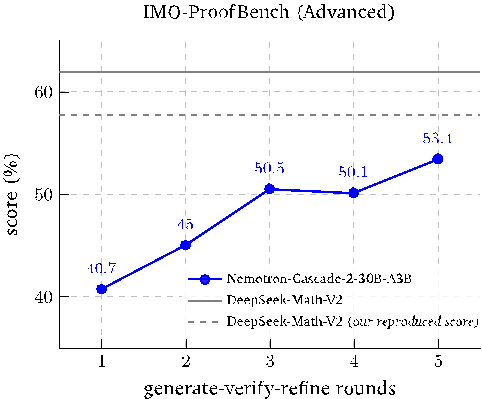

*The image is a line graph titled "IMO-ProofBench (Advanced)". The graph is labeled as such, and it is a line graph with a linear scale of range 0 to 60 on the y-axis, labeled "score (g)", with a linear scale of range 0 to 60 on the x-axis, labeled "generate-verify-refine rounds". The graph has a blue line that is drawn from the y-axis to the x-axis, with a linear scale of range 0 to 60 on the y-axis. The graph has a scale from 0 to 60 on the x-axis, labeled "generate-verify-refine rounds", with a linear scale of range 0 to 60 on the x-axis.  ### Description of the Graph: 1. **Y-Axis**: The y-axis is labeled "score (g)", with a linear scale of range 0 to 60 on the x-axis. 2. **X-Axis**: The x-axis is labeled "generate-verify-refine rounds", with a linear scale of range 0 to 60 on the x-axis. 3. **Line**: The graph has a blue line that is drawn from the y-axis to the x-axis. The line is drawn from the y-axis to the x-axis, with a linear scale of range*

# IMO-ProofBench (Advanced)

60

53

.

4

score (%)

50

.

5

50

.

1

50

45

40

.

7

Nemotron-Cascade-2-30B-A3B

40

DeepSeek-Math-V2

our reproduced score

DeepSeek-Math-V2 (

)

1

2

3

4

5

generate-verify-refine rounds

Figure 4: IMO-ProofBench (Advanced) score graded by LLM ProofAutoGrader (DeepSeek-V3.2-Speciale).

Table 6: Competitive programming results on comprehensive benchmarks, evaluated against a significantly expanded set of proprietary and open-source baseline models.

| |LiveCodeBench v6|LiveCodeBench Pro| | | | | |Codeforces| |
|---|---|---|---|---|---|---|---|---|---|
|Models| | |25Q1| |25Q2| | |2501 - 2507| |
| |2408 - 2505|Easy|Med|Hard|Easy|Med|Hard|ELO|Percentile|
|GPT-5.2 (high)|-|96.6|75.0|5.9|91.8|59.6|23.1|2590|99.9|
|Gemini-3 Pro|90.7|94.4|70.0|5.9|94.8|45.6|7.7|2440|99.8|
|GPT-o4-mini (high)|80.2|85.4|51.7|0.0|84.5|29.8|0.0|2266|99.5|
|DeepSeek-v3.2-Speciale|88.7|89.7|48.1|0.0|88.5|43.1|0.0|2353|99.7|
|GPT-OSS-120B (high)|87.0|88.8|41.9|0.7|88.5|31.1|0.0|2320|99.6|
|Kimi-K2.5-1T-thinking|85.0|88.5|45.6|0.0|90.2|37.9|0.0|2333|99.7|
|Qwen-3.5-397B-A17B|83.6|89.3|44.4|0.0|88.1|31.4|0.0|2350|99.7|
|Qwen-3.5-122B-A10B|78.9|87.6|35.6|0.0|84.3|24.2|0.0|2233|99.4|
|Qwen-3.5-35B-A3B|74.6|84.6|25.6|0.0|81.1|17.8|0.0|2181|99.1|
|Nemotron-3-Super-120B-A12B|78.7|83.0|31.0|0.0|81.7|23.2|0.0|2212|99.4|
|Qwen3-235B-A22B-Thinking-2507|78.7|75.8|18.8|0.0|77.6|17.5|0.0|2119|98.6|
|Nemotron-Cascade-14B|74.6|71.6|16.3|0.0|68.9|10.5|0.0|2004|97.9|
|Qwen3-Next-80B-A3B-Thinking|73.2|68.5|16.3|0.0|69.1|7.5|0.0|1894|96.8|
|Nemotron-3-Nano-30B-A3B|68.3|60.3|6.0|0.0|54.5|3.5|0.0|1681|93.1|
|Nemotron-Cascade-2-30B-A3B|87.2|88.1|39.2|0.7|87.0|27.6|0.0|2320|99.6|
|Nemotron-Cascade-2-30B-A3B (TIR)|88.4|91.0|45.2|2.2|89.3|36.8|0.0|2345|99.7|

For ICPC World Finals 2025, we generate up to 1000 solutions per problem and submit them for official evaluation after initial filtering. We successfully solved 10 out of 12 problems, achieving the #4 Gold medal placement, with 8 problems (except Problems A and I) solved within only 100 submissions.

# 6.2. Competitive Coding Benchmark Results

We evaluate our Nemotron-Cascade-2-30B-A3B model on various competitive coding benchmarks, including LiveCodeBench v6 (Jain et al., 2024), and LiveCodeBench Pro (Zheng et al., 2025)'s 25Q1 and 25Q2 splits. We also estimate Codeforces ELO score through simulated participation on 40 Div.1/Div.2 Codeforces Rounds held from 2501 to 2507. We report our avg@8 results under 128K-token thinking budget, the sampling temperature of 1.0 and the top_p of 0.95. For Tool-Integrated Reasoning (TIR) results, we allow our model to call a stateful Python executor for up to 100 calls. For baseline model evaluation, we follow their recommended inference configurations, ensuring a thinking budget of at least 128K tokens to at most 256K tokens. More evaluation

--- Page 19 ---

details can be found in Appendix A and Appendix D.

As shown in Table 6, Nemotron-Cascade-2-30B-A3B achieves magnificent Pass@1 accuracy and ELO rating, even compared with frontier open-source models with over 100B total params, such as Nemotron-3-Super120B-A12B, GPT-OSS-120B, and Qwen-3.5-122B-A10B. With Tool-Integrated Reasoning (TIR), our model's performance can be further boosted especially on hard problems, and match the strongest open-source models with more than 300B total parameters, such as Kimi-K2.5-1T-Thinking, Qwen-3.5-397B-A17B, and DeepSeekv3.2-Speciale, which either lack TIR support for deep reasoning or perform poorly with Python TIR. Notably, Nemotron-Cascade-2-30B-A3B achieves above 0% on the LiveCodeBench Pro hard split within 8 attempts, demonstrating strong reasoning ability on problems that are extremely difficult even for humans.

# 7. Acknowledgments

We would like to extend our gratitude to the NVIDIA Nemo team for the valuable discussion and collaboration on building reasoning models. We especially wish to thank Boris Ginsburg, Oleksii Kuchaiev, Igor Gitman, Olivier Delalleau, Zhilin Wang, Olivier Delalleau, Tugrul Konuk, Wei Du, Somshubra Majumdar, Wasi Uddin Ahmad, Siddhartha Jain, Jiaqi Zeng, Yi Dong, Alexander Bukharin, Vahid Noroozi, Khushi Bhardwaj, Sugam Dipak Devare, Jian Zhang, and Jonathan Cohen.

We thank Ying Lin for helpful discussions and useful input in building the knowledge-intensive SFT dataset. We also thank Atefeh Sohrabizadeh, Jialin Song, and Jonathan Raiman for valuable discussions on SWE-bench.

--- Page 20 ---

# Appendix

# A. Benchmarks and Evaluation Setups

# A.1. Math

# A.1.1. Non-proof Math

For non-proof math reasoning tasks, we include

- AIME 2025 (MAA, 2025) consists of 30 problems from American Invitational Mathematics Examination at 2025.
- AIME 2026 (MAA, 2026) consists of 30 problems from American Invitational Mathematics Examination at 2026.

HMMT Feb 2025 (HMMT, 2025) consists of 30 problems from Harvard-MIT Mathematics Tournament 2025 February math competition.

IMO-AnswerBench (Luong et al., 2025) consists of 400 problems with verifiable answers carefully chosen from past Olympiad competitions and then altered by experts to avoid memorization.

For Nemotron-Cascade-2-30B-A3 evaluated on AIME 2025, AIME 2026 and HMMT 2025 Feb, we set the thinking budget (maximum response length) to 131K tokens, the sampling temperature to 1.0, the top-p value to 1.0. For the with-tool setting, we enable tool use by appending a system-prompt postfix, allowing the model to call a stateful Python executor for up to 100 tool calls with a maximum response length of 131K tokens. For IMO-AnswerBench, we set to 256K tokens because we found the questions are significantly more difficult. We use and report the LLM-Judge score using GPT-OSS-120B (Agarwal et al., 2025) as the judge and the AnswerAutoGrader prompt (Luong et al., 2025) for answer correctness on IMO-AnswerBench as the short answers are complicated for rule-based verifier to compute. Following Liu et al. (2024, 2026), we report avg@64 for AIME/HMMT and avg@16 for IMO-AnswerBench.

For baseline models, we use official numbers from their reports or evaluate them with the recommended settings if the official numbers are unavailable.

# A.1.2. Math Proof

For math proof tasks, we include

IMO 2025 (IMO, 2025) consists of 6 problems from IMO 2025.

IMO-ProofBench (Luong et al., 2025) is designed to evaluate the ability of AI models to construct comprehensive and valid mathematical arguments. This benchmark consists of 60 proof-based problems, curated to mirror the kinds of problems found in the IMO.

For Nemotron-Cascade-2-30B-A3, we apply test-time scaling following the DeepSeek-Math-V2 generate-verifyrefine pipeline, using the same instructions. We implement this pipeline with NeMo-Skills (NVIDIA, 2025). We use the default hyperparameters from DeepSeek-Math-V2: 128 proof generations, 64 verifications per proof, selection of the top 32 proofs for refinement, and 8 verification analyses paired with each proof, prioritizing the lowest-rated analyses. We then generate 4 refined proofs and continue for up to 8 rounds, or until the average proof score reaches the threshold of 0.99999. We set the maximum generation length to 256K tokens, with temperature 1.0 and top-p 0.95.

For IMO-ProofBench Basic and 11 problems from the Advanced split (i.e., Problems 1, 4, 7, 13, 14, 17, 19, 22, 25, 26, and 28), we reduce the compute budget to 32 proof generations, 16 verifications, top 8 proofs, and 2 rounds to save compute. For IMO-ProofBench evaluation, we use DeepSeek-V3.2-Speciale to make sure the results are reproducible later and run 64 grading attempts with the ProofAutoGrader prompt (Luong et al., 2025). We found that reporting mean score yields 73.8 for DeepSeek-Math-V2 on the Advanced

--- Page 21 ---

split, which is substantially more generous than the human rating of 61.9. We therefore adopt a simple aggregation rule based on analysis: if any judge assigns a score of 0, the final score is set to 0; otherwise, return the mean score . Under this rule, DeepSeek-Math-V2 obtains 57.7, which is much closer to the human rating and reduces the discrepancy from 11.9 points to 4.2 points.

# A.2. Code Reasoning

For code generation tasks, we include

LiveCodeBench (Jain et al., 2024) contains diverse algorithm coding problems with unit tests, collected from AtCoder, LeetCode platforms. We evaluate models competitive coding capability on LiveCodeBench v6 (2024/08-2025/05, 454 problems in total). We report pass@1 accuracy in thinking mode, averaged over 8 generations (avg@8).

LiveCodeBench Pro (Zheng et al., 2025) contains daily-updated challenging competitive coding problems with strong unit tests, collected mainly from top-tier coding contests. We report pass@1 accuracy on Easy/Med difficulty splits in thinking mode, averaged over 8 generations (avg@8) on two recently released subsets: 2025Q1 (2025/01-2025/04, 166 problems in total) and 2025Q2 (2025/04-2025/07, 167 problems in total).

IOI and ICPC World Finals represent the most challenging and prestigious annual algorithmic coding competitions, gathering the world's top human contestants. The IOI awards gold medals to approximately the top 8.3% (one-twelfth) of participants, while the ICPC World Finals (ICPCWF) limits gold medals to only the top 4 teams globally.

SciCode (Tian et al., 2024) serves as a challenging benchmark to evaluate model's ability on solving realistic scientific research tasks from STEM domains. It contains 338 subproblems from 80 main tasks.

For Nemotron-Cascade-2-30B-A3B evaluated on LiveCodeBench v6 and LiveCodeBench Pro, we use a 128Ktoken thinking budget, a sampling temperature of 1.0, a top-p of 0.95. For the with-tool setting, we enable tool use by appending a system-prompt postfix, allowing the model to call a stateful Python executor for up to 100 tool calls with a maximum response length of 131K tokens. We evaluate baseline models with their recommended inference configurations, ensuring a thinking budget of at least 128K tokens.

# A.3. Knowledge and STEM

For knowledge reasoning tasks, we include:

MMLU-Redux (Gema et al., 2024) is a benchmark consisting of a subset of 3,000 manually re-annotated questions across 30 MMLU subjects (Hendrycks et al., 2020), which eliminates the original annotation errors. We evaluate the models in thinking mode and, due to the large test set size, report exact match (EM) accuracy based on a single generation per question.

MMLU-Pro (Wang et al., 2024) is an enhanced version of the original MMLU benchmark that mitigates model saturation by expanding to over 12,000 graduate-level questions and increasing answer choices from four to ten. We report EM accuracy in thinking mode using one generation per question.

GPQA-Diamond (Rein et al., 2024) is a benchmark for assessing an LLM's scientific reasoning capability. It consists of the highest quality 198 GPQA questions covering graduate-level physics, biology, and chemistry. We report pass@1 accuracy in thinking mode, averaged over 8 generations per question (avg@8) to reduce variance.

HLE (Phan et al., 2025) is a frontier academic reasoning benchmark spanning a broad range of expert-level subjects. We evaluate on its text-only split, which contains 2,158 examples.

For Nemotron-Cascade-2-30B-A3B evaluated on MMLU-Redux, MMLU-Pro, GPQA-Diamond and HLE in thinking mode, we use a temperature of 1.0, a top-p value of 0.95, and a 128K-token thinking budget (maximum response length). For HLE, we use the default system prompt and append 'Please place your final answer inside

--- Page 22 ---

\boxed{} ' to each question, and use GPT-OSS-120B as the LLM judge for answer extraction and correctness verification with the prompt in Appendix C.2. Compared with the official HLE response format, which requests an explanation, an answer, and a confidence score, this boxed-answer prompt improves the accuracy by 6-7 points, primarily on the math subset, by better aligning with the answer format used in our math SFT data.

# A.4. Alignment and Instruction-Following

For alignment tasks, we include:

ArenaHard 2.0 (Li et al., 2024) is a human-preference alignment benchmark featuring 750 diverse and rigorous real-user prompts. The dataset is specifically structured with 500 prompts targeting open-ended software engineering problems and complex mathematical questions, while the remaining 250 focus on creative writing. It uses an automatic LLM-as-Judge approach to estimate human preferences relative to a baseline model, enabling fully automated, low-cost, and fast evaluation without human intervention. In our experiments, we report results without style control to allow for straightforward comparison with the officially reported numbers of other models. We evaluate the models in thinking mode, and use GPT-4.1 as the automated judge.

IFBench (Pyatkin et al., 2025) extends IFEval (Zhou et al., 2023) by introducing 58 new, diverse, and challenging verifiable out-of-domain instruction constraints. It provides a separate constraint list to ensure no overlap between training and test constraints, enabling evaluation of an LLM's generalization ability. The test set contains 294 prompts. We report pass@1 accuracy in thinking mode, averaged over 8 generations (avg@8).

Scale AI Multi-Challenge (Deshpande et al., 2025) is a benchmark designed to evaluate LLMs in multi-turn conversations with human users. It consists of four challenge categories: Instruction Retention, Inference Memory, Reliable Versioned Editing, and Self-Coherence. These tasks require models to simultaneously perform accurate instruction following, effective context management, and in-context reasoning. The test set contains 273 conversations in total. We report pass@1 accuracy in thinking mode, averaged across 10 generations (avg@10).

For Nemotron-Cascade models evaluated on IFEval in non-thinking mode, on IFBench and ArenaHard in thinking mode, we use a temperature of 0.6, a top-p value of 0.95, and a maximum response length of 32K tokens. For baseline models, we use officially reported results whenever available; if such results are absent, we evaluate them using their recommended inference configuration or the same settings as ours.

# A.5. Long Context and Context Learning

For long context and context learning tasks, we include:

AA-LCR (Team, 2025) consists of 100 challenging text-based questions that require reasoning over multiple long, real-world documents, including company reports, government consultations, legal documents, and academic papers. Each sample contains a document set averaging approximately 100k tokens. The questions are designed such that answers cannot be directly retrieved from the documents and instead require reasoning across multiple sources of information. We report pass@1 accuracy in thinking mode, averaged over 16 generations (avg@16).

LongBench v2 (Bai et al., 2025) contains 503 challenging multiple-choice questions with context lengths ranging from 8k to 2M words. The benchmark spans six task categories: single-document QA, multidocument QA, long in-context learning, long dialogue history understanding, code repository understanding, and long structured data understanding. The questions are designed to be difficult; even human experts equipped with document search tools may require substantial time to answer them correctly. We evaluate models in thinking mode and report pass@1 accuracy averaged over four generations (avg@4).

NIAH@1M (Ruler Subset) refers to the needle-in-a-haystack (NIAH) tasks from the RULER benchmark (Hsieh et al., 2024). The NIAH test (Kamradt, 2023) assesses an LLM's long-context ability to retrieve

--- Page 23 ---

a specific piece of information (the 'needle') embedded within long distractor text (the 'haystack'). The RULER benchmark defines four variants of this task: Single NIAH, Multi-keys NIAH, Multi-values NIAH, and Multi-queries NIAH. Following Blakeman et al. (2025), we evaluate 100 instances from each category using a 1M-token context setting. Models are evaluated in reasoning-off mode, and we report pass@1 accuracy from a single generation (avg@1).

CL-Bench (Dou et al., 2026) evaluates an LLM's ability to learn from provided context and apply the acquired knowledge to solve tasks, a process referred to as context learning. The benchmark contains 1,899 test samples spanning 500 complex contexts and 31,607 verification rubrics, all developed by experienced domain experts. The knowledge required to complete these tasks largely falls outside what existing models typically learn during pre-training, requiring models to learn directly from the provided context. Models are evaluated in thinking mode, and we report pass@1 accuracy from a single generation (avg@1).

# A.6. Agentic Tasks

For agentic tasks, we include:

BFCL v4 (Patil et al., 2025) offers a comprehensive agentic evaluation framework for LLMs, covering tasks such as web search, memory reading and writing, and function invocation across multiple programming languages. We follow the official BFCL V4 evaluation protocol and report scores across a combination of Agentic, multi-turn, live, and non-live categories. Models are evaluated in thinking mode, and we report pass@1 accuracy based on a single generation (avg@1).

SWE-bench Verified (OpenAI, 2024) is a subset of the original test set from SWE-bench (Jimenez et al., 2023), consisting of 500 samples verified to be non-problematic by human annotators. We evaluate models in non-thinking mode and report pass@1 accuracy, averaged over 4 generations per prompt (avg@4).

𝜏 2 -Bench (Barres et al., 2025) evaluates multi-turn customer-service agents in environments with explicit policies, tool use, and shared world-state updates. We evaluate on the three official subsets: airline (50 examples), retail (114 examples), and telecom (114 examples). To keep the standard error within 1.5, we report avg@16 on airline and avg@8 on both retail and telecom.

Terminal Bench 2.0 (Merrill et al., 2026) is adopted for evaluating agents in terminal-based environments, which comprises of 89 human-validated tasks across specialized fields such as scientific computing, machine learning, and system administration. Moving beyond simple code generation, this benchmark focuses on end-to-end workflows, requiring agents to demonstrate proficiency in holistic operations like model training, system configuration, and software debugging rather than just producing isolated functions. We evaluate the model using the default Terminus-2 scaffolding. We report avg@5 task success rate.

For SWE-bench Verified, we use the OpenHands scaffold (Wang et al., 2025) as the agentic coding evaluation framework. We adopt a full interaction retention policy for agent trajectories, preserving the complete history of tool calls, observations, and model outputs across turns. This includes prior file views, search results, executed commands, and intermediate patches, enabling the model to maintain state and reason effectively over long-horizon debugging processes. We set the maximum context length to 256K tokens and allow up to 200 turns, consistent with our execution-based agentic SWE-RL training configuration. Notably, this evaluation setup closely mirrors our training environment, as both rely on execution-based feedback and multi-turn interaction within the same tool-augmented scaffold. This alignment reduces train-test mismatch and enables the model to more effectively transfer learned behaviors, such as iterative debugging, hypothesis refinement, and tool-driven reasoning, to the evaluation setting.

For 𝜏 2 -Bench evaluation, we adopt a latest-turn thought retention policy for managing reasoning traces in multiturn interactions: we retain the model's reasoning content after the most recent user turn, while discarding reasoning content from earlier turns. The official 𝜏 2 -Bench evaluation code follows a no thought carry-over policy, which removes all prior reasoning content; in our experiments, this evaluation setup consistently reduces scores by 3-5 points relative to latest-turn thought retention. We attribute this gap to train-test mismatch,

--- Page 24 ---

since our SFT data for 𝜏 2 -style interactions is constructed with the same latest-turn thought retention policy, which is also the thought-state management strategy used in Nemotron-3-Nano-v3 and DeepSeek-V3.2. For the telecom subset, we additionally modify the system prompt to emphasize the dual-control setting by repeating the instruction 'Make sure you guide the user through the steps, do not perform user-side actions yourself.' three times. We also tested a full thought retention policy, which preserves reasoning content from all previous turns and more closely matches RL training, but found it gives similar accuracy to latest-turn thought retention while incurring substantially longer contexts. We therefore report our final 𝜏 2 -Bench results using latest-turn thought retention.

# A.7. Multilingual

For multilingual tasks, we include:

MMLU-ProX (Xuan et al., 2025) expands the challenging MMLU-Pro benchmark to include 29 languages. Following Blakeman et al. (2025), six languages are selected for evaluation: English (en), German (de), Spanish (es), French (fr), Italian (it), and Japanese (ja). The model is evaluated in thinking mode, and we report pass@1 accuracy from a single generation (avg@1).

WMT24++ (Deutsch et al., 2025) extends the WMT24 machine translation benchmark to cover 55 languages. Following Blakeman et al. (2025), we evaluate on five translation pairs: English to German (en → de), English to Spanish (en → es), English to French (en → fr), English to Italian (en → it), and English to Japanese (en → ja). We use XCOMET-XXL (Guerreiro et al., 2024) as the evaluation metric to assess the translation quality. Our model is evaluated in thinking mode, and we report pass@1 accuracy based on a single generation (avg@1).

# B. Training Hyperparameters

We list the training hyperparameters for the Nemotron-Cascade-2-30B-A3B during all stages in Table 7, 9, 10.

Table 7: Training hyperparameters for Nemotron-Cascade-2-30B-A3B in SFT.

|Hyperparameters| |
|---|---|
|Global batch size|64|
|Packed sequence length|256 K|
|Max learning rate|5 × 10 - 5|
|Min learning rate|5 × 10 - 6|
|Learning rate warmup steps|200|
|Scheduler|cosine|
|Max Steps|40,000|
|Optimizer|AdamW|
|Optimizer config|𝛽 1 = 0 . 9 , 𝛽 2 = 0 . 98|
|Weight decay|0 . 1|
|# of training steps|33,000|

--- Page 25 ---

- Table 8: Training hyperparameters of Nemotron-Cascade-2-30B-A3B in Cascade RL (IF-RL, Multi-domain RL, MOPD).

|Hyper-parameters|IF-RL|Multi-domain RL|MOPD|
|---|---|---|---|
|Max response length|49K|49K|98K|
|Batch size|128|128|128|
|# Rollout size|16|16|4|
|Learning rate|3 × 10 - 6|3 × 10 - 6|3 × 10 - 6|
|Steps|180|70|52|
| |AdamW|Adam|AdamW|
|Optimizer|𝛽 1 = 0 . 9|𝛽 1 = 0 . 9|𝛽 1 = 0 . 9|
| |𝛽 2 = 0 . 95|𝛽 2 = 0 . 95|𝛽 2 = 0 . 95|
|Temperature|1.0|1.0|1.0|
|Top-p|1.0|1.0|1.0|
|Overlong filtering|False|True|False|

- Table 9: Training hyperparameters of Nemotron-Cascade-2-30B-A3B in Cascade RL (RLHF, Long-context RL, Code RL).

|Hyper-parameters|RLHF|Long-context RL|Code RL|
|---|---|---|---|
|Max response length|16K|49K|118K|
|Batch size|128|128|128|
|# Rollout size|16|16|16|
|Learning rate|3 × 10 - 6|3 × 10 - 6|3 × 10 - 6|
|Steps|25|30|22|
| |AdamW|Adam|AdamW|
|Optimizer|𝛽 1 = 0 . 9|𝛽 1 = 0 . 9|𝛽 1 = 0 . 9|
| |𝛽 2 = 0 . 95|𝛽 2 = 0 . 95|𝛽 2 = 0 . 95|
|Temperature|1.0|1.0|1.0|
|Top-p|1.0|1.0|0.95|
|Overlong filtering|True|True|True|

--- Page 26 ---

Table 10: Training hyperparameters of Nemotron-Cascade-2-30B-A3B model in execution-based agentic SWERL.

|Hyperparameters| |
|---|---|
|# prompts per step|16|
|# rollout|64|
|Temperature|0 . 8|
|Max sequence length|256 𝑘|
|Max turn|200|
|Max learning rate|3 × 10 - 6|
|Min learning rate|0|
|Learning rate warmup steps|10|

# C. Prompt Templates

# C.1. Prompt Templates for Test-Time Scaling on IOI 2025

Write Python code to solve the problem. Please place the solution code in the following format: ''python # Your solution code here '' {problem_statement} Below you are provided the accepted correct solutions but with different input constraints. You may use them as a reference for your insights. ======================= ## Different Constraints (for reference only): {subtask_constraints} ### Accepted Code: [CODE] ======================= ## Different Constraints (for reference only): ... ======================= From here, you are also given your submission history containing **incorrect** code and their corresponding official judgement verdicts as reference - Official judgement verdicts and problem statement/conditions are 100% reliable. You should make improvements from them if they could help: ======================= ### Incorrect Code [CODE] Judgement Verdict: [VERDICT] , Score: [SCORE] ======================= ### Incorrect Code ... =======================

--- Page 27 ---

# C.2. HLE Judge Prompt

Judge whether the following [response] to [question] is correct or not based on the precise and unambiguous [correct_answer] below.

[question]: {question} [response]: {response}

Your judgement must be in the format and criteria specified below:

extracted_final_answer: The final exact answer extracted from the [response]. Put the extracted answer as 'None' if there is no exact, final answer to extract from the response.

[correct_answer]: {correct_answer}

reasoning: Explain why the extracted_final_answer is correct or incorrect based on [correct_answer], focusing only on if there are meaningful differences between [correct_answer] and the extracted_final_answer. Do not comment on any background to the problem, do not attempt to solve the problem, do not argue for any answer different than [correct_answer], focus only on whether the answers match.

correct: Answer 'yes' if extracted_final_answer matches the [correct_answer] given above, or is within a small margin of error for numerical problems. Answer 'no' otherwise, i.e. if there if there is any inconsistency, ambiguity, non-equivalency, or if the extracted answer is incorrect.

confidence: The extracted confidence score between 0|%| and 100|%| from [response]. Put 100 if there is no confidence score available.

# D. ELO Rating Analysis

We perform ELO rating analysis on our Nemotron-Cascade-2-30B-A3B model based on 40 recent Div.1 and Div.2 Codeforces contests held between 2501-2507. Problems and evaluations are provided by LiveCodeBench Pro (Zheng et al., 2025). We adopt similar rating estimation approach as in Wang et al. (2025), by allowing model with up to 𝑁 = 8 submissions to each contest problems, estimating model performance and relative ranking to human contestants with expected penalty consideration. We generate the model's responses using a temperature of 1.0, top-p of 0.95, and a maximum token budget of 128K. The performance details of our Nemotron-Cascade-2-30B-A3B model ( with and without python-tool use) can be found in Table 11 and Table 12, respectively.

We observed our model's strong code reasoning ability on solving really tough problems and achieving high ranking even on some Div. 1 rounds (Round 999, 1012, 1015, 1021 etc.), while maintaining stable performance on solving easy-medium level problems. However, the models still has weakness on dealing with problems that requiring constructive algorithms, interactive manner, and hypothesis-driven ideas.

--- Page 28 ---

Table 11: Nemotron-Cascade-2-30B-A3B performance details on 40 Div.1 and Div.2 Codeforces Rounds ranging from 2501 to 2507 without python-tool use. We attempt each problem with 𝑁 = 8 times in total. For regular codeforces rounds, we present the score after considering expected penalties for each problem. For ICPC style rounds, we mark passed/failed problems as + and - correspondingly. We compute the estimated rank to human contestants and the corresponding Elo score as shown in rightmost two columns.

|Contest Name|Contest Problems|Score|Penalty|Est. Rank|ELO|
|---|---|---|---|---|---|
|Hello 2025|A B C D E1 E2 F G H 500.00 1000.00 1493.75 2235.71 0.0 1900.00 0.0 3650.00 0.0|10779.46|-|13/16703|3449|
|Codeforces Round 996 (Div. 2)|A B C D E F 500.00 993.75 1475.00 0.0 2825.00 0.0|5793.75|-|2/21232|2198|
|Codeforces Round 997 (Div. 2)|A B C D E F1 F2 493.75 1250.00 1475.00 0.0 2225.00 2710.00 1225.00|9378.75|-|1/18823|2198|
|IAEPC Preliminary Contest (Codeforces Round 999, Div. 1 + Div. 2)|A B C D E F1 F2 G H1 500.00 1000.00 1500.00 1493.75 1960.00 0.0 0.0 0.0 2825.00|I 9278.75 0.0|-|43/12647|3076|
|Codeforces Round 1000 (Div. 2)|A B C D E F1 F2 500.00 985.71 1500.00 2250.00 2687.50 1687.50 1325.00|10935.71|-|1/17169|2200|
|Ethflow Round 1 (Codeforces Round 1001, Div. 1 + Div. 2)|A B C D E1 E2 F G H 500.00 993.75 1000.00 0.0 0.0 0.0 0.0 0.0 0.0|2493.75|-|1727/16234|1898|
|Codeforces Round 1002 (Div. 2)|A B C D E1 E2 500.00 975.00 0.0 1825.00 0.0 0.0|3300.00|-|1102/19443|1882|
|Codeforces Round 1004 (Div. 1)|A B C D1 D2 E F 0.0 687.50 1250.00 743.75 0.0 0.0 0.0|2681.25|-|145/1030|2666|
|Codeforces Round 1004 (Div. 2)|A B C D E F G 500.00 960.00 0.0 0.0 1687.50 2250.00 0.0|5397.50|-|8/16749|2098|
|Codeforces Round 1005 (Div. 2)|A B C D E F 493.75 1000.00 1243.75 1735.71 2075.00 2650.00|9198.21|-|1/17621|2260|
|Educational Codeforces Round 174 (Rated for Div. 2)|A B C D E F + + + + - -|4|2.86|156/16701|2242|
|Educational Codeforces Round 175 (Rated for Div. 2)|A B C D E F + + + + - -|4|0.00|234/16060|2195|
|Codeforces Round 1007 (Div. 2)|A B C D1 D2 E F 500.00 1000.00 1485.71 1743.75 1225.00 2475.00 0.0|8429.46|-|1/16254|2198|
|Codeforces Round 1008 (Div. 1)|A B C D E F G 500.00 0.0 1500.00 0.0 0.0 0.0 0.0|2000.00|-|355/909|2312|
|Codeforces Round 1008 (Div. 2)|A B C D E F G 500.00 750.00 1250.00 1575.00 0.0 2750.00 0.0|6825.00|-|9/14641|2008|
|Educational Codeforces Round 176 (Rated for Div. 2)|A B C D E F + + + + + -|5|10.86|2/18159|2198|
|Codeforces Round 1011 (Div. 2)|A B C D E F1 F2 500.00 1250.00 1250.00 1743.75 2500.00 1993.75 900.00|10137.50|-|1/15906|2200|
|Codeforces Round 1012 (Div. 1)|A B1 B2 C1 C2 D E 710.00 975.00 325.00 975.00 0.0 0.0 0.0|2985.00|-|24/653|3057|
|Codeforces Round 1012 (Div. 2)|A B C D E1 E2 F1 F2 500.00 960.00 1750.00 1960.00 1975.00 825.00 1975.00 0.0|9945.00|-|1/8536|2007|
|Codeforces Round 1014 (Div. 2)|A B C D E F 500.00 750.00 1250.00 1750.00 2250.00 0.0|6500.00|-|2/15842|2213|
|Teza Round 1 (Codeforces Round 1015, Div. 1 + Div. 2)|A B C D E F G1 G2 H 750.00 1000.00 1500.00 1735.71 2235.71 2825.00 2475.00 0.0 0.0|12521.43|-|4/11206|3830|
|Neowise Labs Contest 1 (Codeforces Round 1018, Div. 1 + Div. 2)|A B C D E F G H 500.00 750.00 1500.00 1650.00 0.0 0.0 0.0 0.0|4400.00|-|493/12771|2312|
|Codeforces Round 1019 (Div. 2)|A B C D E F 500.00 1000.00 1500.00 1825.00 0.0 0.0|4825.00|-|47/14465|2202|
|Codeforces Round 1021 (Div. 1)|A B C D E F 493.75 900.00 0.0 1825.00 0.0 0.0|3218.75|-|75/651|2760|
|Codeforces Round 1021 (Div. 2)|A B C D E F 500.00 1250.00 1493.75 2150.00 0.0 3075.00|8468.75|-|1/5824|2019|
|Educational Codeforces Round 178 (Rated for Div. 2)|A B C D E F G + + + + + + -|6|12.50|4/11706|2215|
|Codeforces Round 1022 (Div. 2)|A B C D E F 500.00 1187.50 1400.00 0.0 0.0 0.0|3087.50|-|308/11127|2132|
|Codeforces Round 1023 (Div. 2) Codeforces Round 1024 (Div. 1)|A B C D E F1 F2 250.00 750.00 1493.75 1937.50 0.0 2075.00 0.0|6506.25|- -|6/11636 477/857|2209|
| |A B C D E F 485.71 1243.75 0.0 0.0 0.0 0.0|1729.46| | |2149|
|Codeforces Round 1024 (Div. 2)|A B C D E F 250.00 500.00 985.71 1743.75 0.0 0.0|3479.46|-|34/11201|1998|
|Codeforces Round 1025 (Div. 2)|A B C1 C2 C3 D E F 500.00 985.71 1243.75 575.00 500.00 1687.50 2493.75 0.0|7985.71|-|1/15945|2197|
|Codeforces Round 1026 (Div. 2)|A B C D E F 500.00 750.00 1500.00 1960.00 2250.00 2937.50|9897.50|-|1/17668|2198|
|Codeforces Round 1028 (Div. 1)|A B C D E F1 F2 500.00 0.0 0.0 2210.00 0.0 0.0 0.0|2710.00|-|75/956|2865|
|Codeforces Round 1028 (Div. 2)|A B C D E F 493.75 750.00 1250.00 0.0 0.0 2960.00|5453.75|-|4/18314|2018|
|Educational Codeforces Round 179 (Rated for Div. 2)|A B C D E F G + - + + + + -|5|60.00|94/12301|2231|
|Codeforces Round 1030 (Div. 2)|A B C D1 D2 E F 500.00 975.00 1000.00 1243.75 960.00 2325.00 0.0|7003.75|-|2/18335|2205|
|Codeforces Round 1031 (Div. 2) Codeforces Round 1033 (Div. 2) and CodeNite 2025|A B C D E F 500.00 735.71 0.0 0.0 0.0 2825.00|4060.71|- -|20/11032|2216|
| |A B C D E F G 493.75 750.00 1250.00 1735.71 2493.75 2900.00 0.0|9623.21| |1/12948|2216|
|Educational Codeforces Round 180 (Rated for Div. 2) Codeforces Round 1035 (Div. 2)|A B C D E F + + + + + - A B C D E F 500.00 1000.00 1485.71 0.0 0.0 0.0|5 2985.71|33.75 -|8/17128 587/15624|2253 2008|

--- Page 29 ---

Table 12: Nemotron-Cascade-2-30B-A3B performance details on 40 Div.1 and Div.2 Codeforces Rounds ranging from 2501 to 2507 with python-tool use. We attempt each problem with 𝑁 = 8 times in total. For regular codeforces rounds, we present the score after considering expected penalties for each problem. For ICPC style rounds, we mark passed/failed problems as + and - correspondingly. We compute the estimated rank to human contestants and the corresponding Elo score as shown in rightmost two columns.

|Contest Name|Contest Problems| |Score Penalty|Est. Rank|ELO|
|---|---|---|---|---|---|
|Hello 2025|A B C D E1 E2 F G 500.00 1000.00 1500.00 2225.00 937.50 1900.00 0.0 3650.00| |11712.50 -|11/16703|3497|
|Codeforces Round 996 (Div. 2)|A B C D E F 500.00 975.00 1475.00 2075.00 0.0 0.0| |5025.00 -|2/21232|2198|
|Codeforces Round 997 (Div. 2)|A B C D E F1 F2 493.75 1250.00 1500.00 1900.00 2075.00 2743.75 1225.00| |11187.50 -|1/18823|2198|
|IAEPC Preliminary Contest (Codeforces Round 999, Div. 1 + Div. 2)|A B C D E F1 F2 G 500.00 1000.00 1493.75 1485.71 2000.00 0.0 0.0 0.0|H2 I 2937.50 0.0 0.0|9416.96 -|40/12647|3097|
|Codeforces Round 1000 (Div. 2)|A B C D E F1 F2 500.00 1000.00 1500.00 2243.75 2725.00 1687.50 1325.00| |10981.25 -|1/17169|2200|
|Ethflow Round 1 (Codeforces Round 1001, Div. 1 + Div. 2)|A B C D E1 E2 F G 500.00 993.75 1000.00 0.0 0.0 0.0 0.0 0.0| |2493.75 -|1727/16234|1898|
|Codeforces Round 1002 (Div. 2)|A B C D E1 E2 500.00 975.00 0.0 1825.00 0.0 0.0| |3300.00 -|1102/19443|1882|
|Codeforces Round 1004 (Div. 1)|A B C D1 D2 E F 0.0 743.75 1250.00 750.00 0.0 0.0 0.0| |2743.75 -|122/1030|2721|
|Codeforces Round 1004 (Div. 2)|A B C D E F G 500.00 993.75 0.0 0.0 1743.75 2250.00 0.0| |5487.50 -|6/16749|2098|
|Codeforces Round 1005 (Div. 2)|A B C D E F 500.00 985.71 1250.00 1710.00 2210.00 2575.00| |9230.71 -|1/17621|2260|
|Educational Codeforces Round 174 (Rated for Div. 2)|A B C D E F + + + + - -| |4 2.50|156/16701|2242|
|Educational Codeforces Round 175 (Rated for Div. 2)|A B C D E F + + + + + -| |5 5.00|3/16060|2198|
|Codeforces Round 1007 (Div. 2)|A B C D1 D2 E F 500.00 1000.00 1500.00 1725.00 1225.00 2493.75 0.0| |8443.75 -|1/16254|2198|
|Codeforces Round 1008 (Div. 1)|A B C D E F G 500.00 0.0 1500.00 0.0 0.0 0.0 0.0| |2000.00 -|355/909|2312|
|Codeforces Round 1008 (Div. 2)|A B C D E F G 500.00 750.00 1250.00 1725.00 0.0 2750.00 0.0| |6975.00 -|5/14641|2008|
|Educational Codeforces Round 176 (Rated for Div. 2)|A B C D E F + + + + + -| |5 2.50|2/18159|2198|
|Codeforces Round 1011 (Div. 2)|A B C D E F1 F2 500.00 1250.00 1250.00 1743.75 2493.75 2000.00 900.00| |10137.50 -|1/15906|2200|
|Codeforces Round 1012 (Div. 1)|A B1 B2 C1 C2 D E 725.00 975.00 0.0 993.75 0.0 0.0 0.0| |2693.75 -|66/653 1/8536|2745|
|Codeforces Round 1012 (Div. 2)|A B C D E1 E2 F1 F2 500.00 1000.00 1750.00 1975.00 1975.00 0.0 1993.75 0.0| |9193.75 -| |2007|
|Codeforces Round 1014 (Div. 2)|A B C D E F 500.00 750.00 1250.00 1750.00 2250.00 0.0| |6500.00 -|2/15842|2213|
|Teza Round 1 (Codeforces Round 1015, Div. 1 + Div. 2)|A B C D E F G1 G2 750.00 1000.00 1500.00 1743.75 2243.75 0.0 2485.71 0.0| |9723.21 -|55/11206|3008|
|Neowise Labs Contest 1 (Codeforces Round 1018, Div. 1 + Div. 2)|A B C D E F G H 500.00 750.00 1500.00 1687.50 1960.00 0.0 0.0 0.0| |6397.50 -|70/12771|2933|
|Codeforces Round 1019 (Div. 2)|A B C D E F 500.00 1000.00 1500.00 1825.00 0.0 2900.00| |7725.00 -|2/14465|2202|
|Codeforces Round 1021 (Div. 1)|A B C D E F 493.75 985.71 1460.00 1960.00 0.0 0.0 500.00 1250.00 1493.75 2235.71 2710.00 3210.00| |4899.46 -|21/651|3143|
|Codeforces Round 1021 (Div. 2)|A B C D E F| |11399.46 -|1/5824|2019|
|Educational Codeforces Round 178 (Rated for Div. 2)|A B C D E F G| |6|12.11 4/11706|2215|
|Codeforces Round 1022 (Div. 2) Codeforces Round 1024 (Div. 1)|+ + + + + + -| |3235.71 - 4075.00 -|300/11127 156/857|2137 2590|
|Codeforces Round 1023 (Div. 2)|A B C D E F 500.00 1250.00 1485.71 0.0 0.0 0.0 A B C D E F1 F2 250.00 743.75 1493.75 1900.00 0.0 2150.00 0.0 A B C D E F| |6537.50 -|6/11636|2209|
|Codeforces Round 1024 (Div. 2)|500.00 1250.00 0.0 2325.00 0.0 0.0 A B C D E F| |6325.00 -|2/11201|1998|
|Codeforces Round 1025 (Div. 2)|250.00 500.00 1000.00 1750.00 0.0 2825.00 A B C1 C2 C3 D E F 500.00 985.71 1235.71 710.00 460.00 1710.00 2485.71 0.0| |8087.14 -|1/15945|2197|
|Codeforces Round 1026 (Div. 2)|A B C D E F 500.00 750.00 1500.00 0.0 2243.75 2937.50| |7931.25 -|8/17668|2198|
|Codeforces Round 1028 (Div. 1)|A B C D E F1 F2 500.00 1225.00 0.0 2235.71 0.0 0.0 0.0 A B C D E F 493.75 750.00 1250.00 1975.00 0.0 2985.71| |3960.71 -|36/956|3093|
|Codeforces Round 179 (Rated for Div.|A B C D E F + + + + + + -| |6|40.11|2231|
|Codeforces Round 1028 (Div. 2)|G| |7454.46 -|1/18314|2018|
|Codeforces Round 1030 (Div. 2)|A B C D1 D2 E F A B C D E F| |7160.71|3/12301|2216|
|Educational 2) Codeforces Round 1031 (Div. 2)|500.00 993.75 1000.00 1243.75 937.50 2485.71 0.0 500.00 743.75 0.0 0.0 0.0 2900.00| |4143.75 -|- 2/18335|2205|
| |A B C D E F G 500.00 750.00 1250.00 1750.00 2500.00 2900.00 0.0 A B C D E F| |9650.00 - 5|20/11032| |
|Codeforces Round 1033 (Div. 2) and CodeNite 2025|+ + + + + -| |10.86|8/17128|2253|
|Educational Codeforces Round 180 (Rated for Div. 2)| | | |1/12948|2216|

--- Page 30 ---

# E. IMO 2025 Model Solutions

# Problem 1

A line in the plane is called sunny if it is not parallel to any of the 𝑥 -axis, the 𝑦 -axis, or the line 𝑥 + 𝑦 = 0 .

Let 𝑛 ≥ 3 be a given integer. Determine all nonnegative integers 𝑘 such that there exist 𝑛 distinct lines in the plane satisfying both of the following:

for all positive integers 𝑎 and 𝑏 with 𝑎 + 𝑏 ≤ 𝑛 +1 , the point ( 𝑎, 𝑏 ) lies on at least one of the lines; and

exactly 𝑘 of the 𝑛 lines are sunny.

# Short Answer

k = 0, 1, 3 for all n

# Model Proof

Notation. For an integer 𝑛 ≥ 3 define

$$
𝑆 𝑛 = { ( 𝑎, 𝑏 ) ∈ Z 2 | 𝑎 ≥ 1 , 𝑏 ≥ 1 , 𝑎 + 𝑏 ≤ 𝑛 +1 } .
$$

A line in the plane is called sunny if its slope is neither 0 (horizontal), ∞ (vertical), nor -1 (the slope of the line 𝑥 + 𝑦 = 0 ).

We have to determine all non-negative integers 𝑘 for which there exist 𝑛 distinct lines covering all points of 𝑆 𝑛 with exactly 𝑘 of them sunny.

# 1. Constructions showing that 𝑘 = 0 , 1 , 3 are attainable

𝑘 = 0 .

Take the 𝑛 vertical lines 𝑥 = 1 , 𝑥 = 2 , . . . , 𝑥 = 𝑛 . Every point ( 𝑎, 𝑏 ) ∈ 𝑆 𝑛 has 𝑎 ≤ 𝑛 , hence lies on the line 𝑥 = 𝑎 . These lines are not sunny. Clearly there are 𝑛 distinct lines, so 𝑘 = 0 is possible for every 𝑛 ≥ 3 .

𝑘 = 1 .

For 𝑛 ≥ 3 take the 𝑛 -1 vertical lines 𝑥 = 1 , . . . , 𝑥 = 𝑛 -1 and the line

$$
𝐿 : through ( 𝑛, 1) and ( 𝑛 -2 , 2) .
$$

The slope of 𝐿 is 2 -1 ( 𝑛 -2) -𝑛 = -1 2 ; it is not 0 , ∞ , -1 , so 𝐿 is sunny.

Points with 𝑎 ≤ 𝑛 -1 are covered by the vertical line 𝑥 = 𝑎 .

The only point with 𝑎 = 𝑛 is ( 𝑛, 1) , which lies on 𝐿 .

Thus all points of 𝑆 𝑛 are covered. Hence 𝑘 = 1 is attainable for all 𝑛 ≥ 3 .

𝑘 = 3 .

Case 𝑛 = 3 .

𝑆 3 consists of the six points

$$
(1 , 1) , (1 , 2) , (1 , 3) , (2 , 1) , (2 , 2) , (3 , 1) .
$$

Take the three sunny lines

$$
ℓ 1 : 𝑦 = 𝑥, ℓ 2 : 𝑦 = -2 𝑥 +5 , ℓ 3 : 𝑦 = -1 2 𝑥 + 5 2
$$

$$
.
$$

Their slopes are 1 , -2 , -1 2 - none is 0 , ∞ , -1 , so they are sunny. One checks directly that each of the six points belongs to at least one of them. Therefore 𝑘 = 3 is possible for 𝑛 = 3 . Case 𝑛 ≥ 4 .

--- Page 31 ---

Take the 𝑛 -3 vertical lines 𝑥 = 1 , 𝑥 = 2 , . . . , 𝑥 = 𝑛 -3 . The remaining points of 𝑆 𝑛 are those with 𝑎 ≥ 𝑛 -2 :

$$
𝑊 = { ( 𝑛 -2 , 1) , ( 𝑛 -2 , 2) , ( 𝑛 -2 , 3) , ( 𝑛 -1 , 1) , ( 𝑛 -1 , 2) , ( 𝑛, 1) } .
$$

Cover 𝑊 by the following three sunny lines:

$$
𝐿 𝑎 : through ( 𝑛 -2 , 1) and ( 𝑛 -1 , 2) (slope 1) , 𝐿 𝑏 : through ( 𝑛 -2 , 2) and ( 𝑛, 1) (slope -1 2 ) , 𝐿 𝑐 : through ( 𝑛 -2 , 3) and ( 𝑛 -1 , 1) (slope -2) .
$$

All slopes are different from 0 , ∞ , -1 , hence these lines are sunny.

Together with the 𝑛 -3 vertical lines we have exactly 𝑛 distinct lines. Every point with 𝑎 ≤ 𝑛 -3 lies on a vertical line; the six points of 𝑊 lie on 𝐿 𝑎 , 𝐿 𝑏 , 𝐿 𝑐 . Thus the whole 𝑆 𝑛 is covered. Consequently 𝑘 = 3 is attainable for all 𝑛 ≥ 3 .

# 2. Impossibility: no other value of 𝑘 can occur

We prove by induction on 𝑛 that any covering of 𝑆 𝑛 by 𝑛 lines must have 𝑘 ∈ { 0 , 1 , 3 } .

# 2.1. The boundary set 𝑋 and a lemma

Define the three special lines

$$
𝑆 1 : 𝑥 = 1 , 𝑆 2 : 𝑦 = 1 , 𝑆 3 : 𝑥 + 𝑦 = 𝑛 +1 .
$$

These are the sides of the right triangle that contains 𝑆 𝑛 . Let 𝑋 be the set of points of 𝑆 𝑛 lying on these three sides; i.e.

$$
𝑋 = { (1 , 𝑏 ) | 1 ≤ 𝑏 ≤ 𝑛 } ∪ { ( 𝑎, 1) | 1 ≤ 𝑎 ≤ 𝑛 } ∪ { ( 𝑎, 𝑏 ) | 𝑎 + 𝑏 = 𝑛 +1 } .
$$

A1

There are | 𝑋 | = 3 𝑛 -3 distinct points (the three corners are counted twice) A2

Lemma. A line that is not one of 𝑆 1 , 𝑆 2 , 𝑆 3 contains at most two points of 𝑋 .

Proof. If such a line contained two distinct points from the same side, it would coincide with that side, contradicting the assumption. Hence it can contain at most one point from each side. A3 Moreover, a straight line can intersect the boundary of a triangle in at most two points (unless it coincides with a side). Therefore it contains at most two points of 𝑋 . □

# 2.2. A counting argument for 𝑛 ≥ 4

Consider any covering of 𝑆 𝑛 by 𝑛 lines, and let 𝑘 be the number of sunny lines A4 . For each line ℓ denote by 𝑓 ( ℓ ) the number of points of 𝑋 that lie on ℓ . Because every point of 𝑋 is covered at least once,

$$
∑︁ ℓ 𝑓 ( ℓ ) ≥ | 𝑋 | = 3 𝑛 -3 . (1)
$$

If a line is one of the special sides 𝑆 1 , 𝑆 2 , 𝑆 3 , then it contains all 𝑛 points of that side, so 𝑓 ( ℓ ) = 𝑛 . If it is not a special side (whether sunny or not), the lemma gives 𝑓 ( ℓ ) ≤ 2 .

Let 𝑠 be the number of the three special sides that actually appear among the 𝑛 lines. Then

$$
∑︁ ℓ 𝑓 ( ℓ ) ≤ 𝑠 · 𝑛 +( 𝑛 -𝑠 ) · 2 = 2 𝑛 + 𝑠 ( 𝑛 -2) . (2)
$$

Combining (1) and (2) we obtain

$$
3 𝑛 -3 ≤ 2 𝑛 + 𝑠 ( 𝑛 -2) = ⇒ 𝑛 -3 ≤ 𝑠 ( 𝑛 -2) . (3)
$$

For 𝑛 ≥ 4 we have 𝑛 -2 > 0 A5 , so (3) forces 𝑠 ≥ 1 . Hence every covering of 𝑆 𝑛 with 𝑛 ≥ 4 lines must contain at least one of the sides 𝑥 = 1 , 𝑦 = 1 or 𝑥 + 𝑦 = 𝑛 +1 .

# A1 |

Similar to definition of 𝑆 𝑛 , we need to require 𝑎, 𝑏 are integers.

# A2 |

What means of counted twice? Two options: 1. Each edge have 𝑛 point, so totally 3 𝑛 in 3 edges, but three corners counted twice so 3 𝑛 -3 distinct. 2. Directly say 3 𝑛 -3 distinct points without mentioning counted twice is also okay.

# A3 |

This sentence is not related to the proof.

# A4 |

The definition is unnecessary since 𝑘 is not used in 2.2.

$$
A5 | 𝑛 -3 > 0
$$

--- Page 32 ---

# 2.3. Reducing the problem to 𝑛 -1

Assume 𝑛 ≥ 4 and that a covering of 𝑆 𝑛 with 𝑛 lines and 𝑘 sunny lines exists. By the previous paragraph, one of the special sides is present; we show how to produce a covering of 𝑆 𝑛 -1 with 𝑛 -1 lines and the same 𝑘 .

Case A: 𝑥 = 1 is present.

Remove the line 𝑥 = 1 . The remaining 𝑛 -1 lines cover all points of 𝑆 𝑛 with 𝑎 ≥ 2 . Let

$$
𝑆 ′ = { ( 𝑎, 𝑏 ) ∈ 𝑆 𝑛 | 𝑎 ≥ 2 } ,
$$

and define the translation 𝜙 : 𝑆 ′ → 𝑆 𝑛 -1 by 𝜙 ( 𝑎, 𝑏 ) = ( 𝑎 -1 , 𝑏 ) A6 . This is a bijection. Translate the remaining 𝑛 -1 lines by ( -1 , 0) : for each line ℓ (with ℓ = ( 𝑥 = 1) ), set ℓ ′ = { ( 𝑥 -1 , 𝑦 ) | ( 𝑥, 𝑦 ) ∈ ℓ } . Translation preserves slopes, so ℓ ′ is sunny exactly when ℓ is sunny, and distinct lines remain distinct. Because the original lines covered 𝑆 ′ , their translates cover 𝜙 ( 𝑆 ′ ) = 𝑆 𝑛 -1 . Thus we obtain a covering of 𝑆 𝑛 -1 by 𝑛 -1 lines with exactly 𝑘 sunny lines.

̸

Case B: 𝑦 = 1 is present.

Analogously, remove 𝑦 = 1 , translate the remaining lines by (0 , -1) , and obtain a covering of 𝑆 𝑛 -1 with 𝑛 -1 lines and 𝑘 sunny lines.

Case C: 𝑥 + 𝑦 = 𝑛 +1 is present.

Remove this line. The set { ( 𝑎, 𝑏 ) ∈ 𝑆 𝑛 | 𝑎 + 𝑏 ≤ 𝑛 } is exactly 𝑆 𝑛 -1 . The remaining 𝑛 -1 lines cover 𝑆 𝑛 -1 directly (they cover all of 𝑆 𝑛 , and the removed line contains no point of 𝑆 𝑛 -1 ). No translation is needed, and the number of sunny lines stays 𝑘 .

In all three cases we have produced a covering of 𝑆 𝑛 -1 by 𝑛 -1 lines with the same 𝑘 .

# 2.4. Base case 𝑛 = 3 and induction

Base case 𝑛 = 3 .

We have already exhibited coverings with 𝑘 = 0 , 1 , 3 . It remains to show that 𝑘 = 2 is impossible.

The set 𝑆 3 is exactly the boundary 𝑋 for 𝑛 = 3 . Observe that the only lines containing two points of 𝑆 3 and being sunny are

- ℓ 1 : through (1 , 1) , (2 , 2) ( 𝑠𝑙𝑜𝑝𝑒 1) ,
- ℓ 2 : through (1 , 2) , (3 , 1) ( 𝑠𝑙𝑜𝑝𝑒 - 1 / 2) ,
- ℓ 3 : through (1 , 3) , (2 , 1) ( 𝑠𝑙𝑜𝑝𝑒 - 2) .

Any other line containing two points has slope 0 , ∞ , or -1 , hence is non-sunny.

Suppose a covering of 𝑆 3 by three lines has exactly 𝑘 = 2 sunny lines. Then there is exactly one non-sunny line 𝑁 .

If 𝑁 is one of the special sides (say 𝑥 = 1 ), then 𝑁 covers three points. The remaining three points must be covered by the two sunny lines. But any line through two of those three points is either vertical, horizontal, or of slope -1 , all non-sunny. Hence each sunny line can contain at most one of these points, so they cover at most two points - contradiction.

If 𝑁 is not a special side , then 𝑁 contains at most two points. Let 𝑓 ( ℓ ) be the number of points of 𝑆 3 on line ℓ . To cover all six points we need ∑︀ 𝑓 ( ℓ ) ≥ 6 . For a sunny line that is not special, 𝑓 ( ℓ ) ≤ 2 (by the lemma). If any line had 𝑓 ( ℓ ) ≤ 1 , then the total sum would be at most 1 + 2 + 2 = 5 < 6 . Therefore each line must satisfy 𝑓 ( ℓ ) = 2 . In particular, the two sunny lines each contain exactly two points, and 𝑁 also contains exactly two points. Thus the three lines partition 𝑆 3 into three disjoint collinear pairs.

The only collinear pairs that can be covered by a sunny line are { ℓ 1 } , { ℓ 2 } , { ℓ 3 } . Hence the two sunny lines must be two of { ℓ 1 , ℓ 2 , ℓ 3 } . The uncovered pair is exactly the pair of the remaining ℓ 𝑚 . For 𝑁 to cover that pair, 𝑁 would have to be the line through those two points, which is ℓ 𝑚 , a sunny line - contradicting that 𝑁 is non-sunny. Therefore 𝑘 = 2 is impossible. Consequently, for 𝑛 = 3 the only possible 𝑘 are 0 , 1 , 3 .

# Induction step for 𝑛 ≥ 4 .

Assume the statement holds for 𝑛 -1 . Given any covering of 𝑆 𝑛 by 𝑛 lines with 𝑘 sunny lines, we have shown how to produce a covering of 𝑆 𝑛 -1 by 𝑛 -1 lines with the same 𝑘 . By the induction hypothesis, 𝑘 ∈ { 0 , 1 , 3 } . Hence the statement holds for 𝑛 as well.

By induction, for every 𝑛 ≥ 3 any covering of 𝑆 𝑛 by 𝑛 lines must have 𝑘 ∈ { 0 , 1 , 3 } . Together with the constructions in §1, we conclude that the set of all non-negative integers 𝑘 for which such a configuration exists is exactly

A6 |

𝜑 (( 𝑎, 𝑏 )) since input is a pair ( 𝑎, 𝑏 ) not two parameter 𝑎 and 𝑏 .

--- Page 33 ---

*[0, 1, 3),*

{

0

,

1

,

3

}

.

Human Expert Comment

7

/

7

--- Page 34 ---

# Problem 2

Let Ω and Γ be circles with centres 𝑀 and 𝑁 , respectively, such that the radius of Ω is less than the radius of Γ . Suppose Ω and Γ intersect at two distinct points 𝐴 and 𝐵 . Line 𝑀𝑁 intersects Ω at 𝐶 and Γ at 𝐷 , so that 𝐶, 𝑀, 𝑁, 𝐷 lie on 𝑀𝑁 in that order. Let 𝑃 be the circumcentre of triangle 𝐴𝐶𝐷 . Line 𝐴𝑃 meets Ω again at 𝐸 = 𝐴 and meets Γ again at 𝐹 = 𝐴 . Let 𝐻 be the orthocentre of triangle 𝑃𝑀𝑁 . Prove that the line through 𝐻 parallel to 𝐴𝑃 is tangent to the circumcircle of triangle 𝐵𝐸𝐹 .

̸

̸

# Short Answer

No short answer provided.

# Model Proof

We set up a coordinate system with 𝑀 = (0 , 0) and 𝑁 = ( 𝑑, 0) , 𝑑 > 0 .

Circles: Ω : 𝑥 2 + 𝑦 2 = 𝑟 2 (radius 𝑟 ), Γ : ( 𝑥 -𝑑 ) 2 + 𝑦 2 = 𝑅 2 (radius 𝑅 ), 0 < 𝑟 < 𝑅 .

They intersect in two points; let 𝐴 = ( 𝑥 𝐴 , 𝑦 𝐴 ) with 𝑦 𝐴 > 0 , 𝐵 = ( 𝑥 𝐴 , -𝑦 𝐴 ) . Solving the circle equations gives

Define

$$
𝑥 𝐴 = 𝑑 2 + 𝑟 2 -𝑅 2 2 𝑑 , 𝑦 2 𝐴 = (︀ ( 𝑅 + 𝑟 ) 2 -𝑑 2 )︀(︀ 𝑑 2 -( 𝑅 -𝑟 ) 2 )︀ 4 𝑑 2 .
$$

$$
𝑈 = 𝑅 + 𝑟, 𝑉 = 𝑅 -𝑟, 𝐾 = 𝑑 2 -𝑉 2 , 𝐿 = 𝑈 2 -𝑑 2 .
$$

Then 4 𝑦 2 𝐴 = 𝐿𝐾 𝑑 2 . (Note that 𝑑 satisfies 𝑉 < 𝑑 < 𝑈 because the circles intersect in two distinct points.)

The line 𝑀𝑁 (the 𝑥 -axis) meets Ω at 𝐶 = ( -𝑟, 0) and Γ at 𝐷 = ( 𝑑 + 𝑅, 0) . The order on 𝑀𝑁 is 𝐶, 𝑀, 𝑁, 𝐷 .

# 1. Circumcenter 𝑃 of △ 𝐴𝐶𝐷

Since 𝐶 and 𝐷 lie on the 𝑥 -axis, the perpendicular bisector of 𝐶𝐷 is the vertical line 𝑥 = ℎ where

$$
ℎ = -𝑟 +( 𝑑 + 𝑅 ) 2 = 𝑑 + 𝑅 -𝑟 2 = 𝑑 + 𝑉 2 .
$$

Thus 𝑃 = ( ℎ, 𝑝 ) for some 𝑝 . From 𝑃𝐴 = 𝑃𝐶 we obtain

Solving for 𝑝 yields

The vector v = 𝑃 -𝐴 is

$$
( ℎ -𝑥 𝐴 ) 2 +( 𝑝 -𝑦 𝐴 ) 2 = ( ℎ + 𝑟 ) 2 + 𝑝 2 .
$$

$$
𝑝 = -𝐾𝑇 4 𝑑𝑦 𝐴 , where 𝑇 = 𝑑 + 𝑅 + 𝑟 = 𝑑 + 𝑈.
$$

$$
v = ( 𝑣 𝑥 , 𝑣 𝑦 ) = (︂ 𝑉 𝑇 2 𝑑 , -𝐾𝑈𝑇 4 𝑑 2 𝑦 𝐴 )︂ .
$$

# 2. Second intersections 𝐸,𝐹 and midpoint 𝑆 of 𝐸𝐹

The line 𝐴𝑃 consists of points 𝐴 + 𝑡 v . Substituting into Ω (using 𝐴 · 𝐴 = 𝑟 2 ) gives

$$
2 𝑡 𝐴 · v + 𝑡 2 | v | 2 = 0 ,
$$

so the non-zero root is 𝑡 𝐸 = -2 𝐴 · v / | v | 2 . Compute

$$
𝐴 · v = -𝑟𝑇 2 = ⇒ 𝑡 𝐸 = 𝑟𝑇 | v | 2 .
$$

Similarly, for Γ we use ( 𝐴 -𝑁 ) · v = -𝑅𝑇/ 2 and obtain

--- Page 35 ---

$$
𝑡 𝐹 = 𝑅𝑇 | v | 2 .
$$

Hence 𝐸 = 𝐴 + 𝑡 𝐸 v , 𝐹 = 𝐴 + 𝑡 𝐹 v . The midpoint 𝑆 of 𝐸𝐹 is 𝑆 = 𝐴 + 𝑡 𝑆 v with

$$
𝑡 𝑆 = 𝑡 𝐸 + 𝑡 𝐹 2 = ( 𝑟 + 𝑅 ) 𝑇 2 | v | 2 = 𝑈𝑇 2 | v | 2 .
$$

# 3. Unit vectors along and perpendicular to 𝐴𝑃

Let e = v / | v | and n = ( -𝑣 𝑦 , 𝑣 𝑥 ) / | v | . Then e is the direction of 𝐴𝑃 , n is perpendicular to 𝐴𝑃 , and 𝐸𝐹 is parallel to e . The half-length of 𝐸𝐹 is

Thus 𝐸 = 𝑆 -ℓ e , 𝐹 = 𝑆 + ℓ e .

$$
ℓ = | 𝑡 𝐹 -𝑡 𝐸 | | v | 2 = 𝑉 𝑇 2 | v | , ℓ 2 = 𝑉 2 𝑇 2 4 | v | 2 .
$$

# 4. Orthocenter 𝐻 of △ 𝑃𝑀𝑁

Points: 𝑀 = (0 , 0) , 𝑁 = ( 𝑑, 0) , 𝑃 = ( ℎ, 𝑝 ) .

The altitude from 𝑃 is the vertical line 𝑥 = ℎ .

The altitude from 𝑀 is perpendicular to 𝑃𝑁 ; slope of 𝑃𝑁 is -𝑝/ ( 𝑑 -ℎ ) , so the altitude from 𝑀 has equation 𝑦 = 𝑑 -ℎ 𝑝 𝑥 . Intersection gives

$$
𝐻 = (︂ ℎ, ℎ ( 𝑑 -ℎ ) 𝑝 )︂ .
$$

Now ℎ ( 𝑑 -ℎ ) = ( 𝑑 + 𝑉 )( 𝑑 -𝑉 ) 4 = 𝑑 2 -𝑉 2 4 = 𝐾 4 . Using 𝑝 = -𝐾𝑇 4 𝑑𝑦 𝐴 , we obtain

$$
𝐻 = (︂ ℎ, 𝐾/ 4 -𝐾𝑇/ (4 𝑑𝑦 𝐴 ) )︂ = (︂ ℎ, -𝑑𝑦 𝐴 𝑇 )︂ .
$$

# 5. Computation of 𝛽 = ( 𝑆 -𝐵 ) · n and 𝛾 = ( 𝑆 -𝐻 ) · n

Because 𝑆 = 𝐴 + 𝑡 𝑆 v and n ⊥ v , we have

Thus

$$
( 𝑆 -𝐵 ) · n = ( 𝐴 -𝐵 ) · n , ( 𝑆 -𝐻 ) · n = ( 𝐴 -𝐻 ) · n .
$$

$$
𝛽 = ( 𝐴 -𝐵 ) · n , 𝛾 = ( 𝐴 -𝐻 ) · n .
$$

Now 𝐴 -𝐵 = (0 , 2 𝑦 𝐴 ) and n = ( -𝑣 𝑦 , 𝑣 𝑥 ) / | v | , so

$$
𝛽 = 2 𝑦 𝐴 𝑣 𝑥 | v | = 2 𝑦 𝐴 | v | · 𝑉 𝑇 2 𝑑 = 𝑦 𝐴 𝑉 𝑇 𝑑 | v | .
$$

To compute 𝛾 , we use w · n = -w × v | v | (for any w ). Hence

We compute the cross product. Coordinates:

$$
𝛾 = -( 𝐴 -𝐻 ) × v | v | .
$$

Then

$$
𝑥 𝐴 -ℎ = -𝑉 𝑇 2 𝑑 , 𝑦 𝐴 -𝐻 𝑦 = 𝑦 𝐴 + 𝑑𝑦 𝐴 𝑇 = 𝑦 𝐴 𝑇 + 𝑑 𝑇 , 𝑣 𝑥 = 𝑉 𝑇 2 𝑑 , 𝑣 𝑦 = -𝐾𝑈𝑇 4 𝑑 2 𝑦 𝐴 .
$$

$$
( 𝐴 -𝐻 ) × v = ( 𝑥 𝐴 -ℎ ) 𝑣 𝑦 -( 𝑦 𝐴 -𝐻 𝑦 ) 𝑣 𝑥 = (︂ -𝑉 𝑇 2 𝑑 )︂(︂ -𝐾𝑈𝑇 4 𝑑 2 𝑦 𝐴 )︂ -(︂ 𝑦 𝐴 𝑇 + 𝑑 𝑇 )︂(︂ 𝑉 𝑇 2 𝑑 )︂ = 𝑉 𝐾𝑈𝑇 2 8 𝑑 3 𝑦 𝐴 -𝑉 𝑦 𝐴 ( 𝑇 + 𝑑 ) 2 𝑑 .
$$

--- Page 36 ---

Factor 𝑉 2 𝑑 :

$$
( 𝐴 -𝐻 ) × v = 𝑉 2 𝑑 (︂ 𝐾𝑈𝑇 2 4 𝑑 2 𝑦 𝐴 -𝑦 𝐴 ( 𝑇 + 𝑑 ) )︂ .
$$

Let 𝐵 = 𝐾𝑈𝑇 2 4 𝑑 2 𝑦 𝐴 -𝑦 𝐴 ( 𝑇 + 𝑑 ) . Multiply by 2 𝑦 𝐴 :

Using 4 𝑦 2 𝐴 = 𝐿𝐾 𝑑 2 we have 𝑦 2 𝐴 = 𝐿𝐾 4 𝑑 2 , so

$$
2 𝑦 𝐴 𝐵 = 𝐾𝑈𝑇 2 2 𝑑 2 -2 𝑦 2 𝐴 ( 𝑇 + 𝑑 ) .
$$

Thus

$$
2 𝑦 2 𝐴 ( 𝑇 + 𝑑 ) = 𝐿𝐾 ( 𝑇 + 𝑑 ) 2 𝑑 2 .
$$

$$
2 𝑦 𝐴 𝐵 = 𝐾 2 𝑑 2 (︀ 𝑈𝑇 2 -𝐿 ( 𝑇 + 𝑑 ) )︀ .
$$

Now 𝑇 = 𝑑 + 𝑈 and 𝐿 = 𝑈 2 -𝑑 2 . Compute

$$
𝑈𝑇 2 -𝐿 ( 𝑇 + 𝑑 ) = 𝑈 ( 𝑑 + 𝑈 ) 2 -( 𝑈 2 -𝑑 2 )(2 𝑑 + 𝑈 ) = 2 𝑑 2 𝑇.
$$

Hence 2 𝑦 𝐴 𝐵 = 𝐾 2 𝑑 2 · 2 𝑑 2 𝑇 = 𝐾𝑇 , so 𝐵 = 𝐾𝑇 2 𝑦 𝐴 . Consequently,

Therefore

$$
( 𝐴 -𝐻 ) × v = 𝑉 2 𝑑 · 𝐾𝑇 2 𝑦 𝐴 = 𝑉 𝐾𝑇 4 𝑑𝑦 𝐴 .
$$

Comparing with 𝛽 = 𝑦 𝐴 𝑉 𝑇 𝑑 | v | , we obtain

Moreover, using 4 𝑦 2 𝐴 = 𝐿𝐾 𝑑 2 we can write

$$
𝛾 = -𝑉 𝐾𝑇 4 𝑑𝑦 𝐴 | v | .
$$

$$
𝛾 = -𝐾 4 𝑦 2 𝐴 𝛽.
$$

$$
𝐾 4 𝑦 2 𝐴 = 𝑑 2 𝐿 = ⇒ 𝛾 = -𝑑 2 𝐿 𝛽.
$$

6. Expression for | 𝑆 -𝐵 | 2

Write 𝐴 -𝐵 = 𝛼 e + 𝛽 n , where 𝛼 = ( 𝐴 -𝐵 ) · e = ( 𝐴 -𝐵 ) · v | v | . Compute

so

$$
( 𝐴 -𝐵 ) · v = 2 𝑦 𝐴 𝑣 𝑦 = 2 𝑦 𝐴 (︂ -𝐾𝑈𝑇 4 𝑑 2 𝑦 𝐴 )︂ = -𝐾𝑈𝑇 2 𝑑 2 ,
$$

Since 𝑆 = 𝐴 + 𝑡 𝑆 v and v = | v | e ,

$$
𝛼 = -𝐾𝑈𝑇 2 𝑑 2 | v | .
$$

$$
𝑆 -𝐵 = ( 𝐴 -𝐵 ) + 𝑡 𝑆 v = ( 𝛼 e + 𝛽 n ) + 𝑡 𝑆 | v | e = ( 𝛼 + 𝑡 𝑆 | v | ) e + 𝛽 n .
$$

Now 𝑡 𝑆 | v | = 𝑈𝑇 2 | v | . Thus

$$
𝛼 + 𝑡 𝑆 | v | = -𝐾𝑈𝑇 2 𝑑 2 | v | + 𝑈𝑇 2 | v | = 𝑈𝑇 2 | v | (︂ 1 -𝐾 𝑑 2 )︂ = 𝑈𝑇 2 | v | · 𝑉 2 𝑑 2 = 𝑈𝑉 2 𝑇 2 𝑑 2 | v | .
$$

--- Page 37 ---

Hence

Substitute 𝑦 2 𝐴 = 𝐿𝐾 4 𝑑 2 to obtain

$$
| 𝑆 -𝐵 | 2 = ( 𝛼 + 𝑡 𝑆 | v | ) 2 + 𝛽 2 = 𝑈 2 𝑉 4 𝑇 2 4 𝑑 4 | v | 2 + 𝑦 2 𝐴 𝑉 2 𝑇 2 𝑑 2 | v | 2 .
$$

$$
| 𝑆 -𝐵 | 2 = 𝑉 2 𝑇 2 | v | 2 (︂ 𝑈 2 𝑉 2 4 𝑑 4 + 𝐿𝐾 4 𝑑 4 )︂ = 𝑉 2 𝑇 2 4 𝑑 4 | v | 2 (︀ 𝑈 2 𝑉 2 + 𝐿𝐾 )︀ .
$$

# 7. Circumcenter 𝑂 of △ 𝐵𝐸𝐹 and the tangency condition

The perpendicular bisector of 𝐸𝐹 is the line through 𝑆 parallel to n , so we can write 𝑂 = 𝑆 + 𝜆 n for some real 𝜆 . The circumradius 𝜌 satisfies 𝜌 2 = | 𝑂 -𝐸 | 2 = ℓ 2 + 𝜆 2 . The condition | 𝑂 -𝐵 | 2 = 𝜌 2 gives

$$
| ( 𝑆 -𝐵 ) + 𝜆 n | 2 = ℓ 2 + 𝜆 2 .
$$

Expanding, and using ( 𝑆 -𝐵 ) = 𝛼 ′ e + 𝛽 n with 𝛼 ′ = 𝛼 + 𝑡 𝑆 | v | (so that | 𝑆 -𝐵 | 2 = 𝛼 ′ 2 + 𝛽 2 ), we get

$$
𝛼 ′ 2 +( 𝛽 + 𝜆 ) 2 = ℓ 2 + 𝜆 2 = ⇒ | 𝑆 -𝐵 | 2 +2 𝜆𝛽 = ℓ 2 . (1)
$$

Thus 2 𝜆𝛽 = ℓ 2 -| 𝑆 -𝐵 | 2 .

Now consider the line through 𝐻 parallel to 𝐴𝑃 . Its distance to 𝑂 equals the circumradius of △ 𝐵𝐸𝐹 iff

$$
⃒ ⃒ ( 𝑂 -𝐻 ) · n ⃒ ⃒ = 𝜌.
$$

Since 𝑂 -𝐻 = ( 𝑆 -𝐻 ) + 𝜆 n and ( 𝑆 -𝐻 ) · n = 𝛾 , we have ( 𝑂 -𝐻 ) · n = 𝛾 + 𝜆 . Therefore tangency is equivalent to

$$
( 𝛾 + 𝜆 ) 2 = 𝜆 2 + ℓ 2 ⇐⇒ 𝛾 2 +2 𝛾𝜆 = ℓ 2 . (2)
$$

Substituting 𝜆 = ℓ 2 -| 𝑆 -𝐵 | 2 2 𝛽 from (1) into (2) yields

$$
𝛾 2 + 𝛾 𝛽 (︀ ℓ 2 -| 𝑆 -𝐵 | 2 )︀ = ℓ 2 .
$$

Multiplying by 𝛽 and rearranging gives

$$
𝛾 (︀ ℓ 2 -| 𝑆 -𝐵 | 2 )︀ = 𝛽 (︀ ℓ 2 -𝛾 2 )︀ . (3)
$$

# 8. Verification of (3)

We now use the explicit expressions:

$$
𝛽 = 𝑦 𝐴 𝑉 𝑇 𝑑 | v | , 𝛾 = -𝑑 2 𝐿 𝛽, ℓ 2 = 𝑉 2 𝑇 2 4 | v | 2 , | 𝑆 -𝐵 | 2 = 𝑉 2 𝑇 2 4 𝑑 4 | v | 2 (︀ 𝑈 2 𝑉 2 + 𝐿𝐾 )︀ .
$$

Set 𝑐 = -𝑑 2 𝐿 , so that 𝛾 = 𝑐𝛽 . Then (3) becomes (after dividing by the non-zero factor 𝛽 )

Compute each side:

$$
𝑐 (︀ ℓ 2 -| 𝑆 -𝐵 | 2 )︀ = ℓ 2 -𝑐 2 𝛽 2 . (3')
$$

Hence

$$
𝑐 2 𝛽 2 = 𝑑 4 𝐿 2 · 𝑦 2 𝐴 𝑉 2 𝑇 2 𝑑 2 | v | 2 = 𝑑 4 𝐿 2 · 𝐿𝐾𝑉 2 𝑇 2 4 𝑑 4 | v | 2 = 𝐾𝑉 2 𝑇 2 4 𝐿 | v | 2 .
$$

Next,

$$
ℓ 2 -𝑐 2 𝛽 2 = 𝑉 2 𝑇 2 4 | v | 2 -𝐾𝑉 2 𝑇 2 4 𝐿 | v | 2 = 𝑉 2 𝑇 2 4 | v | 2 (︂ 1 -𝐾 𝐿 )︂ = 𝑉 2 𝑇 2 4 | v | 2 · 𝐿 -𝐾 𝐿 .
$$

--- Page 38 ---

$$
ℓ 2 -| 𝑆 -𝐵 | 2 = 𝑉 2 𝑇 2 4 | v | 2 -𝑉 2 𝑇 2 4 𝑑 4 | v | 2 (︀ 𝑈 2 𝑉 2 + 𝐿𝐾 )︀ = 𝑉 2 𝑇 2 4 | v | 2 [︂ 1 -𝑈 2 𝑉 2 + 𝐿𝐾 𝑑 4 ]︂ .
$$

Thus the left-hand side of (3') is

$$
𝑐 (︀ ℓ 2 -| 𝑆 -𝐵 | 2 )︀ = -𝑑 2 𝐿 · 𝑉 2 𝑇 2 4 | v | 2 [︂ 1 -𝑈 2 𝑉 2 + 𝐿𝐾 𝑑 4 ]︂ = -𝑉 2 𝑇 2 4 𝐿 | v | 2 (︂ 𝑑 2 -𝑈 2 𝑉 2 + 𝐿𝐾 𝑑 2 )︂ .
$$

Equation (3') is therefore equivalent (after multiplying both sides by 4 𝐿 | v | 2 /𝑉 2 𝑇 2 ) to

Multiply by 𝑑 2 :

$$
-𝑑 2 + 𝑈 2 𝑉 2 + 𝐿𝐾 𝑑 2 = 𝐿 -𝐾.
$$

$$
-𝑑 4 + 𝑈 2 𝑉 2 + 𝐿𝐾 = ( 𝐿 -𝐾 ) 𝑑 2 .
$$

Now substitute 𝐿 = 𝑈 2 -𝑑 2 , 𝐾 = 𝑑 2 -𝑉 2 . The left side expands to

$$
-𝑑 4 + 𝑈 2 𝑉 2 +( 𝑈 2 -𝑑 2 )( 𝑑 2 -𝑉 2 ) = -𝑑 4 + 𝑈 2 𝑉 2 + 𝑈 2 𝑑 2 -𝑈 2 𝑉 2 -𝑑 4 + 𝑑 2 𝑉 2 = 𝑑 2 ( 𝑈 2 + 𝑉 2 -2 𝑑 2 ) .
$$

The right side is

$$
( 𝐿 -𝐾 ) 𝑑 2 = (︀ ( 𝑈 2 -𝑑 2 ) -( 𝑑 2 -𝑉 2 ) )︀ 𝑑 2 = ( 𝑈 2 + 𝑉 2 -2 𝑑 2 ) 𝑑 2 ,
$$

which is identical. Hence (3') holds, and consequently (3) and (2) are satisfied. Therefore the line through 𝐻 parallel to 𝐴𝑃 is tangent to the circumcircle of △ 𝐵𝐸𝐹 .

□

# LLM Judge Comment

Instruction: adopt from ProofBench(Ma et al., 2025) With Reference Solution and Marking Scheme (Strict) You are an **expert math proof grader**. You are judging the correctness of an LLM-generated proof for a math problem.

### Input Your input will consist of: * **Problem Statement**: A mathematical problem that the proof is attempting to solve.

**Reference Solution**: A correct solution or proof provided for reference. This is **not necessarily the only valid solution**. If the problem requires a final numeric or algebraic answer, this section contains the correct answer, which should be the only accepted final answer (though alternative reasoning paths are valid).

**Marking Scheme**: A problem-specific grading rubric (0-7 scale) with checkpoints, zero-credit items, and deductions. You must follow this scheme when assigning points.

**Proof Solution**: The proof that you need to evaluate. This proof may contain errors, omissions, or unclear steps. The proof was generated by another language model.

### Task Analyze the proof carefully.

Compare the proof against the reference solution and the marking scheme.

Award points according to the marking scheme's checkpoints, zero-credit items, and deductions.

Identify logical errors, incorrect steps, or unclear reasoning.

Give a score between 0 and 7 with a brief overall assessment.

Show clearly how the score was derived:

Which checkpoints were earned (with awarded points).

Grade this as an IMO marker using ultra-strict standards. Do not fill in missing steps, do not repair the proof, and do not infer claims that are not explicitly proved. Treat any later use of an unstated or unreproved bound as a gap. First list every logical dependency line by line, then check whether each dependency has been established earlier in the written solution. Distinguish clearly between: (1) correct idea, (2) complete written proof, and (3) patchable gap. Score according to the written proof, not the intended argument

problem: {problem}

Reference Solution: {reference solution}

--- Page 39 ---

Marking Scheme: {marking scheme} proof: {proof}

-----------------

# GPT-5.4-Thinking(Extensive)

Thought for 2m 35s>

Here is the grading, done as an ultra-strict IMO marker on the written proof only.

Overall judgment: the submitted proof is mathematically sound and, despite being very calculation-heavy, it is a complete coordinate proof. It does not follow the reference solution's synthetic route, but it replaces the official constructions by explicit coordinate/algebraic identities and closes the tangency criterion directly. I do not see a fatal logical gap.

Dependency audit

The proof fixes coordinates (M=(0,0)), (N=(d,0)), with circles

$$
Ω : 𝑥 2 + 𝑦 2 = 𝑟 2 , Γ : ( 𝑥 -𝑑 ) 2 + 𝑦 2 = 𝑅 2 , 0 < 𝑟 < 𝑅.
$$

This is a valid coordinate setup. No gap.

2. It writes and derives

$$
𝐴 = ( 𝑥 𝐴 , 𝑦 𝐴 ) , 𝐵 = ( 𝑥 𝐴 , -𝑦 𝐴 ) ,
$$

$$
𝑥 𝐴 = 𝑑 2 + 𝑟 2 -𝑅 2 2 𝑑 , 𝑦 2 𝐴 = (( 𝑅 + 𝑟 ) 2 -𝑑 2 )( 𝑑 2 -( 𝑅 -𝑟 ) 2 ) 4 𝑑 2 .
$$

This follows from solving the two circle equations and using symmetry about the (x)-axis. Established.

3. It defines

$$
𝑈 = 𝑅 + 𝑟, 𝑉 = 𝑅 -𝑟, 𝐾 = 𝑑 2 -𝑉 2 , 𝐿 = 𝑈 2 -𝑑 2 ,
$$

and notes (V<d<U) because the circles intersect in two distinct points. Hence ( 𝐾 > 0) , ( 𝐿 > 0) , ( 𝑦 𝐴 > 0) . Established.

It identifies

$$
𝐶 = ( -𝑟, 0) , 𝐷 = ( 𝑑 + 𝑅, 0) ,
$$

with order (C,M,N,D). Correct and established.

5. It finds the circumcenter (P) of ( △ ACD) as (P=(h,p)), where

$$
ℎ = -𝑟 +( 𝑑 + 𝑅 ) 2 = 𝑑 + 𝑉 2 .
$$

This uses that the perpendicular bisector of (CD) is vertical. Established.

6. From (PA=PC), it states

$$
𝑝 = -𝐾𝑇 4 𝑑𝑦 𝐴 , 𝑇 = 𝑑 + 𝑈.
$$

This is a compressed algebra step, but it is a direct consequence of the displayed equation and the earlier definitions. I checked it; it is correct. No logical gap.

7. It defines ( v = 𝑃 -𝐴 ) and gives

$$
v = ( 𝑣 𝑥 , 𝑣 𝑦 ) = (︂ 𝑉 𝑇 2 𝑑 , -𝐾𝑈𝑇 4 𝑑 2 𝑦 𝐴 )︂ .
$$

Again, compressed algebra, but correct and dependent only on already established formulas.

8. It parametrizes line (AP) as ( 𝐴 + 𝑡 v ). Substituting into ( Ω ), it derives the second intersection parameter

$$
𝑡 𝐸 = 𝑟𝑇 | v | 2 .
$$

This follows from

$$
2 𝑡, 𝐴 · v + 𝑡 2 | v | 2 = 0
$$

--- Page 40 ---

and the computed identity ( 𝐴 · v = -𝑟𝑇/ 2

). Established. ), it derives

9. Similarly, substituting into ( Γ

$$
𝑡 𝐹 = 𝑅𝑇 | v | 2 .
$$

This depends on ( ( 𝐴 -𝑁 ) · v = -𝑅𝑇/ 2 ). Established. 10. Hence

$$
𝐸 = 𝐴 + 𝑡 𝐸 v , 𝐹 = 𝐴 + 𝑡 𝐹 v ,
$$

and the midpoint (S) of (EF) is

$$
𝑆 = 𝐴 + 𝑡 𝑆 v , 𝑡 𝑆 = 𝑈𝑇 2 | v | 2 .
$$

Established.

11. It defines

$$
e = v | v | , n = ( -𝑣 𝑦 , 𝑣 𝑥 ) | v | ,
$$

so ( e ) is the direction of (AP), ( n ⊥ 𝐴𝑃 ), and ( 𝐸𝐹 ‖ 𝐴𝑃 ). Established. 12. It computes the half-length of (EF):

$$
ℓ = | 𝑡 𝐹 -𝑡 𝐸 | , | v | 2 = 𝑉 𝑇 2 | v | .
$$

Correct and established.

13. It computes the orthocenter (H) of ( △ 𝑃𝑀𝑁 ). From the altitude equations it gets

$$
𝐻 = (︂ ℎ, ℎ ( 𝑑 -ℎ ) 𝑝 )︂ ,
$$

and then

$$
𝐻 = (︂ ℎ, -𝑑𝑦 𝐴 𝑇 )︂ .
$$

This is correct and fully supported by earlier formulas. 14. It defines

$$
𝛽 = ( 𝑆 -𝐵 ) · n , 𝛾 = ( 𝑆 -𝐻 ) · n .
$$

Using ( 𝑆 = 𝐴 + 𝑡 𝑆 v ) and ( n ⊥ v ), it reduces these to

$$
𝛽 = ( 𝐴 -𝐵 ) · n , 𝛾 = ( 𝐴 -𝐻 ) · n .
$$

Established.

15. It computes

$$
𝛽 = 𝑦 𝐴 𝑉 𝑇 𝑑 | v | .
$$

Correct and established.

16. It computes

$$
𝛾 = -( 𝐴 -𝐻 ) × v | v | ,
$$

then works through the cross product and arrives at

$$
𝛾 = -𝑉 𝐾𝑇 4 𝑑𝑦 𝐴 | v | = -𝐾 4 𝑦 2 𝐴 𝛽 = -𝑑 2 𝐿 𝛽.
$$

This is the densest calculation in the proof, but every ingredient used has already been introduced, and the final identity checks out. No missing geometric lemma is being smuggled in. 17. It decomposes (A-B) into the ( ( e , n ) )-basis, then obtains

$$
| 𝑆 -𝐵 | 2 = 𝑉 2 𝑇 2 4 𝑑 4 | v | 2 (︀ 𝑈 2 𝑉 2 + 𝐿𝐾 )︀ .
$$

This is a long but direct algebraic consequence of earlier formulas. Established.

--- Page 41 ---

18. It introduces (O), the circumcenter of ( △ 𝐵𝐸𝐹 ). Since ( 𝐸𝐹 ‖ e ), the perpendicular bisector of (EF) is the line through (S) parallel to ( n ), so

$$
𝑂 = 𝑆 + 𝜆 n .
$$

Correct.

19. Using ( | 𝑂𝐵 | = | 𝑂𝐸 | ), it derives

$$
| 𝑆 -𝐵 | 2 +2 𝜆𝛽 = ℓ 2 . (1)
$$

Correct.

20. It then expresses the line through (H) parallel to (AP) as a line with direction ( e ), so its distance from (O) is ( | ( 𝑂 -𝐻 ) · n | ). Tangency is therefore equivalent to

$$
( 𝛾 + 𝜆 ) 2 = 𝜆 2 + ℓ 2 ⇐⇒ 𝛾 2 +2 𝛾𝜆 = ℓ 2 . (2)
$$

This is a valid tangent-to-circle criterion.

21. Eliminating ( 𝜆 ) between (1) and (2), it obtains

$$
𝛾 ( ℓ 2 -| 𝑆 -𝐵 | 2 ) = 𝛽 ( ℓ 2 -𝛾 2 ) . (3)
$$

Correct algebra.

22. It substitutes the explicit expressions

$$
𝛽, 𝛾, ℓ 2 , | 𝑆 -𝐵 | 2
$$

into (3), rewrites with ( 𝑐 = -𝑑 2 /𝐿 ), and reduces the whole claim to

$$
-𝑑 4 + 𝑈 2 𝑉 2 + 𝐿𝐾 = ( 𝐿 -𝐾 ) 𝑑 2 .
$$

Correct reduction.

23. Finally, substituting ( 𝐿 = 𝑈 2 -𝑑 2 ) and ( 𝐾 = 𝑑 2 -𝑉 2 ), both sides simplify to

$$
𝑑 2 ( 𝑈 2 + 𝑉 2 -2 𝑑 2 ) ,
$$

so (3) holds, hence (2) holds, hence the line through (H) parallel to (AP) is tangent to the circumcircle of ( △ 𝐵𝐸𝐹 ). Complete.

Correct idea vs complete proof vs patchable gaps

Correct idea: yes. The idea is to replace the synthetic construction by a coordinate model, compute (P,E,F,H), write the circumcenter (O) of ( △ 𝐵𝐸𝐹 ) in the ( ( e , n ) )-frame, and reduce tangency to an explicit scalar identity.

Complete written proof: yes. Every major object used later is explicitly defined, and the final tangency condition is actually proved, not merely asserted.

Patchable gaps: there are a few compressed algebra jumps ('solving for (p)', the dot-product simplifications, the cross-product simplification, the final reduction in Section 8), but these are routine algebraic consequences of already displayed formulas, not new unproved geometric claims. Under IMO marking, I would not count these as logical gaps.

Checkpoint scoring

Because this is a full alternative coordinate proof, I map the official checkpoints by equivalent accomplished work rather than by the exact synthetic route.

Foundational Angle Chase - 1/1 Earned by equivalent foundational setup: the proof correctly derives the full coordinate description of (A,B,C,D,P), including the intersection formulas and all sign/positivity conditions needed later.

Parallelogram Construction and Alignment - 2/2 The proof does not use the official (A')-parallelogram route, but it establishes the equivalent control of the (E,F) configuration directly: it computes the line (AP), the second intersections (E,F), the midpoint (S), and the direction/normal frame ( ( e , n ) ). This is enough to replace the official CP2 machinery.

Properties of Point (T) - 2/2 The proof bypasses the auxiliary point (T) entirely and instead analyzes the actual circumcenter (O) of ( △ 𝐵𝐸𝐹 ) directly . This is a valid stronger substitute for the official CP3 structure.

--- Page 42 ---

4. Properties of (H) and Final Conclusion - 2/2 Earned. The proof computes (H) explicitly, computes its signed normal offset ( 𝛾 ), and then verifies the tangency criterion exactly.

# Deductions

No cap applies, because the proof reaches the final tangency statement.

No (-1) deduction applies. I do not see a nontrivial unproved leap in the main line.

Final score

7 / 7

# Brief assessment

This is a valid full-score coordinate solution. It is not elegant, and it is denser than the reference synthetic proof, but as written it does close all the required dependencies. Under ultra-strict marking, I would still award full marks because the proof is complete rather than merely suggestive.

--- Page 43 ---

# Problem 3

Let N denote the set of positive integers. A function 𝑓 : N → N is said to be bonza if

$$
𝑓 ( 𝑎 ) divides 𝑏 𝑎 -𝑓 ( 𝑏 ) 𝑓 ( 𝑎 )
$$

for all positive integers 𝑎 and 𝑏 .

Determine the smallest real constant 𝑐 such that 𝑓 ( 𝑛 ) ≤ 𝑐𝑛 for all bonza functions 𝑓 and all positive integers 𝑛 .

# Short Answer

4

# Model Proof

We will prove that the smallest constant 𝑐 such that 𝑓 ( 𝑛 ) ≤ 𝑐𝑛 for every bonza function 𝑓 is 𝑐 = 4 .

# 1. Basic properties

From the definition, for all 𝑎, 𝑏 ∈ N ,

$$
𝑓 ( 𝑎 ) | 𝑏 𝑎 -𝑓 ( 𝑏 ) 𝑓 ( 𝑎 ) . (*)
$$

Taking 𝑏 = 𝑎 gives 𝑓 ( 𝑎 ) | 𝑎 𝑎 -𝑓 ( 𝑎 ) 𝑓 ( 𝑎 ) . Since 𝑓 ( 𝑎 ) 𝑓 ( 𝑎 ) is a multiple of 𝑓 ( 𝑎 ) , we obtain 𝑓 ( 𝑎 ) | 𝑎 𝑎 . Hence every prime divisor of 𝑓 ( 𝑎 ) divides 𝑎 .

Taking 𝑎 = 𝑏 = 1 yields 𝑓 (1) | 1 -𝑓 (1) 𝑓 (1) . The right-hand side is congruent to 1 modulo 𝑓 (1) , so 𝑓 (1) | 1 . Thus 𝑓 (1) = 1 .

# 2. Behaviour on primes

Let 𝑝 be a prime. Because every prime divisor of 𝑓 ( 𝑝 ) must divide 𝑝 , we have 𝑓 ( 𝑝 ) = 𝑝 𝑡 for some integer 𝑡 ≥ 0 (where 𝑡 = 0 means 𝑓 ( 𝑝 ) = 1 ). Define

B1

$$
𝑆 = { 𝑝 prime | 𝑓 ( 𝑝 ) = 1 } = { 𝑝 | 𝑡 ≥ 1 } .
$$

̸

If 𝑝 ∈ 𝑆 , then 𝑓 ( 𝑝 ) = 𝑝 𝑡 with 𝑡 ≥ 1 . Using (*) with 𝑎 = 𝑝 and an arbitrary 𝑏 we get

$$
𝑝 𝑡 | 𝑏 𝑝 -𝑓 ( 𝑏 ) 𝑝 𝑡 .
$$

In particular, reducing modulo 𝑝 , we have

$$
𝑏 𝑝 ≡ 𝑓 ( 𝑏 ) 𝑝 𝑡 (mod 𝑝 ) .
$$

We now show that 𝑥 𝑝 𝑡 ≡ 𝑥 (mod 𝑝 ) for every integer 𝑥 . This follows by induction on 𝑡 using Fermat's little theorem: for 𝑡 = 0 it is trivial; assuming 𝑥 𝑝 𝑡 ≡ 𝑥 (mod 𝑝 ) , then

$$
𝑥 𝑝 𝑡 +1 = ( 𝑥 𝑝 𝑡 ) 𝑝 ≡ 𝑥 𝑝 (mod 𝑝 ) ≡ 𝑥 (mod 𝑝 ) ,
$$

where the last congruence is Fermat's little theorem. Hence 𝑓 ( 𝑏 ) 𝑝 𝑡 ≡ 𝑓 ( 𝑏 ) (mod 𝑝 ) . Also 𝑏 𝑝 ≡ 𝑏 (mod 𝑝 ) by Fermat. Therefore

so

$$
𝑏 -𝑓 ( 𝑏 ) ≡ 𝑏 𝑝 -𝑓 ( 𝑏 ) 𝑝 𝑡 ≡ 0 (mod 𝑝 ) ,
$$

$$
𝑓 ( 𝑏 ) ≡ 𝑏 (mod 𝑝 ) for all 𝑏 ∈ N . (1)
$$

B1 |

𝑡 should be a function w.r.t 𝑝 , like 𝑡 ( 𝑝 ) or 𝑡 𝑝 , instead of a constant

--- Page 44 ---

# 3. When 𝑆 is infinite

Assume that 𝑆 is infinite. Then for any fixed 𝑛 , the integer 𝑓 ( 𝑛 ) -𝑛 is divisible by every prime in 𝑆 . An integer that is divisible by infinitely many distinct primes must be zero. Hence 𝑓 ( 𝑛 ) = 𝑛 for all 𝑛 . Consequently, the only bonza function with 𝑆 infinite is the identity 𝑓 ( 𝑛 ) = 𝑛 .

# 4. Odd primes in 𝑆 force 𝑆 to be infinite

Suppose that an odd prime 𝑝 belongs to 𝑆 . Let 𝑞 be any prime with 𝑞 ̸≡ 1 (mod 𝑝 ) . From (1) we have 𝑓 ( 𝑞 ) ≡ 𝑞 (mod 𝑝 ) . Because 𝑓 ( 𝑞 ) | 𝑞 𝑞 , the only prime divisors of 𝑓 ( 𝑞 ) are 𝑞 ; thus 𝑓 ( 𝑞 ) is a power of 𝑞 , say 𝑓 ( 𝑞 ) = 𝑞 𝑠 . If 𝑠 = 0 then 𝑓 ( 𝑞 ) = 1 , which would imply 𝑞 ≡ 1 (mod 𝑝 ) , contradicting the choice of 𝑞 . Hence 𝑠 ≥ 1 , and therefore 𝑞 | 𝑓 ( 𝑞 ) , so 𝑞 ∈ 𝑆 .

We now prove that there are infinitely many primes 𝑞 with 𝑞 ̸≡ 1 (mod 𝑝 ) . Assume, to the contrary, that only finitely many such primes exist; list them as 𝑞 1 , 𝑞 2 , . . . , 𝑞 𝑘 (this list contains 𝑝 and 2 because both are not ≡ 1 (mod 𝑝 ) ). Consider

$$
𝑁 = 𝑝 · ( 𝑞 1 𝑞 2 · · · 𝑞 𝑘 ) -1 .
$$

B2 Clearly 𝑁 > 1 . Any prime divisor 𝑟 of 𝑁 is different from every 𝑞 𝑖 , for otherwise 𝑟 would divide 𝑝 · ∏︀ 𝑞 𝑖 and hence divide 𝑁 +1 , forcing 𝑟 | 1 , impossible. By our assumption, every prime divisor of 𝑁 satisfies 𝑟 ≡ 1 (mod 𝑝 ) . Consequently, 𝑁 ≡ 1 (mod 𝑝 ) . But 𝑁 = 𝑝 · ∏︀ 𝑞 𝑖 -1 ≡ -1 (mod 𝑝 ) , a contradiction. Hence there are infinitely many primes 𝑞 with 𝑞 ̸≡ 1 (mod 𝑝 ) . By the previous paragraph, each such prime lies in 𝑆 , so 𝑆 is infinite. Then by §3, 𝑓 is the identity .

Thus, if 𝑓 is not the identity, the set 𝑆 cannot contain any odd prime. Therefore the only possibilities for a non-identity bonza function are

B2 |

correct, but no need to have a multiply as 𝑝 here, since you already said 𝑝 and 2 in the list.

$$
(i) 𝑆 = ∅ or (ii) 𝑆 = { 2 } .
$$

# 5. Case 𝑆 = ∅

This means 𝑓 ( 𝑝 ) = 1 for every prime 𝑝 . We show that then 𝑓 is the constant function 1 .

Suppose, for contradiction, that there exists 𝑎 with 𝑓 ( 𝑎 ) > 1 . Let 𝑟 be a prime divisor of 𝑓 ( 𝑎 ) . From §1 we have 𝑟 | 𝑎 . Since 𝑟 is prime and 𝑆 = ∅ , we have 𝑓 ( 𝑟 ) = 1 . Apply (*) with 𝑎 (the original number) and 𝑏 = 𝑟 :

$$
𝑓 ( 𝑎 ) | 𝑟 𝑎 -𝑓 ( 𝑟 ) 𝑓 ( 𝑎 ) = 𝑟 𝑎 -1 .
$$

Because 𝑟 | 𝑓 ( 𝑎 ) , we obtain 𝑟 | 𝑟 𝑎 -1 . But 𝑟 𝑎 ≡ 0 (mod 𝑟 ) , so 𝑟 𝑎 -1 ≡ -1 (mod 𝑟 ) , contradiction. Hence no such 𝑎 exists, and 𝑓 ( 𝑛 ) = 1 for all 𝑛 . The constant function 1 is clearly bonza because 1 divides any integer.

# 6. Case 𝑆 = { 2 }

Here 𝑓 (2) = 1 (and 𝑓 (2) | 2 2 = 4 , so 𝑓 (2) = 2 or 4 ), while 𝑓 ( 𝑝 ) = 1 for every odd prime 𝑝 . We will prove that 𝑓 ( 𝑛 ) ≤ 4 𝑛 for all 𝑛 .

̸

# 6.1 Odd arguments

Let 𝑛 > 1 be odd. Assume 𝑓 ( 𝑛 ) > 1 and let 𝑟 be a prime divisor of 𝑓 ( 𝑛 ) . Then 𝑟 | 𝑛 (since 𝑓 ( 𝑛 ) | 𝑛 𝑛 ), so 𝑟 is an odd prime. Because 𝑟 is odd, 𝑓 ( 𝑟 ) = 1 . Using (*) with 𝑎 = 𝑛 and 𝑏 = 𝑟 gives

$$
𝑓 ( 𝑛 ) | 𝑟 𝑛 -1 .
$$

But 𝑟 | 𝑓 ( 𝑛 ) implies 𝑟 | 𝑟 𝑛 -1 , which is impossible because 𝑟 𝑛 ≡ 0 (mod 𝑟 ) . Therefore 𝑓 ( 𝑛 ) = 1 for all odd 𝑛 . Also 𝑓 (1) = 1 . B3

# 6.2 Even arguments

Now let 𝑛 be even and write 𝑛 = 2 𝑘 · 𝑚 with 𝑘 = 𝑣 2 ( 𝑛 ) ≥ 1 and 𝑚 odd.

First we show that 𝑓 ( 𝑛 ) is a power of 2 . Suppose an odd prime 𝑟 divides 𝑓 ( 𝑛 ) . Then, as in §6.1, 𝑟 | 𝑛 and 𝑓 ( 𝑟 ) = 1 (since 𝑟 is odd), and (*) with 𝑏 = 𝑟 B4 yields 𝑓 ( 𝑛 ) | 𝑟 𝑛 -1 , leading to the same contradiction 𝑟 | 𝑟 𝑛 -1 . Hence all prime factors of 𝑓 ( 𝑛 ) are 2 , so 𝑓 ( 𝑛 ) = 2 𝑠 for some

𝑠

≥

0

.

Now take 𝑏 to be any odd prime 𝑝 B5 . Because 𝑓 ( 𝑝 ) = 1 , condition (*) gives

B3 | Logical issue. It should be 'Therefore, 𝑓 ( 𝑛 ) = 1 for odd 𝑛 > 1 . Also 𝑓 (1) = 1 , so 𝑓 ( odd ) = 1 '.

B4 | missing 𝑎 = 𝑛 B5 | missing 𝑎 = 𝑛

--- Page 45 ---

$$
2 𝑠 | 𝑝 𝑛 -1 . (2)
$$

Thus 𝑠 ≤ 𝑣 2 ( 𝑝 𝑛 -1) for every odd prime 𝑝 . Consequently,

$$
𝑠 ≤ min odd prime 𝑝 𝑣 2 ( 𝑝 𝑛 -1) .
$$

We compute this minimum. Since 𝑛 is even, write 𝑛 = 2 𝑘 · 𝑚 with 𝑚 odd B6 . For an odd prime 𝑝 , we have (using the lifting-the-exponent lemma or a direct argument)

$$
𝑣 2 ( 𝑝 𝑛 -1) = 𝑣 2 ( 𝑝 2 𝑘 -1) = 𝑣 2 ( 𝑝 -1) + 𝑣 2 ( 𝑝 +1) + 𝑘 -1 . (3)
$$

Proof of (3): Because 𝑚 is odd, 𝑣 2 ( 𝑝 𝑛 -1) = 𝑣 2 ( 𝑝 2 𝑘 -1) . For 𝑘 ≥ 1 , one proves by induction that 𝑣 2 ( 𝑝 2 𝑘 -1) = 𝑣 2 ( 𝑝 -1)+ 𝑣 2 ( 𝑝 +1)+ 𝑘 -1 . The base 𝑘 = 1 is 𝑝 2 -1 = ( 𝑝 -1)( 𝑝 +1) . For the inductive step, 𝑝 2 𝑘 -1 = ( 𝑝 2 𝑘 -1 -1)( 𝑝 2 𝑘 -1 +1) . The first factor contributes 𝑣 2 ( 𝑝 2 𝑘 -1 -1) , and for 𝑘 ≥ 2 one has 𝑣 2 ( 𝑝 2 𝑘 -1 +1) = 1 because 𝑝 2 𝑘 -1 ≡ 1 (mod 8) (as 𝑝 odd implies 𝑝 2 ≡ 1 (mod 8) , and by induction all higher powers are ≡ 1 (mod 8) ). This gives the formula.

For an odd prime 𝑝 , the two consecutive even numbers 𝑝 -1 and 𝑝 +1 have the following property: one of them is divisible by 2 exactly once, the other is divisible by 4 (at least). Hence

B6

|

already defined at the beginning of 6.2

$$
𝑣 2 ( 𝑝 -1) + 𝑣 2 ( 𝑝 +1) ≥ 1 + 2 = 3 ,
$$

and the minimum 3 is attained for infinitely many primes, e.g. 𝑝 = 3 , 5 , 11 , 13 , . . . . Therefore

Thus 𝑠 ≤ 𝑘 +2 , and

$$
min odd prime 𝑝 𝑣 2 ( 𝑝 𝑛 -1) = 3 + 𝑘 -1 = 𝑘 +2 .
$$

$$
𝑓 ( 𝑛 ) = 2 𝑠 ≤ 2 𝑘 +2 = 4 · 2 𝑘 .
$$

Since 𝑛 = 2 𝑘 · 𝑚 with 𝑚 ≥ 1 , we have 2 𝑘 ≤ 𝑛 . Hence

$$
𝑓 ( 𝑛 ) ≤ 4 · 2 𝑘 ≤ 4 𝑛.
$$

For odd 𝑛 we already have 𝑓 ( 𝑛 ) = 1 ≤ 4 𝑛 . The identity function 𝑓 ( 𝑛 ) = 𝑛 also satisfies this bound. Consequently, every bonza function satisfies 𝑓 ( 𝑛 ) ≤ 4 𝑛 for all 𝑛 . B7

# 7. Sharpness

We construct a bonza function 𝐹 for which 𝐹 (4) = 16 , showing that 𝑐 cannot be smaller than 4 .

Define

B7 |

You divided into 3 cases, and here ignored the situation with 𝑓 ( 𝑛 ) = 1 always.

$$
𝐹 (1) = 1 , 𝐹 (2) = 2 ,
$$

$$
𝐹 ( 𝑛 ) = 1 for odd 𝑛 > 1 ,
$$

and for even 𝑛 ≥ 4 , let 𝑘 = 𝑣 2 ( 𝑛 ) and set 𝐹 ( 𝑛 ) = 4 · 2 𝑘 = 2 𝑘 +2 .

(One could also take 𝐹 (2) = 4 ; both work, but we choose 𝐹 (2) = 2 for definiteness.) We verify that 𝐹 satisfies the bonza condition.

Case 𝑎 odd: Then 𝐹 ( 𝑎 ) = 1 and 1 | 𝑏 𝑎 -𝐹 ( 𝑏 ) 1 trivially .

Case 𝑎 = 2 :

𝑏 odd: 𝐹 (2) = 2 divides 𝑏 2 -1 because 𝑏 2 is odd, so 𝑏 2 -1 is even.

𝑏 even: Both 𝑏 2 and 𝐹 ( 𝑏 ) 2 are even, so their difference is even, hence divisible by 2 .

Case 𝑎 ≥ 4 even: Write 𝑎 = 2 𝑘 · 𝑚 with 𝑘 = 𝑣 2 ( 𝑎 ) ≥ 1 and 𝑚 odd, so 𝐹 ( 𝑎 ) = 2 𝑘 +2 . Consider 𝑏 .

𝑏 odd: 𝐹 ( 𝑏 ) = 1 . For any odd 𝑏 and even 𝑎 , we have

$$
𝑣 2 ( 𝑏 𝑎 -1) = 𝑣 2 ( 𝑏 -1) + 𝑣 2 ( 𝑏 +1) + 𝑘 -1 ≥ 3 + 𝑘 -1 = 𝑘 +2 ,
$$

so 2 𝑘 +2 | 𝑏 𝑎 -1 .

𝑏 even: Write 𝐹 ( 𝑏 ) = 2 𝑡 with 𝑡 ≥ 1 (if 𝑏 = 2 then 𝑡 = 1 ; if 𝑏 ≥ 4 then 𝑡 = 𝑣 2 ( 𝑏 ) + 2 ≥ 3 ).

--- Page 46 ---

Then and

$$
𝑣 2 ( 𝑏 𝑎 ) = 𝑎 · 𝑣 2 ( 𝑏 ) ≥ 𝑎 ≥ 𝑘 +2 ( since 𝑎 ≥ 4 and even ) ,
$$

$$
𝑣 2 (︀ 𝐹 ( 𝑏 ) 𝐹 ( 𝑎 ) )︀ = 𝑡 · 𝐹 ( 𝑎 ) = 𝑡 · 2 𝑘 +2 ≥ 2 𝑘 +2 .
$$

B8 Hence both 𝑏 𝑎 and 𝐹 ( 𝑏 ) 𝐹 ( 𝑎 ) are multiples of 2 𝑘 +2 , and therefore their difference is also a multiple of 2 𝑘 +2 .

Thus in all situations 𝐹 ( 𝑎 ) | 𝑏 𝑎 -𝐹 ( 𝑏 ) 𝐹 ( 𝑎 ) . Therefore 𝐹 is bonza. For 𝑛 = 4 we have 𝑣 2 (4) = 2 , so 𝐹 (4) = 2 4 = 16 , giving 𝐹 (4) / 4 = 4 . Hence any constant 𝑐 with 𝑓 ( 𝑛 ) ≤ 𝑐𝑛 for all bonza functions must satisfy 𝑐 ≥ 4 .

# 8. Conclusion

We have shown that every bonza function 𝑓 satisfies 𝑓 ( 𝑛 ) ≤ 4 𝑛 for all 𝑛 ∈ N , and we have exhibited a bonza function for which equality 𝑓 (4) = 4 · 4 is attained (i.e., 𝑓 (4) / 4 = 4 ). Consequently, the smallest possible constant is

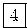

4 .

B8 |

𝑘 +2 should be enough

Human Expert Comment

7 / 7

--- Page 47 ---

# Problem 4

A proper divisor of a positive integer 𝑁 is a positive divisor of 𝑁 other than 𝑁 itself.

The infinite sequence 𝑎 1 , 𝑎 2 , · · · consists of positive integers, each of which has at least three proper divisors.

For each 𝑛 ≥ 1 , the integer 𝑎 𝑛 +1 is the sum of the three largest proper divisors of 𝑎 𝑛 .

Determine all possible values of 𝑎 1 .

# Short Answer

The set of all possible values for 𝑎 1 are integers 𝑎 of the form 𝑎 = 2 𝑥 3 𝑦 𝑚 , where: 1. 𝑥 is a positive odd integer. 2. 𝑦 is a positive integer satisfying 𝑦 ≥ 𝑥 +1 2 . 3. 𝑚 is a positive integer whose prime factors are all greater than or equal to 7.

# Model Proof

# 1. Preliminaries

For a positive integer 𝑁 with at least three proper divisors, list all its divisors in increasing order:

$$
1 = 𝑑 1 < 𝑑 2 < 𝑑 3 < 𝑑 4 < · · · < 𝑑 𝑚 = 𝑁.
$$

Because of the pairing 𝑑 𝑖 · 𝑑 𝑚 +1 -𝑖 = 𝑁 , the three largest proper divisors are

Hence we can write

$$
𝑁 𝑑 2 , 𝑁 𝑑 3 , 𝑁 𝑑 4 .
$$

C1

$$
𝑓 ( 𝑁 ) := sum of the three largest proper divisors of 𝑁 = 𝑁 (︂ 1 𝑑 2 + 1 𝑑 3 + 1 𝑑 4 )︂ . (1)
$$

The sequence is defined by 𝑎 𝑛 +1 = 𝑓 ( 𝑎 𝑛 ) , and we require that every term has at least three proper divisors.

C1 |

In the correct formulation, the 𝑑 2 , 𝑑 3 , 𝑑 4 should be function of 𝑁 .

# 2. Two key lemmas

# Lemma 1 (odd numbers).

If 𝑁 is odd and has at least three proper divisors, then 𝑓 ( 𝑁 ) < 𝑁 and 𝑓 ( 𝑁 ) is odd.

Proof.

Because all divisors of an odd number are odd, we have 𝑑 2 ≥ 3 , 𝑑 3 ≥ 5 , 𝑑 4 ≥ 7 . Hence

$$
1 𝑑 2 + 1 𝑑 3 + 1 𝑑 4 ≤ 1 3 + 1 5 + 1 7 = 71 105 < 1 ,
$$

so 𝑓 ( 𝑁 ) < 𝑁 . Moreover, each of 𝑁/𝑑 2 , 𝑁/𝑑 3 , 𝑁/𝑑 4 is odd (odd divided by odd), so their sum is odd. □

# Lemma 2 (even numbers not divisible by 3).

If 𝑁 is even, 3 ∤ 𝑁 , and has at least three proper divisors, then

- (i) 𝑓 ( 𝑁 ) < 𝑁 , and
- (ii) 𝑓 ( 𝑁 ) is not a multiple of 6 .

# Proof.

Since 𝑁 is even, 𝑑 2 = 2 . The smallest possible values for 𝑑 3 , 𝑑 4 that maximize the sum in (1) are 𝑑 3 = 4 and 𝑑 4 = 5 (e.g., 𝑁 = 20 ). In any case 𝑑 3 ≥ 4 and 𝑑 4 ≥ 5 (because 4 is the only

--- Page 48 ---

even number between 2 and 5 , and 5 is the smallest integer >4 that does not force a factor 3 ). Consequently

$$
1 2 + 1 𝑑 3 + 1 𝑑 4 ≤ 1 2 + 1 4 + 1 5 = 19 20 < 1 ,
$$

so 𝑓 ( 𝑁 ) < 𝑁 .

We now show that 𝑓 ( 𝑁 ) cannot be divisible by 6 .

Write 𝑁 = 2 𝑎 · 𝑚 with 𝑚 odd and 3 ∤ 𝑚 ( 𝑎 ≥ 1 ). Consider two cases.

Case 𝑎 ≥ 2 .

Then 4 | 𝑁 , so 𝑑 3 = 4 . Hence

$$
𝑓 ( 𝑁 ) = 𝑁 2 + 𝑁 4 + 𝑁 𝑑 4 = 3 𝑁 4 + 𝑁 𝑑 4 .
$$

Because 𝑁/ 4 is an integer, 3 𝑁/ 4 is a multiple of 3 . Since 𝑁 is not divisible by 3 , 𝑁/𝑑 4 is also not divisible by 3 . Thus 𝑓 ( 𝑁 ) ≡ 𝑁/𝑑 4 ̸≡ 0 (mod 3) , and therefore 𝑓 ( 𝑁 ) is not a multiple of 3 ; in particular it cannot be a multiple of 6 .

Case 𝑎 = 1 .

Then 𝑁 = 2 𝑚 with 𝑚 odd, 3 ∤ 𝑚 . Let 𝑝 be the smallest prime divisor of 𝑚 ; then 𝑝 ≥ 5 and 𝑑 3 = 𝑝 . The fourth divisor 𝑑 4 is either

an odd divisor 𝑞 with 𝑝 < 𝑞 < 2 𝑝 (if such a divisor exists), or

2 𝑝 (if no odd divisor lies between 𝑝 and 2 𝑝 ).

We examine the two possibilities.

Subcase 𝑑 4 odd.

·

Then 𝑁/𝑑 4 = 2( 𝑚/𝑞 ) is even, 𝑁/ 2 = 𝑚 is odd, and 𝑁/𝑝 = 2( 𝑚/𝑝 ) is even. Hence 𝑓 ( 𝑁 ) = odd + even + even = odd, so 𝑓 ( 𝑁 ) is not even and certainly not a multiple of 6 .

Subcase 𝑑 = 2 𝑝

4 (even).

Here

$$
𝑓 ( 𝑁 ) = 𝑁 2 + 𝑁 𝑝 + 𝑁 2 𝑝 = 𝑚 +2 𝑚 𝑝 + 𝑚 𝑝 = 𝑚 +3 𝑚 𝑝 .
$$

Since 𝑚 is not divisible by 3 , we have 𝑓 ( 𝑁 ) ≡ 𝑚 (mod 3) = 0 . Thus 𝑓 ( 𝑁 ) is not a multiple of 3 and therefore not a multiple of 6 .

̸

In every subcase 𝑓 ( 𝑁 ) is not a multiple of 6 , completing the proof. □

# 3. All terms must be multiples of 6

Assume, for contradiction, that some term 𝑎 𝑛 is not a multiple of 6 .

If 𝑎 𝑛 is odd , Lemma 1 gives that 𝑎 𝑛 +1 = 𝑓 ( 𝑎 𝑛 ) is odd and 𝑎 𝑛 +1 < 𝑎 𝑛 . Repeating, we obtain an infinite strictly decreasing sequence of positive odd integers - impossible by the well-ordering principle.

If 𝑎 𝑛 is even but 3 ∤ 𝑎 𝑛 , Lemma 2 tells us that 𝑎 𝑛 +1 = 𝑓 ( 𝑎 𝑛 ) < 𝑎 𝑛 and 𝑎 𝑛 +1 is not a multiple of 6 . There are two possibilities for 𝑎 𝑛 +1 :

𝑎 𝑛 +1 is odd. Then by Lemma 1 all subsequent terms are odd and strictly decreasing again impossible.

𝑎 𝑛 +1 is even and 3 ∤ 𝑎 𝑛 +1 . Then we can apply the same reasoning to 𝑎 𝑛 +1 : we obtain 𝑎 𝑛 +2 < 𝑎 𝑛 +1 and 𝑎 𝑛 +2 not a multiple of 6 , and so on. This would produce an infinite strictly decreasing sequence 𝑎 𝑛 > 𝑎 𝑛 +1 > 𝑎 𝑛 +2 > . . . of positive integers, which cannot exist.

Thus, in every case, the assumption leads to a contradiction. Consequently, every term of the infinite sequence is a multiple of 6 .

# 4. Reduction to the form 6 𝑀

Write 𝑎 𝑛 = 6 𝑀 𝑛 with 𝑀 𝑛 ∈ N . Because 6 𝑀 𝑛 always has at least the divisors 1 , 2 , 3 , 6 , we have 𝜏 (6 𝑀 𝑛 ) ≥ 4 (i.e., at least three proper divisors).

--- Page 49 ---

For 𝑁 = 6 𝑀 , the three smallest divisors greater than 1 are always 𝑑 2 = 2 and 𝑑 3 = 3 . The fourth divisor 𝑑 4 depends on 𝑀 :

If 𝑀 is even → 4 | 6 𝑀 , and since 4 is the smallest integer larger than 3 , we have 𝑑 4 = 4 .

If 𝑀 is odd and 5 | 𝑀 → 5 | 6 𝑀 and 5 < 6 , so 𝑑 4 = 5 .

If 𝑀 is odd and 5 ∤ 𝑀 → the next divisor is 6 (because 6 | 6 𝑀 and neither 4 nor 5 divides 6 𝑀 ), so 𝑑 4 = 6 .

Using (1) we compute

$$
𝑓 (6 𝑀 ) = 6 𝑀 2 + 6 𝑀 3 + 6 𝑀 𝑑 4 = 3 𝑀 +2 𝑀 + 6 𝑀 𝑑 4 = 5 𝑀 + 6 𝑀 𝑑 4 . (2)
$$

Now analyse the three cases.

𝑀 odd, 5 ∤ 𝑀 → 𝑑 4 = 6

$$
𝑓 (6 𝑀 ) = 5 𝑀 + 𝑀 = 6 𝑀.
$$

Hence 6 𝑀 is a fixed point.

𝑀 odd, 5 | 𝑀 → 𝑑 4 = 5

$$
𝑓 (6 𝑀 ) = 5 𝑀 + 6 𝑀 5 = 31 5 𝑀.
$$

Since 𝑀 is odd and divisible by 5 , 𝑀/ 5 is odd, so the result is odd. Therefore it is not a multiple of 6 . By the result of §3, such a number cannot appear in an infinite sequence.

𝑀 even → 𝑑 4 = 4

$$
𝑓 (6 𝑀 ) = 5 𝑀 + 6 𝑀 4 = 13 2 𝑀.
$$

For this to be a multiple of 6 (necessary for the next term to be admissible) we need

C2

$$
13 2 𝑀 ≡ 0 (mod 6) ⇐⇒ 13 𝑀 ≡ 0 (mod 12) ⇐⇒ 𝑀 ≡ 0 (mod 12) ,
$$

because 13 ≡ 1 (mod 12) . Hence, if 𝑀 is even but not divisible by 12 , then 𝑓 (6 𝑀 ) would not be a multiple of 6 , contradicting §3. Therefore, in an infinite sequence, every even 𝑀 must be divisible by 12 , and then

$$
𝑎 𝑛 +1 = 𝑓 (6 𝑀 ) = 6 · (︂ 13 · 𝑀 12 )︂ ,
$$

so the new parameter is 𝑀 ′ = 13 · ( 𝑀/ 12) .

C2 |

Notation inconsistency. Just use ∤ and | .

# 5. Characterising admissible 𝑀 1 = 𝑎 1 / 6

Let 𝑀 1 = 𝑎 1 / 6 . We have shown that all terms must be multiples of 6 , and the recurrence for the corresponding 𝑀 𝑛 is:

If 𝑀 is odd and 5 ∤ 𝑀 →fi xed point.

If 𝑀 is even and divisible by 12 → 𝑀 ↦→ 13 · ( 𝑀/ 12) .

Any other situation leads to a contradiction.

For the sequence to be infinite, we must start from 𝑀 1 and, after finitely many applications of the even step C3 , reach an odd 𝑀 that is not divisible by 5 . This forces 𝑀 1 to have a very specific structure.

Let 𝑘 be the largest integer such that 12 𝑘 | 𝑀 1 (the exponent of 12 in 𝑀 1 ). Write

$$
𝑀 1 = 12 𝑘 · 𝑑,
$$

C3

|

even step? 1. Second cases 𝑀 → 13 𝑀/ 12 . 2. even 𝑀

--- Page 50 ---

where 𝑑 is a positive integer not divisible by 12 (i.e., 𝑑 is the 'remainder' after removing all factors of 12 ).

We claim that the sequence is infinite iff 𝑑 is odd and 5 ∤ 𝑑 .

# Sufficiency

Assume 𝑀 1 = 12 𝑘 · 𝑑 with 𝑘 ≥ 0 , 𝑑 odd, and 5 ∤ 𝑑 . We prove by induction that

$$
𝑀 𝑖 +1 = 13 𝑖 · 𝑀 1 12 𝑖 = 12 𝑘 -𝑖 · 13 𝑖 · 𝑑 (0 ≤ 𝑖 ≤ 𝑘 ) .
$$

For 𝑖 = 0 this is the definition of 𝑀 1 .

Inductive step: For 𝑖 < 𝑘 , we have 𝑀 𝑖 = 12 𝑘 -𝑖 · 13 𝑖 · 𝑑 . Since 𝑘 -𝑖 ≥ 1 , 𝑀 𝑖 is even and divisible by 12 (because it contains the factor 12 𝑘 -𝑖 ). Hence we may apply the even-step rule, obtaining

$$
𝑀 𝑖 +1 = 13 · 𝑀 𝑖 12 = 13 · 12 𝑘 -𝑖 -1 · 13 𝑖 · 𝑑 = 12 𝑘 -𝑖 -1 · 13 𝑖 +1 · 𝑑,
$$

which matches the formula.

Thus for 𝑖 = 𝑘 -1 we get 𝑀 𝑘 = 12 1 · 13 𝑘 -1 · 𝑑 , which is even and divisible by 12 . Applying the rule once more gives

$$
𝑀 𝑘 +1 = 13 · 𝑀 𝑘 12 = 13 𝑘 · 𝑑,
$$

which is odd (since 13 𝑘 is odd and 𝑑 is odd) and not divisible by 5 . By case 1 of §4, 6 𝑀 𝑘 +1 is a fixed point. Consequently,

$$
𝑎 𝑘 +1 = 6 · 13 𝑘 · 𝑑,
$$

k+2and the sequence becomes constant thereafter. All terms have at least three proper divisors, so the sequence is infinite.

# Necessity

Suppose, for contradiction, that 𝑀 1 does not have the form 12 𝑘 · 𝑑 with 𝑑 odd and 5 ∤ 𝑑 . Write 𝑀 1 = 12 𝑘 · 𝑑 as above (now 𝑑 may be even, or odd but divisible by 5 ). C4 We consider two cases.

# · 𝑑 is even. C5

Then 𝑀 1 is even. If 𝑘 = 0 , then 𝑀 1 is even but not divisible by 12 (because 𝑑 even and not a multiple of 12 ). By §4, case 3, this would give 𝑎 2 not a multiple of 6 - contradiction. If 𝑘 ≥ 1 , then 𝑀 1 is even and divisible by 12 . Apply the even step once to obtain

$$
𝑀 2 = 13 · 𝑀 1 12 = 13 · 12 𝑘 -1 · 𝑑.
$$

Since 𝑑 is even, 𝑀 2 is even. We now check whether 𝑀 2 is divisible by 12 .

-If 𝑘 -1 ≥ 1 (i.e., 𝑘 ≥ 2 ), then 12 𝑘 -1 already contains a factor 12 , so 𝑀 2 is divisible by 12 . But then we can continue the process. However, after exactly 𝑘 steps we will obtain

$$
𝑀 𝑘 +1 = 13 𝑘 · 𝑑,
$$

# C4 |

This formulation should mention 12 ∤ 𝑑

# C5 |

No need to consider for even or odd, we can directly say 𝑀 𝑘 +1 = 13 𝑘 · 𝑑 and then contradictory. We already have the dynamic of 𝑀 𝑖 at the beginning.

which is even (because 𝑑 is even). Since 𝑑 is not divisible by 12 (by the definition of 𝑘 ), 𝑀 𝑘 +1 is not divisible by 12 . Hence at that moment we would have an even 𝑀 that is not divisible by 12 , which forces 𝑓 (6 𝑀 𝑘 +1 ) not to be a multiple of 6 - contradiction.

-If 𝑘 = 1 , then 𝑀 1 = 12 · 𝑑 with 𝑑 even. Then 𝑀 2 = 13 𝑑 is even but not divisible by 12 (because 13 𝑑 lacks the necessary factor 3 and C6 the factor 4 if 𝑑 is not a multiple of 12 ). Again, 𝑀 2 fails the requirement that every even 𝑀 must be divisible by 12 .

In all subcases, contradiction arises.

# · 𝑑 is odd but 5 | 𝑑 .

Then after 𝑘 applications of the even step we obtain

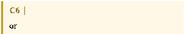

C6

|

or

$$
𝑀 𝑘 +1 = 13 𝑘 · 𝑑,
$$

--- Page 51 ---

which is odd and divisible by 5 . Consequently, 𝑎 𝑘 +1 = 6 𝑀 𝑘 +1 falls into case 2 of §4, yielding 𝑓 ( 𝑎 𝑘 +1 ) odd. As in §3, an odd term would lead to an infinite strictly decreasing sequence of odd numbers - contradiction.

Thus, the only way to avoid contradictions is that 𝑑 is odd and 5 ∤ 𝑑 .

# 6. Final answer

Combining everything, we obtain that the initial value 𝑎 1 can be exactly those numbers of the form

𝑘

𝑎

= 6

·

12

·

𝑑

1

(

𝑘

∈

, 𝑑

,

5

𝑑

)

.

odd

N

∤

0

Equivalently, 𝑎 1 = 2 2 𝑘 +1 · 3 𝑘 +1 · 𝑑 with 𝑑 odd and not divisible by 5 .

Human Expert Comment

7

/

7

--- Page 52 ---

# Problem 5

Alice and Bazza are playing the inekoalaty game, a two-player game whose rules depend on a positive real number 𝜆 which is known to both players. On the 𝑛 th turn of the game (starting with 𝑛 = 1 ) the following happens:

If 𝑛 is odd, Alice chooses a nonnegative real number 𝑥 𝑛 such that

$$
𝑥 1 + 𝑥 2 + · · · + 𝑥 𝑛 ≤ 𝜆𝑛.
$$

If 𝑛 is even, Bazza chooses a nonnegative real number 𝑥 𝑛 such that

$$
𝑥 2 1 + 𝑥 2 2 + · · · + 𝑥 2 𝑛 ≤ 𝑛.
$$

If a player cannot choose a suitable 𝑥 𝑛 , the game ends and the other player wins. If the game goes on forever, neither player wins. All chosen numbers are known to both players.

Determine all values of 𝜆 for which Alice has a winning strategy and all those for which Bazza has a winning strategy.

# Short Answer

The outcome of the inekoalty game depends on the value of 𝜆 as follows:

If 𝜆 > √ 2 2 , Alice has a winning strategy.

If 𝜆 < √ 2 2 , Bazza has a winning strategy.

If 𝜆 = √ 2 2 , neither player has a winning strategy, and the game can go on forever.

# Model Proof

Notation and basic facts

$$
Define 𝑆 𝑛 = ∑︀ 𝑛 𝑖 =1 𝑥 𝑖 and 𝑄 𝑛 = ∑︀ 𝑛 𝑖 =1 𝑥 2 𝑖 .
$$

The rules: on odd 𝑛 , 𝑆 𝑛 ≤ 𝜆𝑛 ; on even 𝑛 , 𝑄 𝑛 ≤ 𝑛 .

From Cauchy-Schwarz, after any even turn 2 𝑘 we have

$$
𝑆 2 2 𝑘 ≤ (2 𝑘 ) 𝑄 2 𝑘 ≤ (2 𝑘 ) · 2 𝑘 = (2 𝑘 ) 2 = ⇒ 𝑆 2 𝑘 ≤ 2 𝑘. (1)
$$

For 𝑘 ≥ 1 define the slack after the even turn 2 𝑘 :

$$
𝑑 𝑘 = 𝜆 (2 𝑘 +1) -𝑆 2 𝑘 .
$$

Alice can move on turn 2 𝑘 +1 iff 𝑑 𝑘 ≥ 0 (she may choose 𝑥 2 𝑘 +1 = 0 ). √

If at some odd turn Alice can legally choose a number 𝑢 > 2 while 𝑄 2 𝑘 = 2 𝑘 , then 𝑄 2 𝑘 +1 = 2 𝑘 + 𝑢 2 > 2 𝑘 +2 and Bazza will have no legal move on the next turn, so Alice wins immediately.

In the general case, we will use the slack to analyse the game.

# Key strategy for Bazza

We consider the following natural strategy for Bazza on even turns: after Alice's move 𝑢 on turn 2 𝑘 +1 , if the game has not ended, Bazza chooses

$$
𝑣 = √︀ 2 𝑘 +2 -𝑄 2 𝑘 +1 ,
$$

i.e. the largest possible number that still satisfies 𝑄 2 𝑘 +2 ≤ 2 𝑘 +2 . This choice is always legal as long as 𝑄 2 𝑘 +1 ≤ 2 𝑘 + 2 and makes 𝑄 2 𝑘 +2 = 2 𝑘 + 2 (the

--- Page 53 ---

maximal possible sum of squares).

We call this the maximal strategy for Bazza.

Claim 1. As long as Alice never picks a number 𝑢 > √ 2 (which would make her win immediately), the maximal strategy forces 𝑄 2 𝑘 = 2 𝑘 for every 𝑘 ≥ 1 .

Proof. By induction. For 𝑘 = 1 , after Alice's first move 𝑥 1 = 𝑎 (with 0 ≤ 𝑎 ≤ 𝜆 ), Bazza can choose 𝑣 = √ 2 -𝑎 2 because 𝑎 2 ≤ 2 (this holds for all relevant 𝜆 ; in the cases where we apply it, we have 𝜆 ≤ √ 2 / 2 < √ 2 , and for larger 𝜆 Alice would win earlier). Then 𝑄 2 = 𝑎 2 + 𝑣 2 = 2 . Inductive step: assume 𝑄 2 𝑘 = 2 𝑘 . Alice's move 𝑢 satisfies 𝑄 2 𝑘 +1 = 2 𝑘 + 𝑢 2 ≤ 2 𝑘 +2 because otherwise 𝑢 2 > 2 and Alice would have won (this can only happen if 𝑄 2 𝑘 = 2 𝑘 and 𝑢 > √ 2 ). D1 If the game continues, we must have 𝑢 ≤ √ 2 . Then 𝑄 2 𝑘 +1 = 2 𝑘 + 𝑢 2 ≤ 2 𝑘 +2 . Bazza chooses 𝑣 = √︀ 2 𝑘 +2 -(2 𝑘 + 𝑢 2 ) = √ 2 -𝑢 2 , yielding 𝑄 2 𝑘 +2 = 2 𝑘 +2 . □

# Analysis of the slack under the maximal strategy

Suppose the maximal strategy is followed and that the game has not ended (so far Alice has never picked 𝑢 > √ 2 ). Let 𝑢 = 𝑥 2 𝑘 +1 and 𝑣 = 𝑥 2 𝑘 +2 . Then

$$
𝑆 2 𝑘 +2 = 𝑆 2 𝑘 + 𝑢 + 𝑣, 𝑄 2 𝑘 +2 = 2 𝑘 +2 ,
$$

and therefore

$$
𝑑 𝑘 +1 = 𝜆 (2 𝑘 +3) -𝑆 2 𝑘 +2 = 𝑑 𝑘 +2 𝜆 -( 𝑢 + 𝑣 ) . (2)
$$

For 0 ≤ 𝑢 ≤ √ 2 define ℎ ( 𝑢 ) = 𝑢 + √ 2 -𝑢 2 . One checks that ℎ ( 𝑢 ) ≥ √ 2 , with equality exactly at 𝑢 = 0 and 𝑢 = √ 2 , and maximum 2 at 𝑢 = 1 . Consequently

$$
𝑑 𝑘 +1 ≤ 𝑑 𝑘 +2 𝜆 -√ 2 , (3)
$$

and equality can be achieved by choosing 𝑢 = 0 (or 𝑢 = √ 2 , if allowed).

Thus the maximal possible increase of 𝑑 𝑘 (when Alice tries to keep her slack large) is 2 𝜆 - √ 2 , attained by taking 𝑢 = 0 .

# Three regimes

$$
1. 𝜆 < √ 2 2
$$

Then 2 𝜆 -√ 2 < 0 .

Bazza's winning strategy.

Bazza adopts the maximal strategy described above.

First, compute an upper bound for 𝑑 1 . After the first two moves, 𝑆 2 = 𝑎 + √ 2 -𝑎 2 with 0 ≤ 𝑎 ≤ 𝜆 D2 . The function 𝑓 ( 𝑎 ) = 𝑎 + √ 2 -𝑎 2 satisfies 𝑓 ( 𝑎 ) ≥ √ 2 (minimum at 𝑎 = 0 ), so

$$
𝑑 1 = 3 𝜆 -𝑆 2 ≤ 3 𝜆 -√ 2 . (4)
$$

√ √ √ √ .

Because 𝜆 < 2 / 2 , we have 3 𝜆 -2 < 2 / 2 < 2

Now, from (3) we obtain for any possible play

$$
𝑑 𝑘 ≤ 𝑑 1 +( 𝑘 -1)(2 𝜆 -√ 2) ≤ (3 𝜆 -√ 2) + ( 𝑘 -1)(2 𝜆 -√ 2) . (5)
$$

(The first inequality follows by induction using 𝑑 𝑘 +1 ≤ 𝑑 𝑘 +2 𝜆 -√ 2 , the second uses the bound on 𝑑 1 .) √

Since 2 𝜆 -2 < 0 , the right-hand side of (5) tends to -∞ as 𝑘 →∞ . Hence there exists a finite 𝐾 with 𝑑 𝐾 < 0 .

When 𝑑 𝐾 < 0 , at the beginning of turn 2 𝐾 +1 Alice cannot move (even 𝑥 = 0 would violate the sum condition), so Bazza wins. √

Moreover, we claim that Alice never gets the chance to win earlier by picking 𝑢 > 2 . Indeed, from (5) and 2 𝜆 -√ 2 < 0 , we have 𝑑 𝑘 ≤ 3 𝜆 -√ 2 < √ 2 for all 𝑘 . Hence 𝑑 𝑘 never exceeds √ 2 , so she cannot legally pick a number larger than √ 2 (which would be required to win immediately). Thus Bazza's strategy is winning. √

Conclusion for 𝜆 < 2 / 2 : Bazza has a winning strategy.

Do not understand. Reads like a thinking draft process.

D2 | Better to use 𝑥 1 not 𝑎

--- Page 54 ---

$$
√ 2 √ .
$$

$$
2. 𝜆 = 2
$$

Here 2 𝜆 -2 = 0

Bazza does not have a winning strategy.

We exhibit a strategy for Alice that prevents Bazza from ever winning.

Let Alice always choose 𝑥 1 = 0 and thereafter 𝑥 2 𝑘 +1 = 0 on every odd turn.

Consider any Bazza moves. On even turns we have only Bazza's numbers, say 𝑦 1 , . . . , 𝑦 𝑘 at turn 2 𝑘 . The constraints are ∑︀ 𝑘 𝑖 =1 𝑦 2 𝑖 = 𝑄 2 𝑘 ≤ 2 𝑘 (because odd terms are zero). By Cauchy-Schwarz,

$$
𝑆 2 𝑘 = 𝑘 ∑︁ 𝑖 =1 𝑦 𝑖 ≤ ⎯ ⎸ ⎸ ⎷ 𝑘 𝑘 ∑︁ 𝑖 =1 𝑦 2 𝑖 ≤ √ 𝑘 · 2 𝑘 = √ 2 𝑘.
$$

Therefore

$$
𝑑 𝑘 = 𝜆 (2 𝑘 +1) -𝑆 2 𝑘 ≥ √ 2 2 (2 𝑘 +1) -√ 2 𝑘 = √ 2 2 > 0 .
$$

Thus Alice can always move (she may choose 0 ). Also, she never wins because to win she would need to make 𝑄 2 𝑘 +1 > 2 𝑘 + 2 , which would require 𝑥 2 2 𝑘 +1 > 2 𝑘 + 2 -𝑄 2 𝑘 ≥ 2 , i.e. 𝑥 2 𝑘 +1 > √ 2 . But 𝑥 2 𝑘 +1 ≤ 𝑑 𝑘 and we have not shown an upper bound on 𝑑 𝑘 ; D4 however, the crucial point is that with this Alice strategy, Bazza never wins because Alice never loses. So this suffices to prove that Bazza does not have a winning strategy (he cannot force a win against every Alice strategy).

Alice does not have a winning strategy.

We now show that Bazza has a strategy to prevent Alice from winning.

Let Bazza adopt the maximal strategy (as in Case 1). We prove that under this strategy, Alice can never win.

First, by Claim 1, as long as the game continues, 𝑄 2 𝑘 = 2 𝑘 . Using (3) with 𝜆 = √ 2 / 2 we get

$$
𝑑 𝑘 +1 = 𝑑 𝑘 + √ 2 -( 𝑢 + 𝑣 ) ≤ 𝑑 𝑘 , (6)
$$

because 𝑢 + 𝑣 ≥ √ 2 . Hence 𝑑 𝑘 is non-increasing. Moreover, from (4) we have

$$
𝑑 1 ≤ 3 𝜆 -√ 2 = √ 2 / 2 .
$$

Thus 𝑑 𝑘 ≤ √ 2 / 2 < √ 2 for all 𝑘 . In particular, 𝑑 𝑘 never exceeds √ 2 , so Alice can never pick a number 𝑢 > √ 2 (which would be necessary to win immediately). √

Could Alice win by picking some 𝑢 ≤ 2 and later build up? To win, she must at some odd turn make 𝑄 2 𝑘 +1 > 2 𝑘 +2 . Since 𝑄 2 𝑘 = 2 𝑘 , this would require 𝑢 2 > 2 , i.e. 𝑢 > √ 2 . Thus any winning move would necessarily be 𝑢 > √ 2 . Because 𝑑 𝑘 ≤ √ 2 / 2 < √ 2 , such a move is impossible. Therefore Alice never wins. D5

Additionally, we check that 𝑑 𝑘 never becomes negative, so Alice always can move. Indeed, using (2) and the fact that 𝑢 ≤ 𝑑 𝑘 (so 𝑢 ≤ √ 2 / 2 < 1 ), the smallest possible 𝑑 𝑘 +1 for a given 𝑑 𝑘 is attained when 𝑢 = 𝑑 𝑘 , giving 𝑑 𝑘 +1 = √ 2 -√︀ 2 -𝑑 2 𝑘 ≥ 0 . Hence 𝑑 𝑘 ≥ 0 for all 𝑘 . D6

Thus the maximal strategy by Bazza prevents Alice from winning, and also avoids his own loss (the game can continue indefinitely, e.g., if Alice always chooses 0 , then 𝑑 𝑘 = √ 2 / 2 constant and 𝑄 2 𝑘 = 2 𝑘 , so the play never ends). Consequently, Alice cannot force a win; she has no winning strategy. √

Since neither player has a strategy that forces a win, the game is a draw for 𝜆 = 2 / 2 .

$$
3. 𝜆 > √ 2 2
$$

Now 2 𝜆 -√ 2 > 0 .

Alice's winning strategy.

She will always choose 0 on her odd turns, until she can force a win.

Specifically, on turn 1 she sets 𝑥 1 = 0 . On each subsequent odd turn 2 𝑘 +1 ( 𝑘 ≥ 1 ), she examines the current slack 𝑑 𝑘 = 𝜆 (2 𝑘 +1) -𝑆 2 𝑘 . If 𝑑 𝑘 > √ 2 𝑘 +2 -𝑄 2 𝑘 , she chooses a

D4

|

This conclusion only focuses on a specific 𝐵 's policy, which already discussed at the beginning. This looks like thinking draft process.

D5 |

??? Reads like a thinking draft process.

D6

|

No need. The proof is finished.

--- Page 55 ---

number 𝑢 with

$$
√︀ 2 𝑘 +2 -𝑄 2 𝑘 < 𝑢 ≤ 𝑑 𝑘 ,
$$

such that 𝑢 2 > 2 𝑘 +2 -𝑄 2 𝑘 (this is possible because 𝑑 𝑘 is strictly larger). She then wins on the next turn because 𝑄 2 𝑘 +1 = 𝑄 2 𝑘 + 𝑢 2 > 2 𝑘 +2 . If 𝑑 𝑘 ≤ √ 2 𝑘 +2 -𝑄 2 𝑘 , she simply chooses 𝑥 2 𝑘 +1 = 0 .

We must verify that this strategy is legal and that it indeed leads to a win.

First, note that as long as Alice always picks 0 , all her moves contribute nothing to 𝑄 and 𝑆 2 𝑘 is the sum of Bazza's even moves. For any Bazza strategy we have

By Cauchy-Schwarz,

$$
𝑄 2 𝑘 = 𝑘 ∑︁ 𝑖 =1 𝑥 2 2 𝑖 ≤ 2 𝑘, 𝑆 2 𝑘 = 𝑘 ∑︁ 𝑖 =1 𝑥 2 𝑖 .
$$

$$
𝑆 2 2 𝑘 ≤ 𝑘 𝑄 2 𝑘 ≤ 2 𝑘 2 = ⇒ 𝑆 2 𝑘 ≤ √ 2 𝑘. (7)
$$

Consequently,

$$
𝑑 𝑘 = 𝜆 (2 𝑘 +1) -𝑆 2 𝑘 ≥ 𝜆 (2 𝑘 +1) -√ 2 𝑘 = (2 𝜆 -√ 2) 𝑘 + 𝜆. (8)
$$

Because 2 𝜆 - √ 2 > 0 , the right-hand side of (8) tends to + ∞ as 𝑘 →∞ . In particular, there exists an integer 𝐾 such that

$$
𝑑 𝐾 > √︀ 2 𝐾 +2 -𝑄 2 𝐾 .
$$

(Since the right side is at most √ 2 𝐾 +2 , it suffices that (2 𝜆 -√ 2) 𝐾 + 𝜆 > √ 2 𝐾 +2 ; this holds for all sufficiently large 𝐾 .)

At the start of turn 2 𝐾 +1 , we have 𝑑 𝐾 > √ 2 𝐾 +2 -𝑄 2 𝐾 . Choose

$$
𝑢 = √︀ 2 𝐾 +2 -𝑄 2 𝐾 + 𝜀,
$$

with 𝜀 > 0 small enough that 𝑢 ≤ 𝑑 𝐾 (possible because 𝑑 𝐾 is strictly larger). Then

$$
𝑆 2 𝐾 +1 = 𝑆 2 𝐾 + 𝑢 ≤ 𝑆 2 𝐾 + 𝑑 𝐾 = 𝜆 (2 𝐾 +1) ,
$$

so the sum condition is satisfied, and

$$
𝑄 2 𝐾 +1 = 𝑄 2 𝐾 + 𝑢 2 > 𝑄 2 𝐾 +(2 𝐾 +2 -𝑄 2 𝐾 ) = 2 𝐾 +2 .
$$

Therefore on turn 2 𝐾 +2 Bazza has no legal move (even 𝑥 = 0 would give 𝑄 > 2 𝐾 +2 ). Alice wins.

It remains to check that Alice can always make the choice 𝑥 2 𝑘 +1 = 0 when 𝑑 𝑘 ≤ √ 2 𝑘 +2 -𝑄 2 𝑘 . The condition for choosing 0 is that 0 ≤ 𝑑 𝑘 , i.e. 𝑑 𝑘 ≥ 0 . From (8), 𝑑 𝑘 ≥ (2 𝜆 -√ 2) 𝑘 + 𝜆 > 0 for all 𝑘 (since the right side is positive for 𝑘 = 1 because 3 𝜆 -√ 2 > 0 for 𝜆 > √ 2 / 2 ). Hence Alice can always pick 0 when she does not want to win yet. Thus her strategy is well defined and guarantees a win in finite time. √

Conclusion for 𝜆 > 2 / 2 : Alice has a winning strategy.

# Final answer

Alice has a winning strategy iff 𝜆 > √ 2 2 .

Bazza has a winning strategy iff 𝜆 < √ 2 2 .

--- Page 56 ---

For 𝜆 = √ 2 2 neither player can force a win; the game can be drawn.

# Human Expert Comment

Some parts of the proof read like a thinking process. It feels like it realizes that c has not been proved, then decides that proving c is not actually necessary. The proof seems finished, but then it starts thinking again.

7 / 7

--- Page 57 ---

# References

Gretel synthetic safety alignment dataset, 12 2024. URL https://huggingface.co/datasets/ gretelai/gretel-safety-alignment-en-v1 . 8

Rishabh Agarwal, Nino Vieillard, Yongchao Zhou, Piotr Stanczyk, Sabela Ramos Garea, Matthieu Geist, and Olivier Bachem. On-policy distillation of language models: Learning from self-generated mistakes. In The twelfth international conference on learning representations , 2024. 12

Sandhini Agarwal, Lama Ahmad, Jason Ai, Sam Altman, Andy Applebaum, Edwin Arbus, Rahul K Arora, Yu Bai, Bowen Baker, Haiming Bao, et al. gpt-oss-120b & gpt-oss-20b model card. arXiv preprint arXiv:2508.10925 , 2025. 7, 8, 9, 20

Wasi Uddin Ahmad, Sean Narenthiran, Somshubra Majumdar, Aleksander Ficek, Siddhartha Jain, Jocelyn Huang, Vahid Noroozi, and Boris Ginsburg. Opencodereasoning: Advancing data distillation for competitive coding. arXiv preprint arXiv:2504.01943 , 2025. 7

Ibragim Badertdinov, Alexander Golubev, Maksim Nekrashevich, Anton Shevtsov, Simon Karasik, Andrei Andriushchenko, Maria Trofimova, Daria Litvintseva, and Boris Yangel. Swe-rebench: An automated pipeline for task collection and decontaminated evaluation of software engineering agents. arXiv preprint arXiv:2505.20411 , 2025. 9

Yushi Bai, Shangqing Tu, Jiajie Zhang, Hao Peng, Xiaozhi Wang, Xin Lv, Shulin Cao, Jiazheng Xu, Lei Hou, Yuxiao Dong, et al. Longbench v2: Towards deeper understanding and reasoning on realistic long-context multitasks. In Proceedings of the 63rd Annual Meeting of the Association for Computational Linguistics (Volume 1: Long Papers) , pages 3639-3664, 2025. 22

Victor Barres, Honghua Dong, Soham Ray, Xujie Si, and Karthik Narasimhan. 𝜏 2 -bench: Evaluating conversational agents in a dual-control environment, 2025. URL https://arxiv.org/abs/2506. 07982 . 23

Aaron Blakeman, Aaron Grattafiori, Aarti Basant, Abhibha Gupta, Abhinav Khattar, Adi Renduchintala, Aditya Vavre, Akanksha Shukla, Akhiad Bercovich, Aleksander Ficek, et al. Nemotron 3 nano: Open, efficient mixture-of-experts hybrid mamba-transformer model for agentic reasoning. arXiv preprint arXiv:2512.20848 , 2025. 7, 8, 9, 11, 12, 14, 15, 23, 24

Aaron Blakeman, Aaron Grattafiori, Aarti Basant, Abhibha Gupta, Abhinav Khattar, Adi Renduchintala, Aditya Vavre, Akanksha Shukla, Akhiad Bercovich, Aleksander Ficek, et al. Nvidia nemotron 3: Efficient and open intelligence. arXiv preprint arXiv:2512.20856 , 2025. 5, 9

Yang Chen, Zhuolin Yang, Zihan Liu, Chankyu Lee, Peng Xu, Mohammad Shoeybi, Bryan Catanzaro, and Wei Ping. Acereason-nemotron: Advancing math and code reasoning through reinforcement learning. Advances in neural information processing systems , 2025. 13

Wei-Lin Chiang, Lianmin Zheng, Ying Sheng, Anastasios Nikolas Angelopoulos, Tianle Li, Dacheng Li, Hao Zhang, Banghua Zhu, Michael Jordan, Joseph E. Gonzalez, and Ion Stoica. Chatbot arena: An open platform for evaluating llms by human preference, 2024. 14

Kaustubh Deshpande, Ved Sirdeshmukh, Johannes Baptist Mols, Lifeng Jin, Ed-Yeremai HernandezCardona, Dean Lee, Jeremy Kritz, Willow E Primack, Summer Yue, and Chen Xing. Multichallenge: A realistic multi-turn conversation evaluation benchmark challenging to frontier llms. In Findings of the Association for Computational Linguistics: ACL 2025 , pages 18632-18702, 2025. 22

--- Page 58 ---

Daniel Deutsch, Eleftheria Briakou, Isaac Rayburn Caswell, Mara Finkelstein, Rebecca Galor, Juraj Juraska, Geza Kovacs, Alison Lui, Ricardo Rei, Jason Riesa, et al. Wmt24++: Expanding the language coverage of wmt24 to 55 languages & dialects. In Findings of the Association for Computational Linguistics: ACL 2025 , pages 12257-12284, 2025. 24

Shihan Dou, Ming Zhang, Zhangyue Yin, Chenhao Huang, Yujiong Shen, Junzhe Wang, Jiayi Chen, Yuchen Ni, Junjie Ye, Cheng Zhang, et al. Cl-bench: A benchmark for context learning. arXiv preprint arXiv:2602.03587 , 2026. 23

Wei Du, Shubham Toshniwal, Branislav Kisacanin, Sadegh Mahdavi, Ivan Moshkov, George Armstrong, Stephen Ge, Edgar Minasyan, Feng Chen, and Igor Gitman. Nemotron-math: Efficient long-context distillation of mathematical reasoning from multi-mode supervision. arXiv preprint arXiv:2512.15489 , 2025. 7

Tony Feng, Trieu H. Trinh, Garrett Bingham, Dawsen Hwang, Yuri Chervonyi, Junehyuk Jung, Joonkyung Lee, Carlo Pagano, Sang-hyun Kim, Federico Pasqualotto, Sergei Gukov, Jonathan N. Lee, Junsu Kim, Kaiying Hou, Golnaz Ghiasi, Yi Tay, YaGuang Li, Chenkai Kuang, Yuan Liu, Hanzhao Lin, Evan Zheran Liu, Nigamaa Nayakanti, Xiaomeng Yang, Heng-Tze Cheng, Demis Hassabis, Koray Kavukcuoglu, Quoc V. Le, and Thang Luong. Towards autonomous mathematics research. arXiv preprint arXiv:2602.10177 , 2026. doi: 10.48550/arXiv.2602.10177. 17

Aryo Pradipta Gema, Joshua Ong Jun Leang, Giwon Hong, Alessio Devoto, Alberto Carlo Maria Mancino, Rohit Saxena, Xuanli He, Yu Zhao, Xiaotang Du, Mohammad Reza Ghasemi Madani, Claire Barale, Robert McHardy, Joshua Harris, Jean Kaddour, Emile van Krieken, and Pasquale Minervini. Are we done with mmlu?, 2024. 21

Gemini Team. A new era of intelligence with gemini 3. https://blog.google/ products-and-platforms/products/gemini/gemini-3/ , 2025. Google Blog, November 18, 2025. 17

Gemini Team. Advanced version of gemini with deep think officially achieves gold-medal standard at the international mathematical olympiad. https://deepmind.google/blog/advanced-version-of-gemini-withdeep-think-officially-achieves-gold-medal-standard-at-the-international-mathematical-olympiad/, 2025. Google DeepMind Blog, July 21, 2025. 6, 17

Gemini Team. Gemini 3 deep think: Advancing science, research and engineering. https://blog.google/innovation-and-ai/models-and-research/gemini-models/ gemini-3-deep-think/ , 2026. Google Blog, February 12, 2026. 17

Shaona Ghosh, Prasoon Varshney, Makesh Narsimhan Sreedhar, Aishwarya Padmakumar, Traian Rebedea, Jibin Rajan Varghese, and Christopher Parisien. Aegis2. 0: A diverse ai safety dataset and risks taxonomy for alignment of llm guardrails. In Proceedings of the 2025 Conference of the Nations of the Americas Chapter of the Association for Computational Linguistics: Human Language Technologies (Volume 1: Long Papers) , pages 5992-6026, 2025. 8

Nuno M Guerreiro, Ricardo Rei, Daan van Stigt, Luisa Coheur, Pierre Colombo, and André FT Martins. xcomet: Transparent machine translation evaluation through fine-grained error detection. Transactions of the Association for Computational Linguistics , 12:979-995, 2024. 24

Daya Guo, Dejian Yang, Haowei Zhang, Junxiao Song, Ruoyu Zhang, Runxin Xu, Qihao Zhu, Shirong Ma, Peiyi Wang, Xiao Bi, et al. Deepseek-R1: Incentivizing reasoning capability in LLMs via reinforcement learning. arXiv preprint arXiv:2501.12948 , 2025. 4

--- Page 59 ---

Adib Hasan, Ileana Rugina, and Alex Wang. Pruning for protection: Increasing jailbreak resistance in aligned llms without fine-tuning. In Proceedings of the 7th BlackboxNLP Workshop: Analyzing and Interpreting Neural Networks for NLP , pages 417-430, 2024. 8

Zhongmou He, Yee Man Choi, Kexun Zhang, Jiabao Ji, Junting Zhou, Dejia Xu, Ivan Bercovich, Aidan Zhang, and Lei Li. Hardtests: Synthesizing high-quality test cases for llm coding. arXiv preprint arXiv:2505.24098 , 2025. 7

Dan Hendrycks, Collin Burns, Steven Basart, Andy Zou, Mantas Mazeika, Dawn Song, and Jacob Steinhardt. Measuring massive multitask language understanding. arXiv preprint arXiv:2009.03300 , 2020. 21

HMMT. Harvard-mit mathematics tournament february 2025, 2025. 20

Cheng-Ping Hsieh, Simeng Sun, Samuel Kriman, Shantanu Acharya, Dima Rekesh, Fei Jia, Yang Zhang, and Boris Ginsburg. Ruler: What's the real context size of your long-context language models? arXiv preprint arXiv:2404.06654 , 2024. 22

Siming Huang, Tianhao Cheng, Jason Klein Liu, Jiaran Hao, Liuyihan Song, Yang Xu, J Yang, Jiaheng Liu, Chenchen Zhang, Linzheng Chai, et al. Opencoder: The open cookbook for top-tier code large language models. arXiv preprint arXiv:2411.04905 , 2024. 7

IMO. International Mathematical Olympiad, 2025. 20

Naman Jain, King Han, Alex Gu, Wen-Ding Li, Fanjia Yan, Tianjun Zhang, Sida Wang, Armando SolarLezama, Koushik Sen, and Ion Stoica. Livecodebench: Holistic and contamination free evaluation of large language models for code. arXiv preprint arXiv:2403.07974 , 2024. 18, 21

Naman Jain, Jaskirat Singh, Manish Shetty, Liang Zheng, Koushik Sen, and Ion Stoica. R2e-gym: Procedural environments and hybrid verifiers for scaling open-weights swe agents, 2025. URL https: //arxiv.org/abs/2504.07164 . 9, 16

Carlos E Jimenez, John Yang, Alexander Wettig, Shunyu Yao, Kexin Pei, Ofir Press, and Karthik Narasimhan. Swe-bench: Can language models resolve real-world github issues? arXiv preprint arXiv:2310.06770 , 2023. 23

Gregory Kamradt. Needle in a haystack - pressure testing llms. Github , 2023. URL https://github. com/gkamradt/LLMTest_NeedleInAHaystack/tree/main . 22

Diederik P Kingma. Adam: A method for stochastic optimization. arXiv preprint arXiv:1412.6980 , 2014. 12, 14, 15

Tianle Li, Wei-Lin Chiang, Evan Frick, Lisa Dunlap, Tianhao Wu, Banghua Zhu, Joseph E Gonzalez, and Ion Stoica. From crowdsourced data to high-quality benchmarks: Arena-hard and benchbuilder pipeline. arXiv preprint arXiv:2406.11939 , 2024. 14, 22

Aixin Liu, Bei Feng, Bing Xue, Bingxuan Wang, Bochao Wu, Chengda Lu, Chenggang Zhao, Chengqi Deng, Chenyu Zhang, Chong Ruan, et al. Deepseek-V3 technical report. arXiv preprint arXiv:2412.19437 , 2024. 8

Aixin Liu, Aoxue Mei, Bangcai Lin, Bing Xue, Bingxuan Wang, Bingzheng Xu, Bochao Wu, Bowei Zhang, Chaofan Lin, Chen Dong, et al. Deepseek-v3. 2: Pushing the frontier of open large language models. arXiv preprint arXiv:2512.02556 , 2025. 4, 6, 7, 9

Zihan Liu, Yang Chen, Mohammad Shoeybi, Bryan Catanzaro, and Wei Ping. AceMath: Advancing frontier math reasoning with post-training and reward modeling. ACL , 2024. 20

--- Page 60 ---

Zihan Liu, Zhuolin Yang, Yang Chen, Chankyu Lee, Mohammad Shoeybi, Bryan Catanzaro, and Wei Ping. Acereason-nemotron 1.1: Advancing math and code reasoning through sft and rl synergy. ICLR , 2026. 20

LM-Provers, Yuxiao Qu, Amrith Setlur, Jasper Dekoninck, Edward Beeching, Jia Li, Ian Wu, Lewis Tunstall, and Aviral Kumar. Qed-nano: Teaching a tiny model to prove hard theorems. https://huggingface.co/spaces/lm-provers/qed-nano-blogpost, 2026. Blog post. 17

Kevin Lu and Thinking Machines Lab. On-policy distillation. Thinking Machines Lab: Connectionism , 2025. doi: 10.64434/tml.20251026. https://thinkingmachines.ai/blog/on-policy-distillation. 12

Weidi Luo, Siyuan Ma, Xiaogeng Liu, Xiaoyu Guo, and Chaowei Xiao. Jailbreakv: A benchmark for assessing the robustness of multimodal large language models against jailbreak attacks. arXiv preprint arXiv:2404.03027 , 2024. 8

Minh-Thang Luong, Dawsen Hwang, Hoang H Nguyen, Golnaz Ghiasi, Yuri Chervonyi, Insuk Seo, Junsu Kim, Garrett Bingham, Jonathan Lee, Swaroop Mishra, et al. Towards robust mathematical reasoning. In Proceedings of the 2025 Conference on Empirical Methods in Natural Language Processing , pages 3540635430, 2025. 17, 20

Wenjie Ma, Andrei Cojocaru, Neel Kolhe, Bradley Louie, Robin Said Sharif, Haihan Zhang, Vincent Zhuang, Matei Zaharia, and Sewon Min. Reliable fine-grained evaluation of natural language math proofs. arXiv preprint arXiv:2510.13888 , 2025. 6, 38

- MAA. American Invitational Mathematics Examination - AIME 2025, 2025. 20
- MAA. American Invitational Mathematics Examination - AIME 2026, 2026. 20

Mike A. Merrill, Alexander G. Shaw, Nicholas Carlini, Boxuan Li, Harsh Raj, Ivan Bercovich, Lin Shi, Jeong Yeon Shin, Thomas Walshe, E. Kelly Buchanan, Junhong Shen, Guanghao Ye, Haowei Lin, Jason Poulos, Maoyu Wang, Marianna Nezhurina, Jenia Jitsev, Di Lu, Orfeas Menis Mastromichalakis, Zhiwei Xu, Zizhao Chen, Yue Liu, Robert Zhang, Leon Liangyu Chen, Anurag Kashyap, Jan-Lucas Uslu, Jeffrey Li, Jianbo Wu, Minghao Yan, Song Bian, Vedang Sharma, Ke Sun, Steven Dillmann, Akshay Anand, Andrew Lanpouthakoun, Bardia Koopah, Changran Hu, Etash Guha, Gabriel H. S. Dreiman, Jiacheng Zhu, Karl Krauth, Li Zhong, Niklas Muennighoff, Robert Amanfu, Shangyin Tan, Shreyas Pimpalgaonkar, Tushar Aggarwal, Xiangning Lin, Xin Lan, Xuandong Zhao, Yiqing Liang, Yuanli Wang, Zilong Wang, Changzhi Zhou, David Heineman, Hange Liu, Harsh Trivedi, John Yang, Junhong Lin, Manish Shetty, Michael Yang, Nabil Omi, Negin Raoof, Shanda Li, Terry Yue Zhuo, Wuwei Lin, Yiwei Dai, Yuxin Wang, Wenhao Chai, Shang Zhou, Dariush Wahdany, Ziyu She, Jiaming Hu, Zhikang Dong, Yuxuan Zhu, Sasha Cui, Ahson Saiyed, Arinbjörn Kolbeinsson, Jesse Hu, Christopher Michael Rytting, Ryan Marten, Yixin Wang, Alex Dimakis, Andy Konwinski, and Ludwig Schmidt. Terminal-bench: Benchmarking agents on hard, realistic tasks in command line interfaces, 2026. URL https://arxiv.org/abs/2601.11868 . 9, 23

NVIDIA. Nemo gym: An open source library for scaling reinforcement learning environments for llm. https://github.com/NVIDIA-NeMo/Gym , 2025. GitHub repository. 15

NVIDIA. NeMo RL: A Scalable and Efficient Post-Training Library. https://github.com/ NVIDIA-NeMo/RL , 2025. GitHub repository. 10

NVIDIA. NeMo-Skills. https://github.com/NVIDIA-NeMo/Skills , 2025. GitHub repository. 20

NVIIDA. Nemotron-3-Nano-30B-A3B-Base-BF16, 2025. URL https://huggingface.co/nvidia/ NVIDIA-Nemotron-3-Nano-30B-A3B-Base-BF16 . 6

OpenAI. Introducing SWE-bench Verified, 2024. 23

--- Page 61 ---

OpenAI. Introducing GPT-5, 2025. 17

Long Ouyang, Jeffrey Wu, Xu Jiang, Diogo Almeida, Carroll Wainwright, Pamela Mishkin, Chong Zhang, Sandhini Agarwal, Katarina Slama, Alex Ray, et al. Training language models to follow instructions with human feedback. NeurIPS , 35, 2022. 4

Jiayi Pan*, Xingyao Wang*, Graham Neubig, Navdeep Jaitly, Heng Ji, Alane Suhr, and Yizhe Zhang. Training software engineering agents and verifiers with swe-gym. In ICML , 2025. URL https://arxiv. org/abs/2412.21139 . 9, 16

Shishir G. Patil, Huanzhi Mao, Charlie Cheng-Jie Ji, Fanjia Yan, Vishnu Suresh, Ion Stoica, and Joseph E. Gonzalez. The Berkeley Function Calling Leaderboard (BFCL): From Tool Use to Agentic Evaluation of Large Language Models. In ICML , 2025. 23

Long Phan, Alice Gatti, Ziwen Han, Nathaniel Li, Josephina Hu, and et al. Humanity's last exam, 2025. URL https://arxiv.org/abs/2501.14249 . 21

Renjie Pi, Grace Lam, Mohammad Shoeybi, Pooya Jannaty, Bryan Catanzaro, and Wei Ping. On data engineering for scaling llm terminal capabilities, 2026. URL https://arxiv.org/abs/2602.21193 . 9

Valentina Pyatkin, Saumya Malik, Victoria Graf, Hamish Ivison, Shengyi Huang, Pradeep Dasigi, Nathan Lambert, and Hannaneh Hajishirzi. Generalizing verifiable instruction following, 2025. URL https: //huggingface.co/datasets/allenai/IF_multi_constraints_upto5 . 11, 22

Qwen Team. Qwen3.5: Towards native multimodal agents, February 2026. URL https://qwen.ai/ blog?id=qwen3.5 . 5

David Rein, Betty Li Hou, Asa Cooper Stickland, Jackson Petty, Richard Yuanzhe Pang, Julien Dirani, Julian Michael, and Samuel R Bowman. Gpqa: A graduate-level google-proof q&a benchmark. In First Conference on Language Modeling , 2024. 21

Zhihong Shao, Peiyi Wang, Qihao Zhu, Runxin Xu, Junxiao Song, Xiao Bi, Haowei Zhang, Mingchuan Zhang, YK Li, Y Wu, et al. DeepseekMath: Pushing the limits of mathematical reasoning in open language models. arXiv preprint arXiv:2402.03300 , 2024. 10

Zhihong Shao, Yuxiang Luo, Chengda Lu, ZZ Ren, Jiewen Hu, Tian Ye, Zhibin Gou, Shirong Ma, and Xiaokang Zhang. Deepseekmath-v2: Towards self-verifiable mathematical reasoning. arXiv preprint arXiv:2511.22570 , 2025. 16, 17

Atefeh Sohrabizadeh, Jialin Song, Mingjie Liu, Rajarshi Roy, Chankyu Lee, Jonathan Raiman, and Bryan Catanzaro. Nemotron-cortexa: Enhancing llm agents for software engineering tasks via improved localization and solution diversity. In Forty-second International Conference on Machine Learning , 2025. 16

Artificial Analysis Team. Artificial analysis long context reasoning benchmark(lcr), 2025. 22

Minyang Tian, Luyu Gao, Shizhuo D Zhang, Xinan Chen, Cunwei Fan, Xuefei Guo, Roland Haas, Pan Ji, Kittithat Krongchon, Yao Li, et al. Scicode: A research coding benchmark curated by scientists. Advances in Neural Information Processing Systems , 37:30624-30650, 2024. 21

Boxin Wang, Chankyu Lee, Nayeon Lee, Sheng-Chieh Lin, Wenliang Dai, Yang Chen, Yangyi Chen, Zhuolin Yang, Zihan Liu, Mohammad Shoeybi, Bryan Catanzaro, and Wei Ping. Nemotron-Cascade: Scaling cascaded reinforcement learning for general-purpose reasoning models. arXiv preprint arXiv:2512.13607 , 2025. 4, 6, 7, 8, 9, 10, 11, 14, 15, 17, 27

--- Page 62 ---

Xingyao Wang, Boxuan Li, Yufan Song, Frank F. Xu, Xiangru Tang, Mingchen Zhuge, Jiayi Pan, Yueqi Song, Bowen Li, Jaskirat Singh, Hoang H. Tran, Fuqiang Li, Ren Ma, Mingzhang Zheng, Bill Qian, Yanjun Shao, Niklas Muennighoff, Yizhe Zhang, Binyuan Hui, Junyang Lin, Robert Brennan, Hao Peng, Heng Ji, and Graham Neubig. Openhands: An open platform for AI software developers as generalist agents. In The Thirteenth International Conference on Learning Representations , 2025. URL https: //openreview.net/forum?id=OJd3ayDDoF . 9, 16, 23

Yubo Wang, Xueguang Ma, Ge Zhang, Yuansheng Ni, Abhranil Chandra, Shiguang Guo, Weiming Ren, Aaran Arulraj, Xuan He, Ziyan Jiang, et al. Mmlu-pro: A more robust and challenging multi-task language understanding benchmark. arXiv preprint arXiv:2406.01574 , 2024. 21

Zhilin Wang, Jiaqi Zeng, Olivier Delalleau, Hoo-Chang Shin, Felipe Soares, Alexander Bukharin, Ellie Evans, Yi Dong, and Oleksii Kuchaiev. Helpsteer3-preference: Open human-annotated preference data across diverse tasks and languages, 2025. URL https://arxiv.org/abs/2505.11475 . 14

Zhilin Wang, Jiaqi Zeng, Olivier Delalleau, Hoo-Chang Shin, Felipe Soares, Alexander Bukharin, Ellie Evans, Yi Dong, and Oleksii Kuchaiev. Helpsteer3-preference: Open human-annotated preference data across diverse tasks and languages, 2025. URL https://arxiv.org/abs/2505.11475 . 14

Yuxiang Wei, Olivier Duchenne, Jade Copet, Quentin Carbonneaux, Lingming Zhang, Daniel Fried, Gabriel Synnaeve, Rishabh Singh, and Sida I Wang. Swe-rl: Advancing llm reasoning via reinforcement learning on open software evolution. arXiv preprint arXiv:2502.18449 , 2025. 9

Ronald J Williams. Simple statistical gradient-following algorithms for connectionist reinforcement learning. Machine learning , 8:229-256, 1992. 11

Bangjun Xiao, Bingquan Xia, Bo Yang, Bofei Gao, Bowen Shen, Chen Zhang, Chenhong He, Chiheng Lou, Fuli Luo, Gang Wang, et al. Mimo-v2-flash technical report. arXiv preprint arXiv:2601.02780 , 2026. 4, 12

Peng Xu, Wei Ping, Xianchao Wu, Chejian Xu, Zihan Liu, Mohammad Shoeybi, and Bryan Catanzaro. Chatqa 2: Bridging the gap to proprietary llms in long context and rag capabilities. arXiv preprint arXiv:2407.14482 , 2024. 8

Weihao Xuan, Rui Yang, Heli Qi, Qingcheng Zeng, Yunze Xiao, Aosong Feng, Dairui Liu, Yun Xing, Junjue Wang, Fan Gao, et al. Mmlu-prox: A multilingual benchmark for advanced large language model evaluation. In Proceedings of the 2025 Conference on Empirical Methods in Natural Language Processing , pages 1513-1532, 2025. 24

An Yang, Anfeng Li, Baosong Yang, Beichen Zhang, Binyuan Hui, Bo Zheng, Bowen Yu, Chang Gao, Chengen Huang, Chenxu Lv, et al. Qwen3 technical report. arXiv preprint arXiv:2505.09388 , 2025. 8, 9, 12, 14

John Yang, Carlos E. Jimenez, Alexander Wettig, Kilian Lieret, Shunyu Yao, Karthik Narasimhan, and Ofir Press. Swe-agent: Agent-computer interfaces enable automated software engineering. In A. Globerson, L. Mackey, D. Belgrave, A. Fan, U. Paquet, J. Tomczak, and C. Zhang, editors, Advances in Neural Information Processing Systems , volume 37, pages 50528-50652. Curran Associates, Inc., 2024. doi: 10. 52202/079017-1601. URL https://proceedings.neurips.cc/paper_files/paper/2024/ file/5a7c947568c1b1328ccc5230172e1e7c-Paper-Conference.pdf . 9

Zonghan Yang, Shengjie Wang, Kelin Fu, Wenyang He, Weimin Xiong, Yibo Liu, Yibo Miao, Bofei Gao, Yejie Wang, YINGWEI MA, Yanhao Li, Yue Liu, Zhenxing Hu, kaitai zhang, Shuyi Wang, Huarong Chen, Flood Sung, Yang Liu, Yang Gao, Zhilin Yang, and Tianyu Liu. Kimi-dev: Agentless training as skill prior for SWE-agents. In The Fourteenth International Conference on Learning Representations , 2026. URL https://openreview.net/forum?id=tYppHuGhxJ . 16

--- Page 63 ---

Qiying Yu, Zheng Zhang, Ruofei Zhu, Yufeng Yuan, Xiaochen Zuo, Yu Yue, Weinan Dai, Tiantian Fan, Gaohong Liu, Lingjun Liu, et al. DAPO: An open-source LLM reinforcement learning system at scale. arXiv preprint arXiv:2503.14476 , 2025. 11

Aohan Zeng, Xin Lv, Zhenyu Hou, Zhengxiao Du, Qinkai Zheng, Bin Chen, Da Yin, Chendi Ge, Chengxing Xie, Cunxiang Wang, et al. Glm-5: from vibe coding to agentic engineering. arXiv preprint arXiv:2602.15763 , 2026. 4, 12

Wenting Zhao, Xiang Ren, Jack Hessel, Claire Cardie, Yejin Choi, and Yuntian Deng. Wildchat: 1m chatgpt interaction logs in the wild. arXiv preprint arXiv:2405.01470 , 2024. 8

Lianmin Zheng, Wei-Lin Chiang, Ying Sheng, Tianle Li, Siyuan Zhuang, Zhanghao Wu, Yonghao Zhuang, Zhuohan Li, Zi Lin, Eric. P Xing, Joseph E. Gonzalez, Ion Stoica, and Hao Zhang. Lmsys-chat-1m: A large-scale real-world llm conversation dataset, 2023. 8

Zihan Zheng, Zerui Cheng, Zeyu Shen, Shang Zhou, Kaiyuan Liu, Hansen He, Dongruixuan Li, Stanley Wei, Hangyi Hao, Jianzhu Yao, et al. Livecodebench pro: How do olympiad medalists judge llms in competitive programming? arXiv preprint arXiv:2506.11928 , 2025. 18, 21, 27

Jeffrey Zhou, Tianjian Lu, Swaroop Mishra, Siddhartha Brahma, Sujoy Basu, Yi Luan, Denny Zhou, and Le Hou. Instruction-following evaluation for large language models, 2023. URL https://arxiv.org/ abs/2311.07911 . 22

