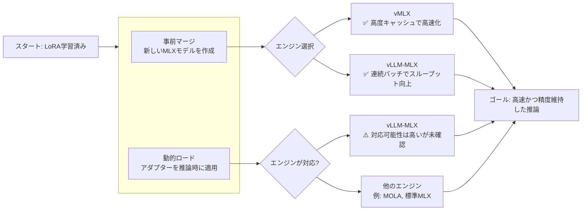

このメモは、Mac 上で Nemotron-3-Nano-30B-A3B-BF16 系モデルを MLX で扱うときの高速化観点を、重複なく整理したものです。

## 要点

- BF16 のまま扱うなら、まずは MLX ネイティブな実行系を使う。
- 単発実行より、可能な範囲で小さめのバッチ実行に寄せる。
- 同じ長い前置きや共通プロンプトは、プレフィックスキャッシュで再利用する。
- メモリが厳しい場合は、同時実行数やコンテキスト長を先に削る。
- macOS と MLX はできるだけ新しい安定版を使う。

## 優先順位

1. MLX ネイティブな推論エンジンを使う。
   - 候補は mlx-lm と vllm-mlx。
   - PyTorch MPS 経由で回しているなら、まずここを置き換える。

2. バッチサイズを上げる。
   - batch=1 の対話処理は GPU/Metal を活かしにくい。
   - 2〜8 程度まで試し、メモリと速度のバランスを見る。

3. キャッシュを活かす。
   - 同一プレフィックスの再利用で prefill を短縮する。
   - 似た入力を繰り返すワークロードほど効きやすい。


## 実務メモ

- モデル本体の量子化はしない前提で考える。
- 速度改善の主戦場は、実行系、バッチ、キャッシュ、OS 側の空きメモリ。
- まずは mlx-lm で再現し、必要なら vMLX を比較対象にする。

ーーー
その他：

**はい、ご提案の方向性（LoRAを事前マージしたモデルを作成し、vMLXまたはvLLM-MLXで推論する）は、どちらのエンジンでも高速推論が可能です。** これは、LoRAの適用という「動的な重み変更」の問題を、事前の「静的なモデル作成」に変換する賢いアプローチです。

以下の図は、あなたの目標を達成するための全体像と選択肢をまとめたものです。



### 🔧 方策1：事前マージモデル + vMLX
**結論：完全に対応しており、vMLXの性能をフルに活かせます。**

*   **原理**: `mlx-lm`などでLoRAアダプターをベースモデルに統合（マージ）し、新しい単一のMLXモデルファイルを作成します【turn0search14】。このマージ済みモデルは、vMLXにとって「通常のMLXモデル」と全く同じ扱いになります。
*   **vMLXでの動作**: vMLXは、**モデルの重みが固定されていることを前提とした高度な最適化（5層キャッシュなど）を行います**【turn0search5】【turn0search8】。マージ済みモデルはこの前提を満たすため、vMLXのすべての高速化機能（特に繰り返しプロンプトに対する圧倒的なTTFT短縮）が期待通りに機能します【turn0search7】。
*   **メリット**:
    *   **確実性が高い**: vMLXはMLX形式のモデルをネイティブにサポートしており、複雑な設定なしで直接読み込めます【turn0search8】。
    *   **キャッシュの恩恵**: マージ後のモデルは「固定」なので、vMLXの前述キャッシュが完全に有効に働き、2回目以降の同一プロンプト推論が爆速になります【turn0search5】。
*   **デメリット**:
    *   **モデルの再作成が必要**: LoRAを変更するたびに、マージとモデル変換のプロセスを繰り返す必要があります。

### 🚀 方策2：事前マージモデル + vLLM-MLX
**結論：対応しており、特に高並行処理で威力を発揮します。**

*   **原理**: 方策1と同じく、マージ済みのMLXモデルを使用します。
*   **vLLM-MLXでの動作**: vLLM-MLXは、**vLLMのコア機能（連続バッチ処理など）をApple Siliconに移植したもの**です【turn0search1】【turn0search2】。マージ済みモデルは標準的な推論モデルとして認識され、機能します。
*   **メリット**:
    *   **高いスループット**: 5つの同時リクエストで1.5倍から3.4倍のスループット向上がベンチマークで示されています【turn0search0】。複数のユーザーやツールから同時にアクセスされる環境に有利です。
    *   **エコシステム**: vLLM本体がLoRAをネイティブにサポートしているため、そのMLXポーティングであるvLLM-MLXも将来的にLoRA動的ロードに対応する可能性が高いです【turn0search16】。
*   **デメリット**:
    *   **単一リクエストの最適化**: vMLXのような極端なTTFT短縮（224倍）は、このベンチマークでは確認されていません【turn0search0】。そのため、チャットのような単一ストリームの使用感ではvMLXに分がある場合があります【turn0search2】。

### ⚖️ 方策比較と推奨
以下の表は、あなたの要件（精度維持、高速化）に基づいた比較です。

| 特徴 | **vMLX** | **vLLM-MLX** |
| :--- | :--- | :--- |
| **事前マージモデルの対応** | ✅ 完全対応 | ✅ 対応 |
| **最大の強み** | **圧倒的なTTFT短縮** (繰り返しプロンプト)【turn0search5】【turn0search7】 | **高並行スループット** (連続バッチ処理)【turn0search0】 |
| **適した使用シーン** | 1人のユーザーによる対話、同じシステムプロンプトの繰り返し | 複数クライアントからの同時リクエスト、APIサーバーとしての運用 |
| **LoRA動的ロードの可能性** | ❌ 非対応（設計思想上） | ⚠️ 親プロジェクト(vLLM)が対応しているため、対応する可能性が高い【turn0search16】 |

### 💡 最終的な推奨アクション
1.  **まずはvMLXで試す**:
    ```bash
    # 1. mlx-lmでLoRAをベースモデルにマージする
    python -m mlx_lm.lora --model <ベースモデル> --adapter-path <LoRAパス> --save-path ./merged-model

    # 2. vMLXでマージ済みモデルを起動
    pip install vmlx
    vmlx serve ./merged-model
    ```
    この方法が、あなたの「精度を落とさずに、単一の高速な推論を実現する」という目標に最も直接的で効果的です【turn0search5】。

2.  **将来の拡張性を考慮する場合**: vLLM-MLXの動向を注視してください。LoRAの動的ロードがサポートされれば、マージの手間が省け、より柔軟な運用が可能になります【turn0search16】。
